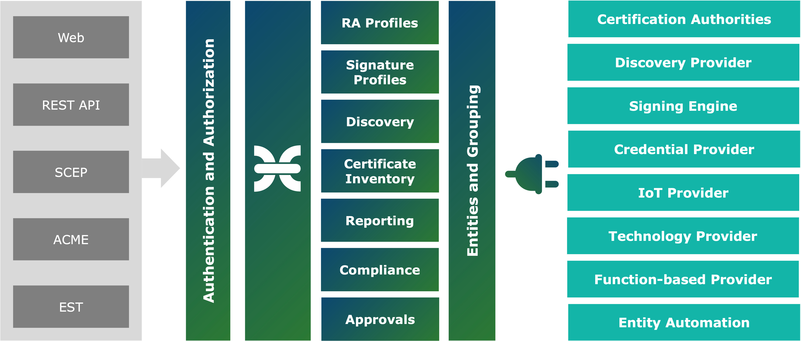

import DocCard from '@theme/DocCard';

# Introduction

CZERTAINLY is a platform for effective and efficient trust lifecycle management and automation for companies of any size and individuals. One of its goals is to provide an easy and affordable way to secure digital communication and support information security in more and more connected world.

It is designed and developed by a team of PKI and information security enthusiasts with practical point of view on the certificate and cryptographic key management in hybrid environments. PKI is the backbone of security in our daily communication and its security and easy management should be available to everyone.

## Trust Lifecycle Components

The platform offer management and automation of the following trust lifecycle components:

| Component                                              | Short description                                                                                                                                                                                                                                                                                                                                                                                  |
|--------------------------------------------------------|----------------------------------------------------------------------------------------------------------------------------------------------------------------------------------------------------------------------------------------------------------------------------------------------------------------------------------------------------------------------------------------------------|
| [Digital Certificates](/docs/certificate-key/introduction) | Digital certificate management and automation that supports various types of certificates and can connect to multiple certification authorities. Discovering certificates in hybrid infrastructures and locations. Issuing and distributing certificates to entities. Renew and rekey options for expiring certificates. Supporting standard interfaces for certificate management and automation. |
| [Cryptographic Keys](/docs/certificate-key/introduction)   | Cryptographic key management and automation supporting various cryptographic technologies for consistent and secure generation of keys and cryptographic operations. Support for encryption/decryption, signing/verification, using symmetric and asymmetric keys. Experimental support for PQC algorithms. Management and automation using standard interfaces and protocols.                     |
| [Digital Signature](/docs/signing/introduction)            | Remote digital signing management and automation for multiple digital signature formats and technologies. Validation of produced digital signatures. Compliant to standards and regulations. Supporting standard interfaces and protocols for remote signing.                                                                                                                                      |

## Cloud-native Architecture

CZERTAINLY is developed as a cloud-native application. It is designed to be deployed on Kubernetes cluster and it is using cloud-native technologies and approaches.
Each component of the platform is a micro-service and the main approach is to keep each service as a simple container that can be easily replaced or scaled.

The platform is split into several parts:

- **interfaces** that is used to communicate with the platform and its services
- **core** services that provide the main functionality of the platform
- **connectors** that are used to connect to external systems and services

For more information, refer to the [Concept and Design](/docs/certificate-key/concept-design/overview) section.

## Community and Contribution

Anyone can join us in building innovative trust lifecycle management tools that can be freely used by anyone.

Contribution is important to enhance the platform and make it more affordable and available for all of us using digital assets:
- [Submit a feature request, bug report, ideas and more](https://github.com/3KeyCompany/CZERTAINLY/issues/new/choose)
- [Create a pull request and be recognized](https://github.com/3KeyCompany/CZERTAINLY/blob/develop/CONTRIBUTING.md)
- [Discuss your ideas with other](https://github.com/3KeyCompany/CZERTAINLY/discussions)
- [Chat with us](https://discord.gg/XYsSZKjSt4)

You can help us to build the community by spreading and sharing information about the CZERTAINLY with others.
You can follow us on [LinkedIn](https://www.linkedin.com/company/czertainly) and [GitHub](https://github.com/3KeyCompany/CZERTAINLY).

export const item = {
    type: 'link',
    href: '/docs/contributors/overview',
    label: 'Contributors',
    description: 'Guides and information for contributors.'
}

<section className='row'>
        <article className="col col--6 margin-bottom--lg">
            <DocCard item={item} />
        </article>
</section>
