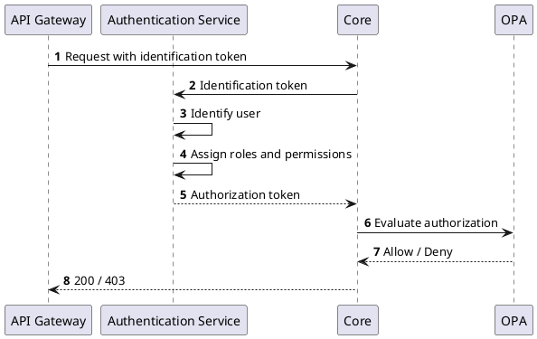

# Authorization

Once user is properly authenticated and identified, internal authorization token is issued based on the roles and associated permissions that are assigned to the user.
The authorization token is used by internal services to evaluate authorization of identified user.

The authorization is evaluated using [Open Policy Agent](https://www.openpolicyagent.org/) policies (OPA).

The following diagram shows the interaction with the OPA:

For more information about the authorization policies, refer to [CZERTAINLY Authorization OPA Policies](https://github.com/3KeyCompany/CZERTAINLY-Auth-OPA-Policies).