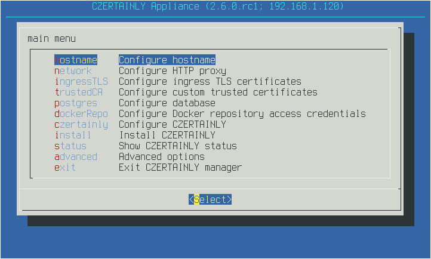

# Text-based user interface

CZERTAINLY appliance is using Text-based User Interface (TUI) to ease
initialization and operations of the appliance.

TUI consist of main and advanced menus. The first as name suggests
offers basic operations with appliance and the second more advanced
tasks.

To navigate through menu use UP and DOWN arrows on keyboard. For
switching between set of input fields and buttons use TAB key. For
switching between multiple buttons use LEFT and RIGHT arrows on
keyboard. To speed up navigation you can use highlighted hotkeys, if
same letter is highlighted twice repeat key press to select the second
value. To select highlighted option use the ENTER key.

