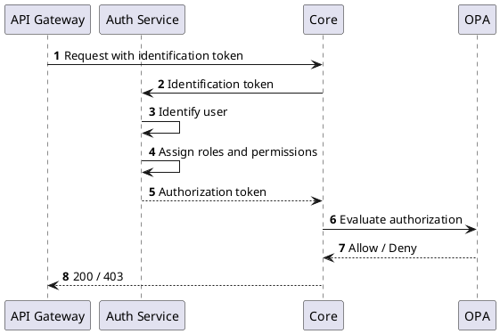

# Authorization

Once user is properly authenticated and identified, internal authorization token is issued based on the roles and associated permissions that are assigned to the user.
The authorization token is used by internal services to evaluate authorization of identified user.

The authorization is evaluated using [Open Policy Agent](https://www.openpolicyagent.org/) policies (OPA).

The following diagram shows the interaction with the OPA:

For more information about the authorization policies, refer to [CZERTAINLY Auth OPA Policies](https://github.com/3KeyCompany/CZERTAINLY-Auth-OPA-Policies).

## Object access level based on its associations

In addition to evaluation of object access based on individual assigned permissions for resource actions, user can be granted access to some object by its owner and group associations.

In case of owner association, if authorized user is the owner of accessed object, it has granted access for all actions on that object.

In case of group associations, user permissions for action `Members` for resource `Group` is evaluated and checked if it is allowed for any group associated to accessed object. If it is true, user has granted access for `List` and `Detail` action on that object.
