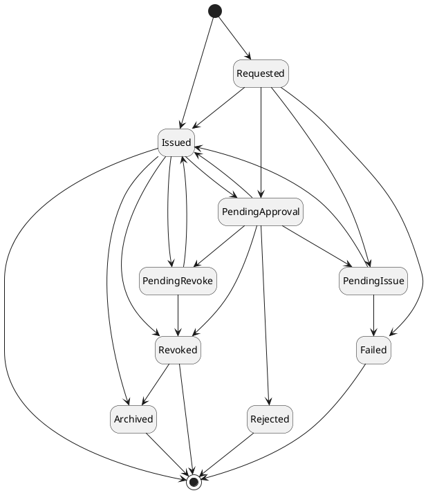
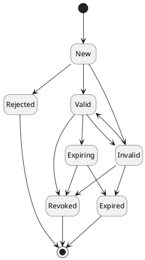
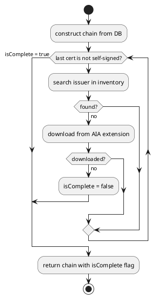
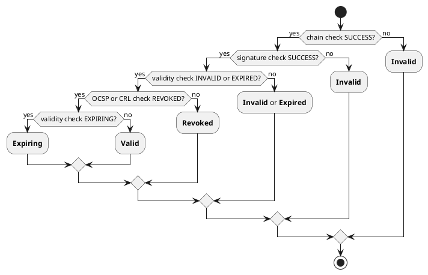

# Certificate

The `Certificate` holds the information about the certificate and its lifecycle. It represents the certificate in a human-readable format. `Certificate` holds the following information of any certificate:

- Human understandable parsed certificate content
- Base64 certificate content
- Certificate state
- Certificate validation status
- Certificate compliance status
- Metadata including discovery information

In addition to the above details, the following are mapped to the `Certificate` for the ease of management,

- Certificate owner
- Binding `RA Profile`
- `Entity`
- `Group` it belongs to

## Certificate state

Certificate status represents stage of certificate lifecycle and transition to different state depends on certificate operations (e.g. issue, revoke, etc.) and/or events (approval expired, certificate revoked externally).

Certificate can be in following states:

| Status             | Description                                                              |
|--------------------|--------------------------------------------------------------------------|
| `Requested`        | The `Certificate` is created (requested) and ready to be issued.         |
| `Pending Approval` | The `Certificate` action is waiting to be approved.                      |
| `Pending Issue`    | The `Certificate` action is waiting to be issued at authority.           |
| `Pending Revoke`   | The `Certificate` action is waiting to be revoked at authority.          |
| `Rejected`         | The `Certificate` issue approval request was rejected.                   |
| `Failed`           | The `Certificate` request issuance failed.                               |
| `Issued`           | The `Certificate` is issued and active.                                  |
| `Revoked`          | The `Certificate` is revoked.                                            |
| `Archived`         | The `Certificate` is archived and not displayed in inventory by default. |

Certificate state transition diagram is as follows:

## Certificate validation status

 or events (e.g. expired, invalid, etc.) in platform.
When certificate is requested, it starts in status `New` and needs to be issued to use it or perform client operations with it.  

The following statuses are supported:

| Status      | Description                                                                       |
|-------------|-----------------------------------------------------------------------------------|
| `New`       | The `Certificate` is created (requested) and ready to be issued                   |
| `Rejected`  | The `Certificate` issue approval request was rejected.                            |
| `Valid`     | The `Certificate` is valid according to validation described [below](#validation) |
| `Invalid `  | The `Certificate` is valid according to validation described [below](#validation) |
| `Revoked`   | The `Certificate` is revoked                                                      |
| `Expiring`  | The `Certificate` is marked as expiring when its expiry is in less than 30 days   |
| `Expired`   | The `Certificate` is expired                                                      |

The `Certificate` status transition diagram is as follows:

## Validation

Certificate validation is a complex process that ensures the security and trustworthiness of digital certificates in various applications, including secure web browsing, email encryption, and digital signatures.
It plays a crucial role in establishing secure and authenticated communication over the internet.

In `CZERTAINLY` platform, certificate validation is periodically checked by system scheduled job to keep up-to-date certificate status.
To achieve that, crucial part of validation algorithm is to update and construct certificate chain (path). Currently, only `X.509` certificates are supported.
Therefore, following description of certificate validation is valid for `X.509` certificate type. 

### Certificate chain

Certificate chain is constructed by following algorithm:
1. Add certificates to chain by recursively following the issuer certificate reference stored in DB.
2. If last certificate is self-signed certificate (presumed root CA), return certificate chain with indication that chain is complete. 
3. Search for issuer certificate in inventory by issuer subject DN. If more candidates are present, take first where verification of certificate signature with its public key is successful. 
4. If no candidate in inventory found, check if Authority Information Access (AIA) extension is available and try to download certificate from URL from AIA extension
5. Construct certificate chain further by repeating step 3 and 4 until no more certificates are available from both sources
6. Return available certificate chain with indication that chain is complete when last certificate is self-signed

### Validation algorithm

Construct the certificate chain and validate certificates from root CA to subject certificate as following based on [RFC5280](https://datatracker.ietf.org/doc/html/rfc5280#section-6):

1. **Check the completeness of chain**
2. **Verify signature of certificate** using issuer public key - [Section 6.1.3 (a)(1)](https://datatracker.ietf.org/doc/html/rfc5280#section-6.1.3)
3. **Check certificate validity** by comparing `notBefore` and `notAfter` dates with current date - [Section 6.1.3 (a)(2)](https://datatracker.ietf.org/doc/html/rfc5280#section-6.1.3)
4. **Consult Revocation Authorities** - [Section 6.1.3 (a)(3)](https://datatracker.ietf.org/doc/html/rfc5280#section-6.1.3)
   - if OCSP is available, then do the OCSP check
   - if CRL information is available, then do the CRL check
   - if no revocation information source is available, show warning that the revocation was not checked, was not available, or related reason.
5. **Check if certificate issuer DN equals to issuer subject DN** - [Section 6.1.3 (a)(4)](https://datatracker.ietf.org/doc/html/rfc5280#section-6.1.3)
6. **Check basic constraints**
   - if certificate is version 3 and not end certificate, check if basic constraint extension is present and CA flag is set to true - [Section 6.1.4 (k)](https://datatracker.ietf.org/doc/html/rfc5280#section-6.1.4)
   - if certificate is CA, check path length greater than zero and less than its issuer - [Section 6.1.4 (l)](https://datatracker.ietf.org/doc/html/rfc5280#section-6.1.4)
7. **Check key usage** of CA certificate [Section 6.1.4 (n)](https://datatracker.ietf.org/doc/html/rfc5280#section-6.1.4)

### Validation check types

Certificate validation algorithm consists of different validation check types. `Certificate` is validated by different criteria to provide partial validation result.

The following validation checks are performed for `Certificate`:

| # | Validation check       | Description                                                                                      | Result                                                                                                                                                                                                                                                                                                                                                                                                                                              |
|---|------------------------|--------------------------------------------------------------------------------------------------|-----------------------------------------------------------------------------------------------------------------------------------------------------------------------------------------------------------------------------------------------------------------------------------------------------------------------------------------------------------------------------------------------------------------------------------------------------|
| 1 | Certificate chain      | Check the completeness of chain (certificate validation path) and validity of issuer certificate | SUCCESS if chain is complete. FAILED if certificate in validation path is missing or issuer certificate is invalid or revoked.                                                                                                                                                                                                                               |
| 2 | Signature verification | Check the signature of `Certificate` using public key of the issuer certificate.                 | NOT CHECKED if issuer is missing. SUCCESS if signature verified. FAILED if verification fails.                                                                                                                                                                                                               |
| 3 | Certificate validity   | Check certificate validity based on `notBefore` and `notAfter` dates of the certificate.         | INVALID in case  `notBefore` >= current date. EXPIRED in case `notAfter` <= current date. EXPIRING in case the `notAfter` is less than 30 days from current date. SUCCESS if `notBefore` < current date.                                                       |
| 4 | OCSP check             | Check status using OCSP URL available in the certificate extension `AuthorityInformationAccess`. | NOT CHECKED if issuer is missing. WARNING if OCSP URL is not available or failed to check status. SUCCESS if OCSP returns `good`. REVOKED if the OCSP return `revoked`.                                                                                        |
| 5 | CRL check              | Check status using CRL USL available in the certificate attribute `CRLDistributionPoints`.       | NOT CHECKED if issuer is missing. WARNING if CRL URL is not available or failed to check status. SUCCESS in case CRL is available, valid, and the certificate is not on the list. REVOKED in case CRL is available, valid, and the certificate is on the list. |
| 6 | Basic Constraints      | Check the basic constraints if extension is present.                                             | FAILED if certificate is version 3, not end certificate and does not have CA flag set. WARNING if cannot check if certificate is CA or path length is greater than its issuer. SUCCESS otherwise.                                                                                                              |
| 7 | Certificate Key Usage  | Check if certificate key can be used to verify signatures. Applicable for CA certificates.       | NOT CHECKED if certificate is not CA. SUCCESS if certificate has `keyCertSign` bit set in key usage extension. FAILED otherwise.                                                                                                                                                                             |

The above is true for a single `Certificate`, but all certificates in the certificate chain are validated the same way.

### Validation result evaluation

After certificate is checked with individual validation check types, check results are then used as input for calculating result certificate validation status. 
Certificate validation checks results and result validation status are then stored and saved.

Calculation of result status is as follows:

## Attributes

`Certificate` attributes hold information related to the platform. Once a certificate request is submitted platform creates the `Certificate` with a specific identification, defines certificate type, and assigns validity status. `Certificate` attributes also include connection to the other part of platform components.

## Metadata

Metadata provides any additional information about the `Certificate` that can be technology specific.
Metadata can be used for further processing of the `Certificate` by different components and modules of the platform.