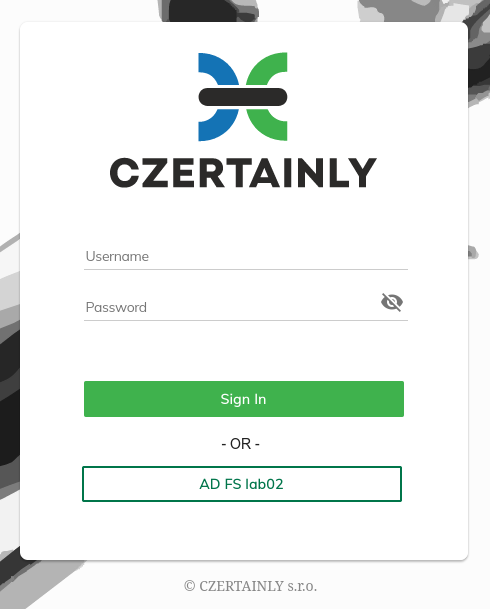

# Overview

This integration guide describes how to use [Microsoft Active Directory Federation Services](https://learn.microsoft.com/en-us/windows-server/identity/ad-fs/ad-fs-overview) (MS AD FS) as an Identity Provider (IdP) for CZERTAINLY platform. MS AD FS comunicate with CZERTAINLY using SAML protocol. The platform is internally using OIDC. Keycloak is used as a bridge and mapping platform between SAML and OIDC.

To complete this integration it is required to have finished integration with [Keycloak](../keycloak/overview). This is typically using [Helm Charts](../../installation-guide/deployment/deployment-helm/overview) for platform installation. The Virtual Appliance is using Helm so it is ready to be integrated with MS AD FS too.

This guide is heavily inspired by the document [How to Setup MS AD FS 3.0 as Brokered Identity Provider in Keycloak](https://www.keycloak.org/2017/03/how-to-setup-ms-ad-fs-30-as-brokered) by Hynek Mlnařík.

## Integration

Integration consists of two steps

| # | Step                 | Description |
|---|----------------------|-------------|
| 1 | [Keycloak](keycloak) | Configure MS AD FS as SAML IdP for Keycloak, define attribute mapping and export SAML XML metadata for AD FS. |
| 2 | [MS AD FS](adfs)      | Import SAML metadata, establish trust and define attribute mapping for CZERTAINLY. |

In case of trouble, there is a short section for [troubleshooting problems with integration](troubleshooting).

## Login using MS AD FS

To log into CZERTIANLY using MS AD FS use the button bellow `Sign In` button on the login page. In our example, it is named `AD FS lab02`.

