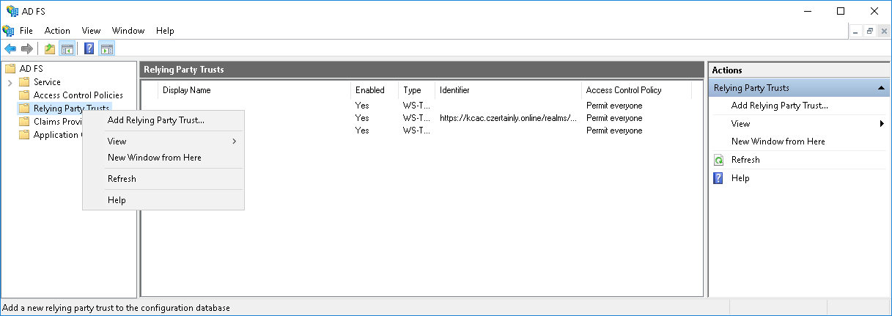
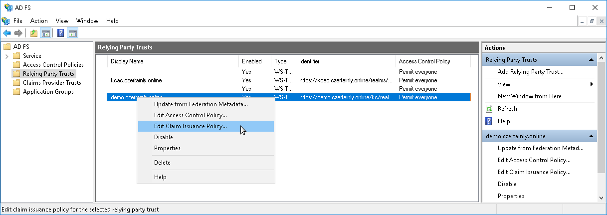

# MS AD FS

In the *AD FS Management console*, right-click `Trust relationships` -> `Relying Party Trusts` and select `Add Relying Party Trust` from the menu:

On the [first page](../../../../docs/assets/MSADFS-AddRelyingParty01.png) of the wizard select that the Relying Party you are going to add is `Claims aware`.

On the [next page](../../../../docs/assets/MSADFS-AddRelyingParty02.png) Import data about the relying party using URL or manually via file by clicking browse.

On the [next page](../../../../docs/assets/MSADFS-AddRelyingParty03.png) you can change the `Display name` of the new Relying party, when done select `Next`.

On the [fourth page](../../../../docs/assets/MSADFS-AddRelyingParty04.png) you can adjust the `Access control Policy` to limit users from using the new Relying Party. When done select `Next`.

On the [fifth page](../../../../docs/assets/MSADFS-AddRelyingParty05.png) you can review all settings, by clicking the `Next` button you will add the new Relying party. Close [sixth page](../../../../docs/assets/MSADFS-AddRelyingParty06.png) and you have finished adding a new Relying party.

Now is AD FS capable of authenticating users, but will not send any user attribute. For that, it is necessary to set claim mapping as described in the following section.

## Setup Claim Mapping

In the list of `Relying Party Trusts` right-click on the newly added Party and from the context menu select `Edit claim Issuance Policy...`

In [newly opened window](../../../../docs/assets/MSADFS-AddClaim1.png) titled `Edit Claim Issuance Policy for ...` click on Add Rule ... and select `Add Transform Claim Rule`. Click the `Next` button, and define [Name ID](../../../../docs/assets/MSADFS-AddClaim2.png) to `use Windows Qualified Domain Name`. With these settings user in CZERTAINLY will have a name in the format `username/domain`.

Click again `Add rule` to define releasing user attributes: Name and email. Select [`Send LDAP Attributes as Claims`](../../../../docs/assets/MSADFS-AddClaim3.png) and [define releasing](../../../../docs/assets/MSADFS-AddClaim4.png) of email address, Given Name and Surname.

To release information about group membership click again on `Add rule` and select [`Send Group Membership as a Claim`](../../../../docs/assets/MSADFS-AddClaim5.png). In the newly opened click on the Browse button and [select the first group](../../../../docs/assets/MSADFS-AddClaim6.png) you want to send to CZERTAINLY. Define also `Claim rule name` in the example we are using `Group: users`, define `Outgoing claim type` as `Group` and finally `Outgoing claim type` as `users`. Click on OK. Repeat for every group you want to share with CZERTAINLY.

In our example [we show](../../../../docs/assets/MSADFS-AddClaim7.png) `Claim Issuance Policy` which releases:
  * *Windows Qualified Domain Name* as *Name ID*
  * *email*, *Given-Name*, *Surname*
  * *Group* with three possible values: *admins*, *managers*, *users*
