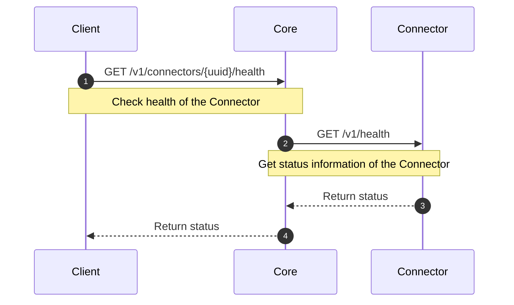

# Health Interface

## Overview

Each `Connector` has to implement the `Health` interface. This interface provides information about the status of services on which the `Connector` depends like database, HSM and so on. Although it is mandatory to implement `Health` interface, it is fully up to the `Connector` implementation what information will be provided.

## How it works

The `Health` interface provides current information about the status of the services provided by the `Connector` whenever it is requested.
Typically, when you would like to access details of the `Connector`, you can request information about its status.

## Health-check information

The status information contains the following structure:
- overall status of the `Connector`
- partial information about the service (which can contain any information and status)

The status can be one of the following:
- ok - service is running as expected
- nok - there is a problem with the service, you should check the `Connector`
- unknown - status information not available

## Processes

### Health-check

The `Client` with proper permissions can request health-check of the `Connectors` and invoke API that works with the `Health` interface of the `Connector`.
The following diagrams represents the requests and communication flow.

## Specification and example

You can find specification and information about the `Health` interface on the following locations:
- [Core Connector API](/api/core-connector/)
- Connector API specifications, see for example [Authority Provider](/api/connector-authority-provider-v2/)