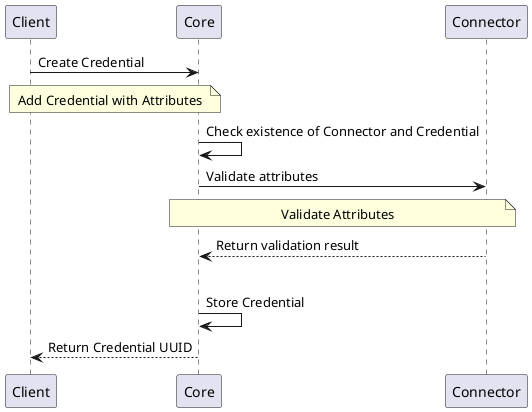
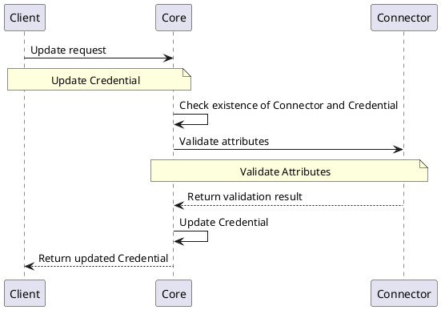
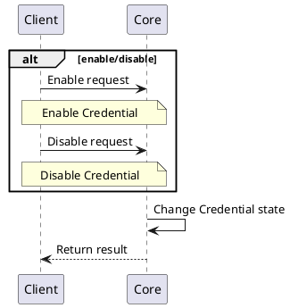

# Credential Provider

## Overview

Typically, when we need to access some service, we need to be properly authenticated and authorized. For this purpose we need to provide information to the service that can be used for this purpose. This is the purpose of the Credential Provider that defines the credential and its properties that are needed to securely access required service.

## How it works

The Credential Provider defines specific configuration of the credentials that can be used across the platform for authentication and authorization. 

## Provider objects

The Credential Provider is managing `Credential` objects.
For more information, refer to [`Credential Component`](../../concept-design/core-components/credential).

## Processes

The following processes are associated with the Credential Provider and management of the `Credential` objects.

### Add `Credential`

### Get `Credential` details

### Update `Credential`

### Remove `Credential`

### Change state of the `Credential`

## Specification and example

The Credential Provider implements [Common Interfaces](common-interfaces/overview).
There are no additional interfaces needed for the Credential Provider.

The OpenAPI specification of the Credential Provider can be found here: [Connector API - Credential Provider](/api/connector-credential-provider/).