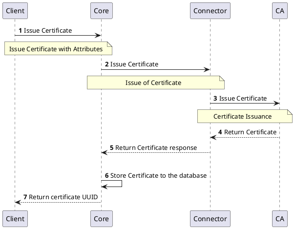
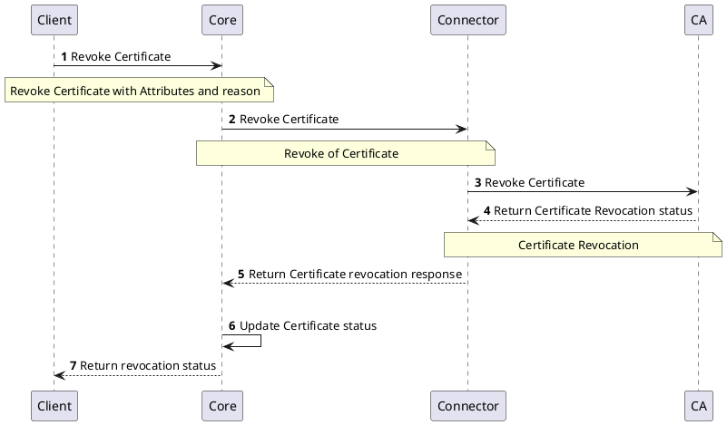

# Authority Provider Legacy

:::caution
Authority Provider Legacy is deprecated and will be removed in future release.
:::

## Overview

Authority Provider Legacy interface provides specific set of certificate management functions that support only API operations of the `EJBCA`.
The interfaces of the Authority Provider Legacy contain:
- Authority Management
- Certificate Management
- End Entity Management
- Profiles Management

## How it works

Authority Provider Legacy provides the ability to communicate with the EJBCA certification authorities.
:::caution
The Authority Provider Legacy interface is designed to work only with the EJBCA. If you are looking to support different technology, consider [Authority Provider v2](authority-provider-v2) interface.
:::

## Provider objects

[`Authority`](../../concept-design/core-components/authority) objects are managed in the platform through the Authority Provider Legacy implementation.

## Processes

The following processes are associated with the Authority Provider Legacy and management of the `Authority` objects.

## `Authority` Instance Management

[//]: # (Description should be independent from v2, it can change in time)
Management of the `Authority` instances are same as the V2 Authority Provider. Refer to the [`V2 Authority Provider`](v2-authority-provider) for more information.

## `Certificate `Management

[//]: # (Description should be independent from v2, it can change in time)
Management of the `Certificates` follows the same structure as V2 Authority Providers, but uses legacy interfaces for all the Certificate related operations . Sections below represents the list of processes involved in managing the certificates.

### Issue `Certificate`

The below diagram shows the sequence of messages that are exchanged between the client, core, and provider to issue a certificate.

### Renew `Certificate`

[//]: # (What about renewal, this is supported I believe)

### Revoke `Certificate`

The below diagram shows the sequence of messages that are exchanged between the client, core, and provider to revoke a certificate.

## Specification and example

The Authority Provider Legacy implements [Common Interfaces](common-interfaces/overview) and the following additional interfaces:
- [Authority Management](/api/connector-authority-provider-legacy/#tag/Authority-Management-API)
- [Certificate Management](/api/connector-authority-provider-legacy/#tag/Certificate-Management-API)
- [End Entity Profiles](/api/connector-authority-provider-legacy/#tag/End-Entity-Profiles-API)
- [End Entity Management](/api/connector-authority-provider-legacy/#tag/End-Entity-Management-API)

The OpenAPI specification of the Authority Provider Legacy can be found here: [Connector API - Authority Provider Legacy](/api/connector-authority-provider-legacy/).
