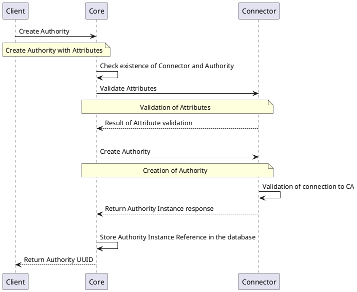
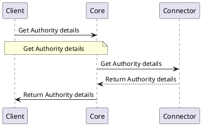
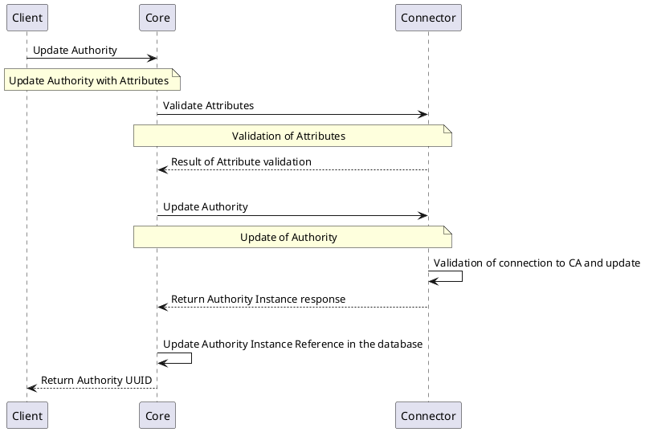
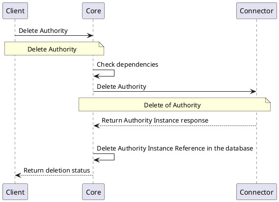
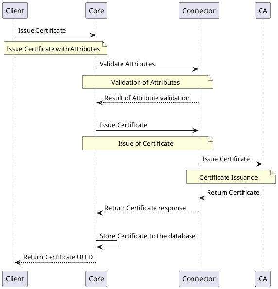
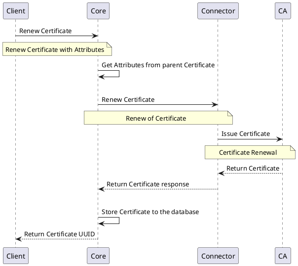
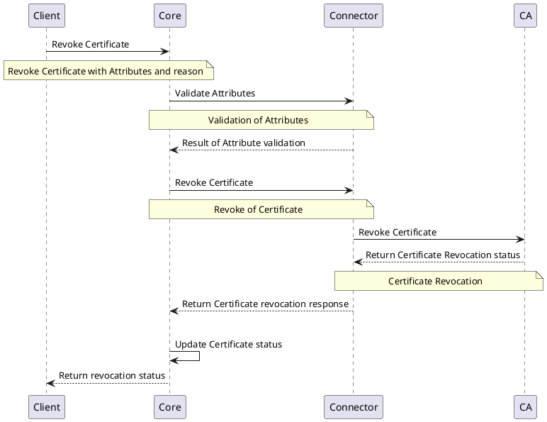

# V2 Authority Provider

## Overview

Authority Providers are the implementations of the `Authority Provider` interface. The Authority Provider interface is used to manage the certificate authority. The Authority Provider acts as an interface between CZERTAINLY `Core` and the certificate authority providing the following functionalities:

1. Issue certificates
2. Revoke certificates
3. Renew certificates 

## How it works

Authority Provider `Connector` provides the ability to communicate with the certificate authorities. Based on the CA the `Connector` connects with, it communicates with the CA using the appropriate protocol and enables the certificate management.

## Provider objects

The `Authority Provider` is managing `Authority` objects.
For more information, refer to [`Authority`](../../concept-design/core-components/authority).

## Processes

This section of the document explains the list of processes involved in managing the certificates on the platform using the `Authority Providers`.

## `Authority` Instance Management

### Create `Authority` Instance

The below diagram shows the sequence of messages that are exchanged between the client, core, and provider for creating a new Authority instance.

### Get `Authority` Instance Details

The below diagram shows the sequence of messages that are exchanged between the client, core, and provider to get the details of an Authority instance.

### Update `Authority` Instance

The below diagram shows the sequence of messages that are exchanged between the client, core, and provider to update an Authority instance.

### Delete `Authority` Instance

The below diagram shows the sequence of messages that are exchanged between the client, core, and provider to delete an Authority instance.

## `Certificate` Management
Sections below represents the list of processes involved in managing the certificates.

### Issue `Certificate`

The below diagram shows the sequence of messages that are exchanged between the client, core, and provider to issue a Certificate.

### Renew `Certificate`

The below diagram shows the sequence of messages that are exchanged between the client, core, and provider to renew a Certificate.

### Revoke `Certificate`

The below diagram shows the sequence of messages that are exchanged between the client, core, and provider to revoke a Certificate.

## Specification and example

`Authority Providers` implement the following `Function Groups`:

- [Authority Management Interface](https://github.com/3KeyCompany/CZERTAINLY-Interfaces/blob/develop/src/main/java/com/czertainly/api/interfaces/connector/AuthorityInstanceController.java)
- [V2 Certificate Management Interface](https://github.com/3KeyCompany/CZERTAINLY-Interfaces/blob/develop/src/main/java/com/czertainly/api/interfaces/connector/v2/CertificateController.java)
- [Health Interface](https://github.com/3KeyCompany/CZERTAINLY-Interfaces/blob/develop/src/main/java/com/czertainly/api/interfaces/connector/HealthController.java)
- [Info](https://github.com/3KeyCompany/CZERTAINLY-Interfaces/blob/develop/src/main/java/com/czertainly/api/interfaces/connector/InfoController.java)
- [Attributes](https://github.com/3KeyCompany/CZERTAINLY-Interfaces/blob/develop/src/main/java/com/czertainly/api/interfaces/connector/AttributesController.java)

:::info
API specification can be found in the [API Specification](https://docs.czertainly.com/api/connector-authority-provider-v2/)
