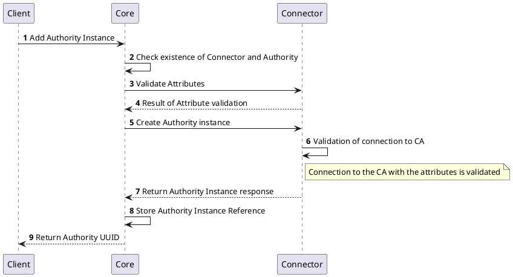
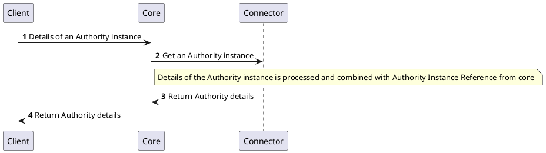
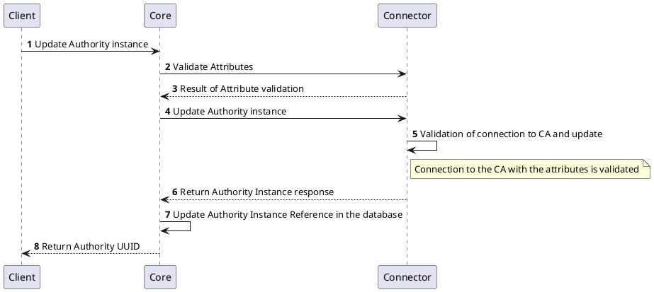
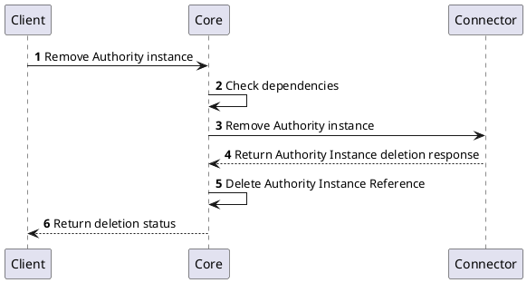
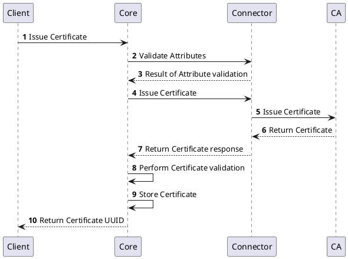
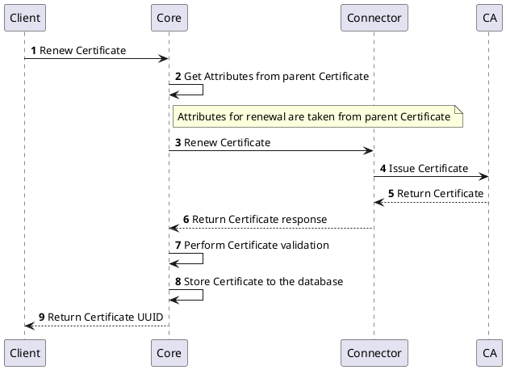
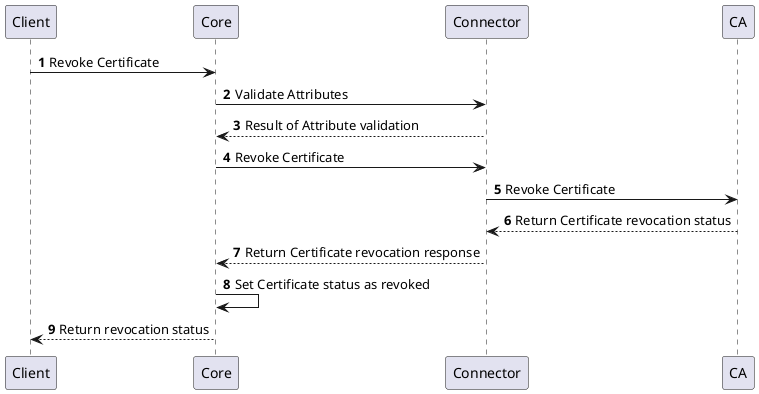

# Authority Provider v2

## Overview

Authority Provider v2 interface is used to manage operations with certificates issued by certification authority. The Authority Provider v2 acts as an interface between the `Core` and the certification authority providing the following management functions:
1. Issue
2. Renew
3. Revoke 

## How it works

Authority Provider v2 provides the ability to communicate with different types and technologies of certification authorities.

## Provider objects

[`Authority`](../../concept-design/core-components/authority) objects are managed in the platform through the Authority Provider v2 implementation.

## Processes

The following processes are associated with the Authority Provider v2 and management of the `Authority` objects.

## `Authority` Instance Management

### Create `Authority` Instance

### Get `Authority` Instance Details

### Update `Authority` Instance

### Delete `Authority` Instance

The below diagram shows the sequence of messages that are exchanged between the client, core, and provider to delete an Authority instance.

## `Certificate` Management
Sections below represents the list of processes involved in managing the certificates.

### Issue `Certificate`

### Renew `Certificate`

### Revoke `Certificate`

## Specification and example

The Authority Provider v2 implements [Common Interfaces](common-interfaces/overview) and the following additional interfaces:
- [Authority Management](/api/connector-authority-provider-v2/#tag/Authority-Management-API)
- [Certificate Management](/api/connector-authority-provider-v2/#tag/Certificate-Management-API)

The OpenAPI specification of the Authority Provider v2 can be found here: [Connector API - Authority Provider v2](/api/connector-authority-provider-v2/).

