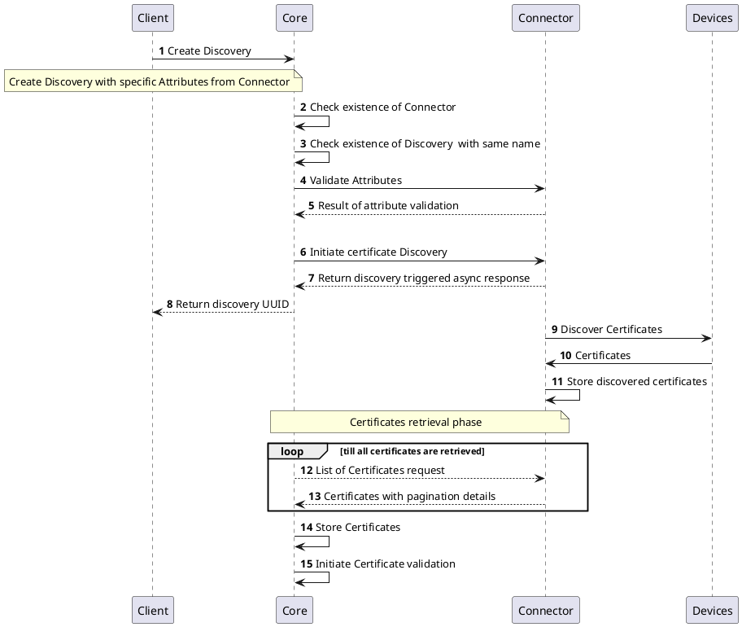
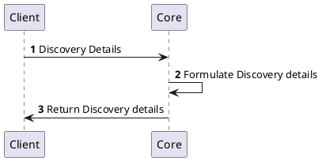
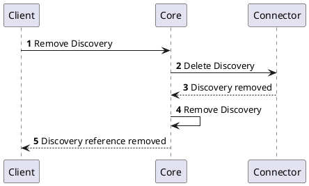

# Discovery Provider

## Overview

Certificate discovery, in other words searching for certificates in various location and sources, is important part of the lifecycle management. It provides clear understanding and visibility on all certificates that are used in the infrastructure and therefore should be included in the inventory to start manage them. Discovery can also detect certificates that are not allowed or should not be deployed.

Discovery Providers implements the functionality to discover certificate. It is responsible for discovering the certificates from defined source and returning the list of certificates to the `Core` inventory and makes it available for various lifecycle management operations.

## How it works

Discovery Provider triggers the discovery process using specific configuration. The trigger is managed from `Core`. Once the certificate discovery process is initiated, platform periodically checks for the discovered certificates that are included in the certificate inventory.

The history of `Discovery` is maintained in the `Core` for further reference.

## Provider objects

[`Discovery`](../../concept-design/modules/certificate-discovery) objects are managed in the platform through the Discovery Provider implementation.
Each `Discovery` provides an overview of the configuration and the discovery process, including discovered certificates.

## Processes

The following processes are associated with the Discovery Provider and management of the `Discovery` objects.

### Create `Discovery`

### Get `Discovery` Details

### Delete `Discovery`

## Specification and example

The Discovery Provider implements [Common Interfaces](common-interfaces/overview) and the following additional interfaces:
- [Discovery](/api/connector-discovery-provider/#tag/Discovery-API)

The OpenAPI specification of the Discovery Provider can be found here: [Connector API - Discovery Provider](/api/connector-discovery-provider/).