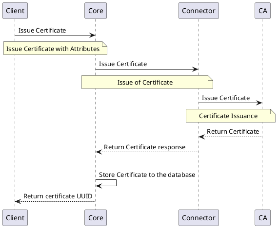
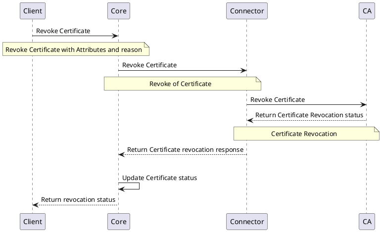

# Legacy Authority Provider

## Overview

Legacy Authority Provider is the implementation of Legacy Authority Provider interface. This `Connector` implements the same functionalities as [V2 Authority Provider](v2-authority-provider) but supports only API operations especially for `EJBCA`

## How it works

Authority Provider `Connector` provides the ability to communicate with the certificate authorities. Based on the CA the `Connector` connects with, it communicates with the CA using the appropriate protocol and enables certificate management.

## Provider objects

The Authority Provider is managing `Authority` objects.
For more information, refer to [`Authority`](../../concept-design/core-components/authority).

## Processes

This section of the document explains the list of processes involved in managing the certificates on the platform using the Authority Providers.

## `Authority` Instance Management

Management of the `Authority` instances are same as the V2 Authority Provider. Refer to the [`V2 Authority Provider`](v2-authority-provider) for more information.

## `Certificate `Management

Management of the `Certificates` follows the same structure as V2 Authority Providers, but uses legacy interfaces for all the Certificate related operations . Sections below represents the list of processes involved in managing the certificates.

### Issue `Certificate`

The below diagram shows the sequence of messages that are exchanged between the client, core, and provider to issue a certificate.

### Revoke `Certificate`

The below diagram shows the sequence of messages that are exchanged between the client, core, and provider to revoke a certificate.

## Specification and example

`Authority Providers` implement the following `Function Groups`:

- [Authority Management Interface](https://github.com/3KeyCompany/CZERTAINLY-Interfaces/blob/develop/src/main/java/com/czertainly/api/interfaces/connector/AuthorityInstanceController.java)
- [V2 Certificate Management Interface](https://github.com/3KeyCompany/CZERTAINLY-Interfaces/blob/develop/src/main/java/com/czertainly/api/interfaces/connector/CertificateController.java)
- [Health Interface](https://github.com/3KeyCompany/CZERTAINLY-Interfaces/blob/develop/src/main/java/com/czertainly/api/interfaces/connector/HealthController.java)
- [Info](https://github.com/3KeyCompany/CZERTAINLY-Interfaces/blob/develop/src/main/java/com/czertainly/api/interfaces/connector/InfoController.java)
- [Attributes](https://github.com/3KeyCompany/CZERTAINLY-Interfaces/blob/develop/src/main/java/com/czertainly/api/interfaces/connector/AttributesController.java)

:::info
API specification can be found in the [API Specification](https://docs.czertainly.com/api/connector-authority-provider-v2/)
