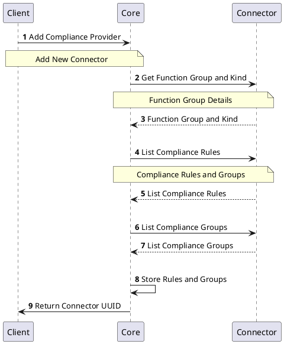

# Compliance Provider

## Overview

Each certificate and cryptographic key can contain various attributes and can be based on different algorithms. There are also various standards and regulations that require specific behaviour of the certificate, for example to be able to react on algorithm deprecation or vulnerabilities. The compliance checking helps to monitor the compliance status of each certificate that is included in the inventory of the platform.

Compliance Provider implements the functionality of compliance settings and checking for the certificates available in the platform. it applies specific compliance rules and group of compliance rules to `Certificate` and informs about the compliance status. Based on the compliance check, the `Certificate` will either be determined as compliant or not compliant.

## How it works

Compliance Provider have a set of applicable compliance rules and groups that can be configured as part of the `Compliance Profile`. This defines the set of compliance requirements. To check for the compliance status, `Compliance Profile` should be associated with `RA Profile`. After that every `Certificate` managed by such `RA Profile` will be checked against compliance rules configured in the `Compliance Profile`.

Compliance checking can be executed on `RA Profile` level (for all `Certificates`), for every specific `Certificate` in the inventory, or for each `Compliance Profile`. 

## Provider objects

[`Compliance Profiles`](../../concept-design/core-components/compliance-profile) objects are managed in the platform through the Compliance Provider implementation.
Each `Compliance Profile` contains a list of available compliance rules and groups that can be applied for a compliance checking.
Many different `Compliance Profiles` with differenty compliance requirements can be managed and applied on certificates.

[//]: # (This should be part of the Compliance Profile description)
The table below shows the provider specific objects that are part of the provider.

| Object | Purpose |
| -------- | --------- |
| `Rule` | The `rule` that is used to check the compliance of the `Certificate`. `Rules` contains specific logic that will apply it to the certificate. If the rule is satisfied, then the certificate is marked as `Compliant`. Else the certificate is marked as `Non Compliant`|
| `Group` | The `group` of `rules` that are used to check the compliance of the certificate. The groups are the logical grouping of the `rules` provided by the `Compliance Provider`. A `rule` may or may not be a part of the `Group`|

## Processes

The following processes are associated with the Compliance Provider and management of the `Compliance Profile` objects and checking compliance status of `Certificate` object.

### Add Compliance Provider

### Check Certificate Compliance

This section of the document describes the process of checking the compliance of the certificate.

:::info
When a request is made to check the compliance of the `Certificate`, the `Core` gathers list of rules configure in the associated `Compliance Profile` and request each Compliance Profiles for the specific compliance rule result. After all compliance rules are evaluated, the `Core` then computes the overall compliance status.
:::

## Specification and example

The Compliance Provider implements [Common Interfaces](common-interfaces/overview) and the following additional interfaces:
- [Compliance Rules](/api/connector-compliance-provider/#tag/Compliance-Rules-API)
- [Compliance](/api/connector-compliance-provider/#tag/Compliance-API)

The OpenAPI specification of the Compliance Provider can be found here: [Connector API - Compliance Provider](/api/connector-compliance-provider/).