# Entity Provider

:::info Using Entity Provider
Entity Provider helps to integrate any technology (open and proprietary) that is not able, not capable, or you do not want to, use standard interface and protocols for management and automation of the certificate and cryptographic keys lifecycle.
:::

## Overview

The `Certificate` can be stored and managed in various locations in the infrastructure. Entity Provide gives you the capability of management entities that are the end user of `Certificates` and if supported, manage their location with associated `Certificate` and cryptographic key.

Entity Provider can implement literally any type of the certificate store.

## How it works

[//]: # (This is not a specific description of keystore entity provide, it should be general)
Keystore Entity Provider `Connector` provides access to the keystore locations on the remote servers. Multiple locations on one server are supported. The Connector can create multiple Entities and automate the certificate lifecycle on associated locations.

## Provider objects

[`Entity`](../../concept-design/core-components/entity) and [Location](../../concept-design/core-components/location) objects are managed in the platform through the Entity Provider implementation.
`Entity` represents end user of the `Certificate` and it can have access to multiple `Locations`.

[//]: # (This should be described in the components)
[//]: # (Description is brief, it should be extended with all features that locations and entities provide, for example there is no mention about the multiple entries or key management support, etc.)

| Object | Purpose |
| -------- | --------- |
| `Entity` | The `Entity` that is managed by the `Entity Provider`. Entities are comprised of multiple locations|
| `Location` | The `location` of the `Entity` that is managed by the `Entity Provider`. Location is the object that contains the details of the certificates and information about where they are currently deployed. A Single location can have more than one certificates |

## Processes related to `Entity`

The following processes are associated with the Entity Provider and management of the `Entity` objects.

### Create `Entity`

The below diagram shows the sequence of messages that are exchanged between the client, core, and provider to create an `Entity`.

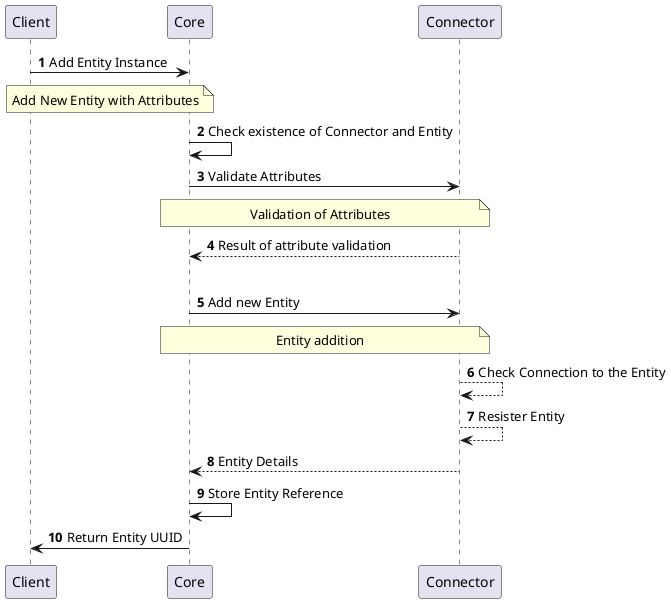

### Get `Entity` Details

The below diagram shows the sequence of messages that are exchanged between the client, core, and provider to get the details an `Entity`.

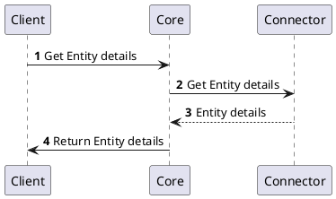

### Update `Entity`

The below diagram shows the sequence of messages that are exchanged between the client, core, and provider to update an `Entity`.

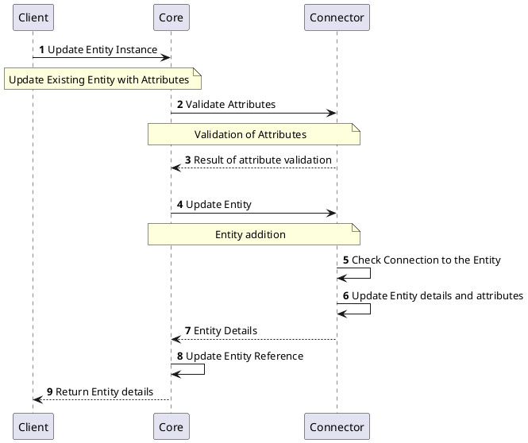

### Remove `Entity`

The below diagram shows the sequence of messages that are exchanged between the client, core, and provider to delete an `Entity`.

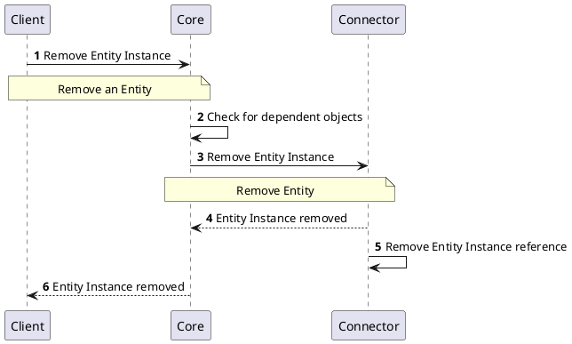

## Processes related to `Location`

The following processes are associated with the Entity Provider and management of the `Location` objects.

### Create `Location`

The below diagram shows the sequence of messages that are exchanged between the client, core, and provider to create a `Location`.

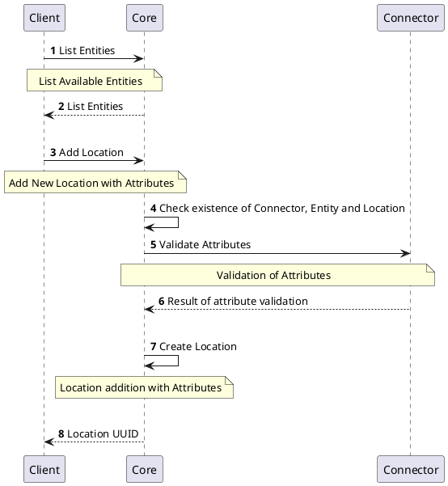

### `Location` Details

The below diagram shows the sequence of messages that are exchanged between the client, core, and provider to remove a `Location`.

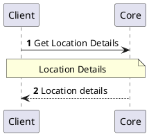

### Update `Location`

The below diagram shows the sequence of messages that are exchanged between the client, core, and provider to update a `Location`.

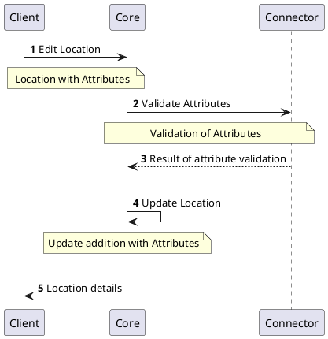

### Remove `Location`

The below diagram shows the sequence of messages that are exchanged between the client, core, and provider to remove a `Location`.

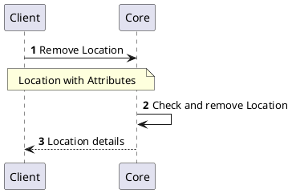

### Change `Location` State

The below diagram shows the sequence of messages that are exchanged between the client, core, and provider to enable/disable a `Location`.

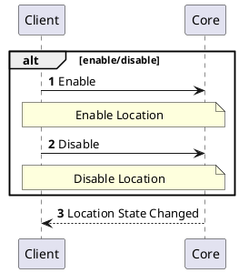

### Issue `Certificate` in `Location`

The below diagram shows the sequence of messages that are exchanged between the client, core, and provider to issue a certificate in the `Location`.

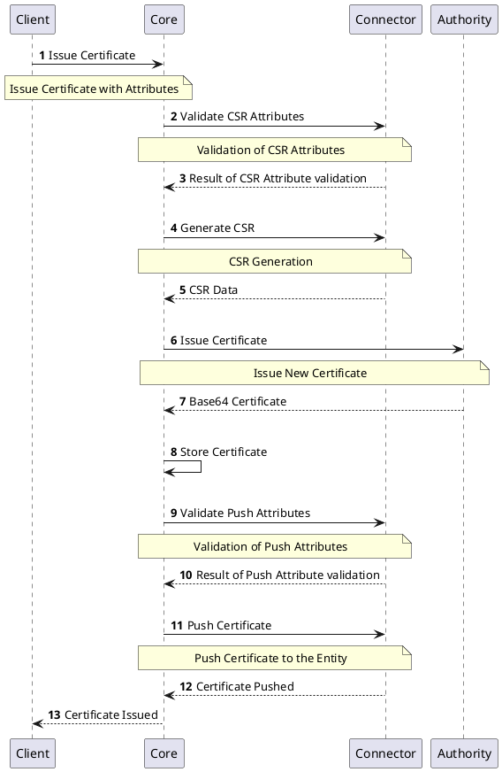

### Renew `Certificate` in `Location`

The below diagram shows the sequence of messages that are exchanged between the client, core, and provider to renew a certificate in the `Location`.

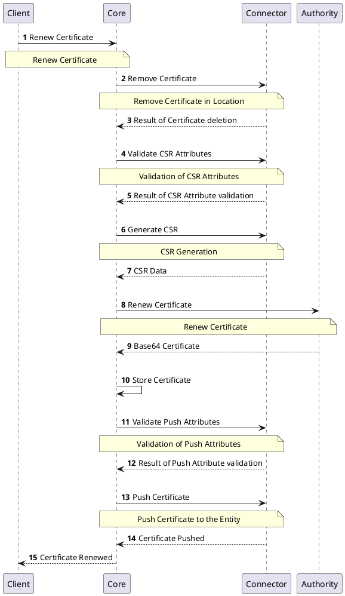

### Push `Certificate` to `Location`

The below diagram shows the sequence of messages that are exchanged between the client, core, and provider to push a certificate to the `Location`.

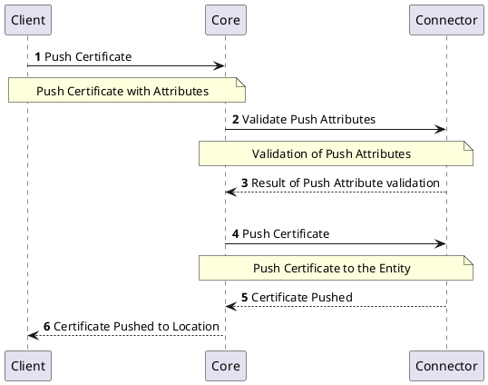

### Delete `Certificate` from `Location`

The below diagram shows the sequence of messages that are exchanged between the client, core, and provider to revoke and delete a certificate from the `Location`.

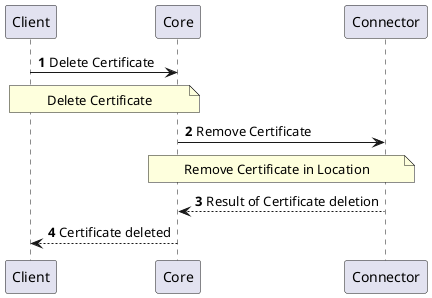

## Specification and example

The Entity Provider implements [Common Interfaces](common-interfaces/overview) and the following additional interfaces:
- [Entity Management](/api/connector-entity-provider/#tag/Entity-Management-API)
- [Location Operations](/api/connector-entity-provider/#tag/Location-Operations-API)

The OpenAPI specification of the Entity Provider can be found here: [Connector API - Entity Provider](/api/connector-entity-provider/).
