# Entity Provider

:::info Using Entity Provider
Entity Provider helps to integrate any technology (open and proprietary) that is not able, not capable, or you do not want to, use standard interface and protocols for management and automation of the certificate and cryptographic keys lifecycle.
:::

## Overview

The `Certificate` can be stored and managed in various locations in the infrastructure. Entity Provide gives you the capability of management entities that are the end user of `Certificates` and if supported, manage their location with associated `Certificate` and cryptographic key.

Entity Provider can implement literally any type of the certificate store.

## How it works

Entity Provider `Connector` provides access to the locations on the remote devices. These devices are the actual end-users of the certificate. Multiple locations on one server are supported. The Connector can create multiple Entities and automate the certificate lifecycle on associated locations.

## Provider objects

[`Entity`](../../02-concept-design/04-core-components/09-entity.md) and [`Location`](../../02-concept-design/04-core-components/10-location.md) objects are managed in the platform through the Entity Provider implementation.
`Entity` represents end user of the `Certificate` and it can have access to multiple `Locations`.

The following diagram shows the relation (sample) between `Entity Provier`, `Entity`, `Location`, and `Certificate`:

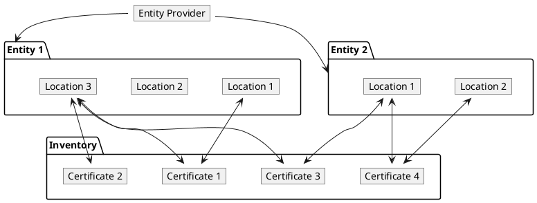

## Processes related to `Entity`

The following processes are associated with the Entity Provider and management of the `Entity` objects.

### Create `Entity`

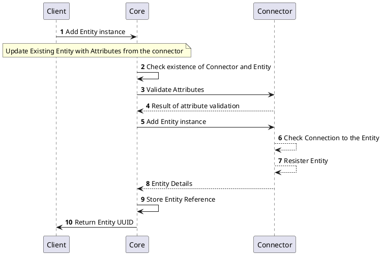

### Get `Entity` Details

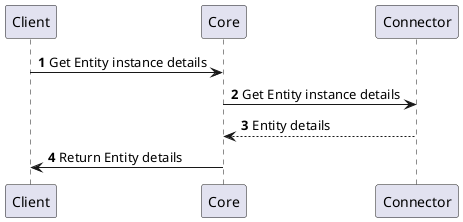

### Update `Entity`

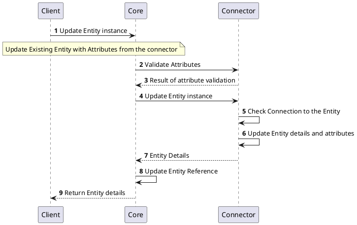

### Remove `Entity`

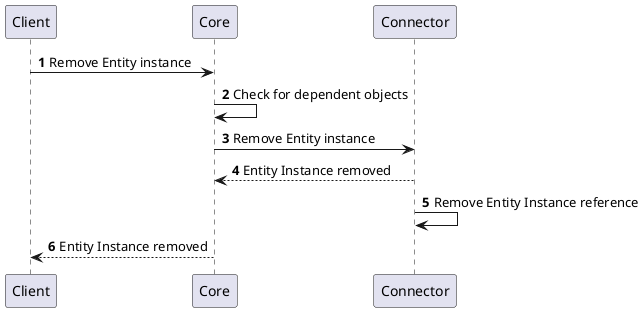

## Processes related to `Location`

The following processes are associated with the Entity Provider and management of the `Location` objects.

### Create `Location`

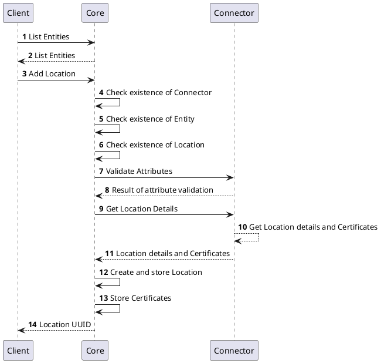

### `Location` Details

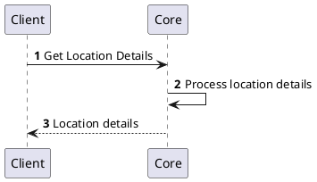

### Update `Location`

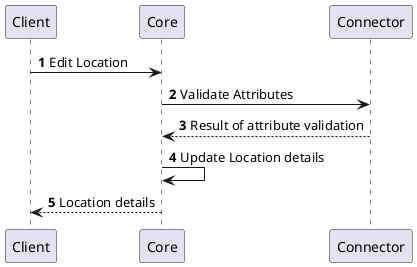

### Remove `Location`

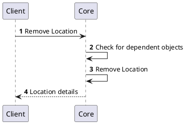

### Change `Location` State

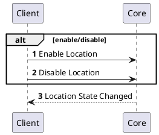

### Issue `Certificate` in `Location`

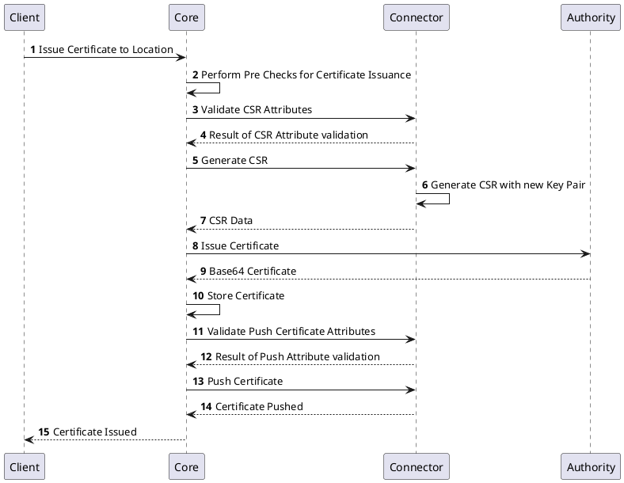

### Renew `Certificate` in `Location`

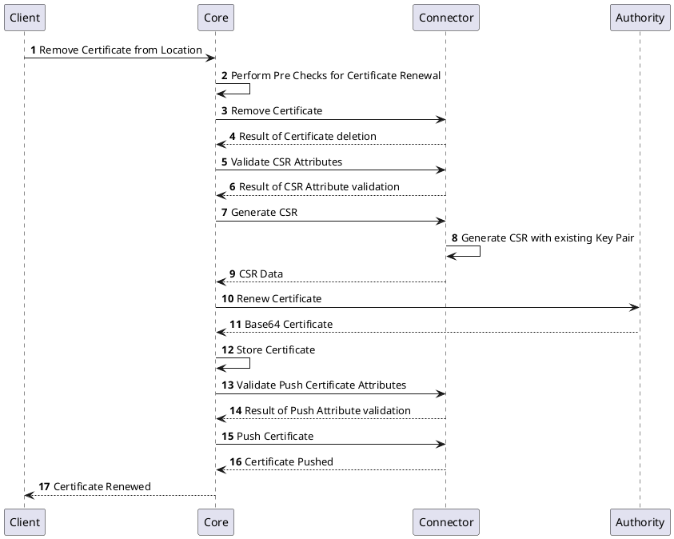

### Push `Certificate` to `Location`

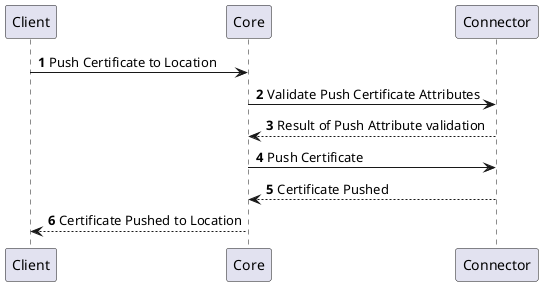

### Delete `Certificate` from `Location`

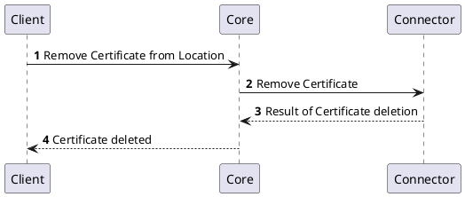

## Specification and example

The Entity Provider implements [Common Interfaces](common-interfaces/overview) and the following additional interfaces:
- [Entity Management](/api/connector-entity-provider/#tag/Entity-Management-API)
- [Location Operations](/api/connector-entity-provider/#tag/Location-Operations-API)

The OpenAPI specification of the Entity Provider can be found here: [Connector API - Entity Provider](/api/connector-entity-provider/).
