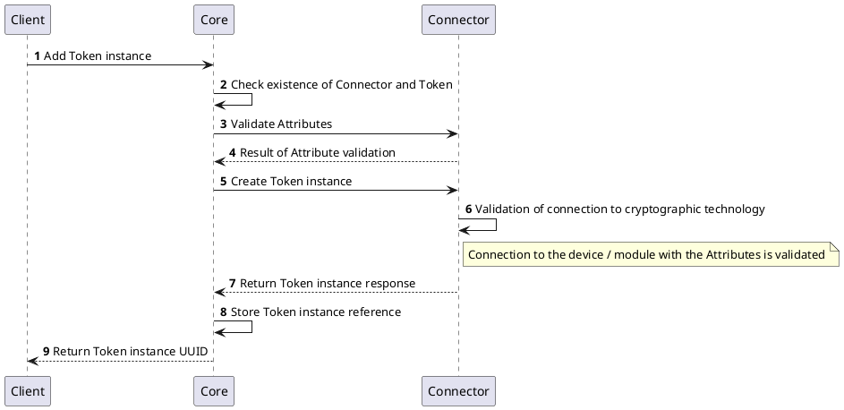
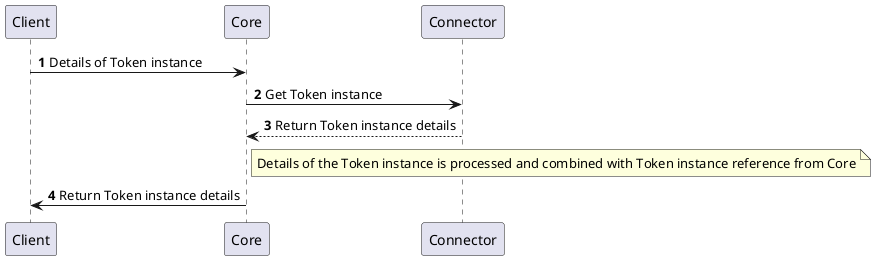
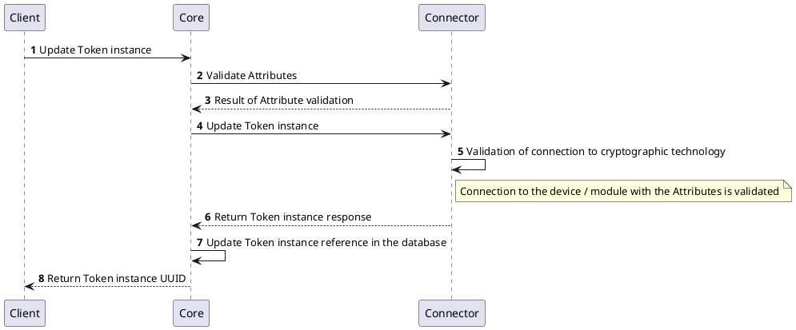
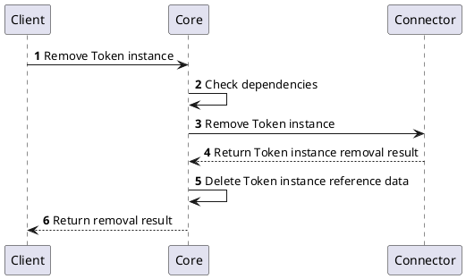
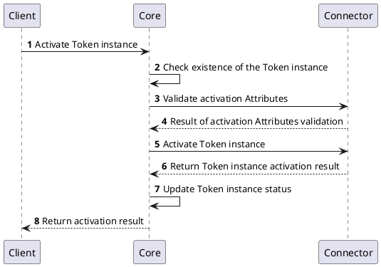
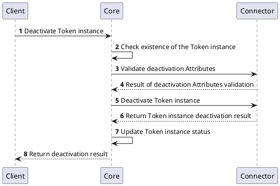
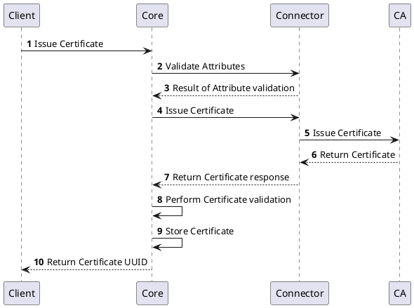
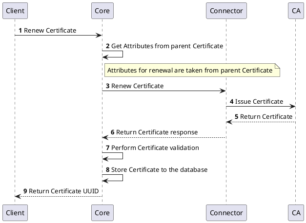
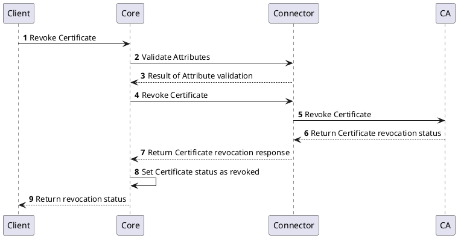

# Cryptography Provider

## Overview

Cryptography Provider has capability of cryptographic token management and cryptographic key operations that is connected with specific technology like hardware security module, security vault, etc. Cryptographic keys that are created and used in the context of Cryptography Provider are managed by the implementation of Connector and can be used in the platform to execute cryptographic operation with the key.

:::note Entity Provider key management
The Entity Provider Connectors are also capable of key management operations that allow to create private key and sign CSR. These capabilities are available only for the entities managed by the Entity Provider Connector. The Crypto Provider brings key management capabilities for the entire platform.
:::

Using Cryptography Provider, the platform can generate new key pairs, sign the certification signing request, decrypt incoming requests to issue certificate, and many more. 

## How it works

Cryptography Provider implements specific technology capable of managing and using cryptographic keys. Independently of the connected technology, it provides interfaces to manage cryptographic tokens and cryptographic keys in a consistent way. The token is considered to be logical unit maintaining its cryptographic keys and there can be as many tokens as required with proper authentication or activation data.

When there is a need to use cryptographic key, platform can request operation on top of some specific key and the operation will be executed in the technology through the Cryptography Provider implementation. Supported operations are:
- Create / Destroy Key
- Encrypt / Decrypt
- Sign / Verify
- Generate random data

## Provider objects

### Token

Token represents the logical separation of cryptographic keys. One token can contain multiple cryptographic keys. Each Cryptography Provider connector can have multiple tokens. The token is identified by its name and it is unique within the Cryptography Provider connector. Tokens can be managed in the platform.

`Token` can have the following status:

| Status         | Description                                                                                                 |
|----------------|-------------------------------------------------------------------------------------------------------------|
| `ACTIVE`       | Token is active and can be used for key management cryptographic operations                                 |
| `INACTIVE`     | Token is inactive and should be activated before any key management or cryptographic operations is executed |
| `WARNING`      | Token seems to be connected and activated, however, something might be wrong, see more details              |
| `CONNECTED`    | Token is connected but cannot be activated                                                                  |
| `DISCONNECTED` | Token is disconnected from the technology and cannot be used                                                |
| `UNKNONW`      | Unknown state, see logs or details of the Connector                                                         |

### Token Profile

Token Profile represents key management and cryptographic operations service that can be consumed by clients and users. Each Token Profile can be associated with only one Token, but multiple Token Profiles can be assigned with the same Token. Token Profile consists of additional management, compliance, and security rules that apply for the service, like key management interface (PKCS#11, KMIP), or key usage policy (signing, encryption, etc.). Token Profile is identified by its name and it is unique within the platform.

### Inventory of Keys

Every Key that is created is stored in the inventory of cryptographic keys. Inventory of cryptographic keys is a list of all keys that are created in the platform. The inventory is used to track the keys and their usage. Attributes of the Keys are managed consistently in the platform and each Key is associated with the Token Profile that is used to manage it.

The following diagram shows the relationship between Token, Token Profile, and Keys in the inventory.

```plantuml
map "Cryptography Provider" as cp {
}

package "Tokens" {
    map "Token 1" as t1 {
    }
    map "Token 2" as t2 {
    }
    map "Token 3" as t3 {
    }
}


package "Token Profiles" as tps {
    map "Token Profile 1" as tp1 {
    }
    map "Token Profile 2" as tp2 {
    }
    map "Token Profile 3" as tp3 {
    }
    map "Token Profile 4" as tp4 {
    }
}

package "Inventory of keys" {
    map "Key 1" as k1 {
    }
    map "Key 2" as k2 {
    }
    map "Key 3" as k3 {
    }
    map "Key 4" as k4 {
    }
}

cp --> t1
cp --> t2
cp --> t3
tp1 <-> t1
tp2 <--> t1
tp3 <--> t3
tp4 <--> t2
k1 <--> tp1
k2 <--> tp1
k3 <--> tp2
k4 <--> tp3
```

## Processes

The following processes are associated with the Cryptography Provider and management of the `Token` and `Key` objects.

## `Token` instance management

### Create `Token` instance



### Get `Token` instance details



### Update `Token` instance



### Remove `Token` instance

When the `Token` is removed, it does not necessarily mean that it was removed from the Connector and all Keys were destroyed.



### Get `Token` instance status

Status of the `Token` can be regularly checked by the platform. See the [list of possible states](#token) of the `Token`.

### Activate `Token` instance

`Token` can be activated when is in the `CONNECTED` or `INACTIVE` state. Activation of the `Token` is required before any key management and cryptographic operations can be performed.



### Deactivate `Token` instance




## `Certificate` Management
Sections below represents the list of processes involved in managing the certificates.

### Issue `Certificate`



### Renew `Certificate`



### Revoke `Certificate`



## Specification and example

The Authority Provider v2 implements [Common Interfaces](common-interfaces/overview) and the following additional interfaces:
- [Authority Management](/api/connector-authority-provider-v2/#tag/Authority-Management-API)
- [Certificate Management](/api/connector-authority-provider-v2/#tag/Certificate-Management-API)

The OpenAPI specification of the Authority Provider v2 can be found here: [Connector API - Authority Provider v2](/api/connector-authority-provider-v2/).

