# Entity Provider

## Overview

Entity Providers are the implementation of management of `Certificates` in the end entities. These end entity can be of any type of devices like key stores, servers, mobile devices, etc. `Entity Providers` provides the communication channel between the entity and the core.

`Entity Providers` provides the pathways to perform the following operations:
- Discover the `Certificates` in the entity
- Remove a `Certificate` from the entity
- Issue a new `Certificate` to the entity
- Push an existing `Certificate` to the entity

## How it works

Keystore Entity Provider `Connector` provides access to the keystore locations on the remote servers. Multiple locations on one server are supported. The Connector can create multiple Entities and automate the certificate lifecycle on associated locations.

## Provider objects

The table below contains the list of `Entity Provider` specific objects.

| Object | Purpose |
| -------- | --------- |
| `Entity` | The `Entity` that is managed by the `Entity Provider`. Entities are comprised of multiple locations|
| `Location` | The `location` of the `Entity` that is managed by the `Entity Provider`. Location is the object that contains the details of the certificates and information about where they are currently deployed. A Single location can have more than one certificates |

## Processes

This section of the document explains the list of processes involved in managing the certificates on the entities using the `Entity Providers`.

## Entity
Sections below represents the list of processes involved in managing the entities.

### Create `Entity`

The below diagram shows the sequence of messages that are exchanged between the client, core, and provider to create an `Entity`.

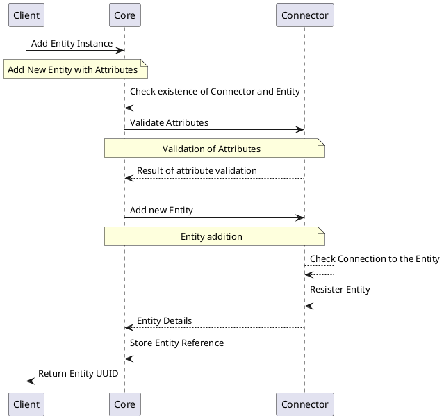

### Get `Entity` Details

The below diagram shows the sequence of messages that are exchanged between the client, core, and provider to get the details an `Entity`.

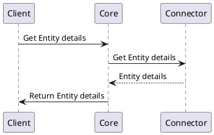

### Update `Entity`

The below diagram shows the sequence of messages that are exchanged between the client, core, and provider to update an `Entity`.

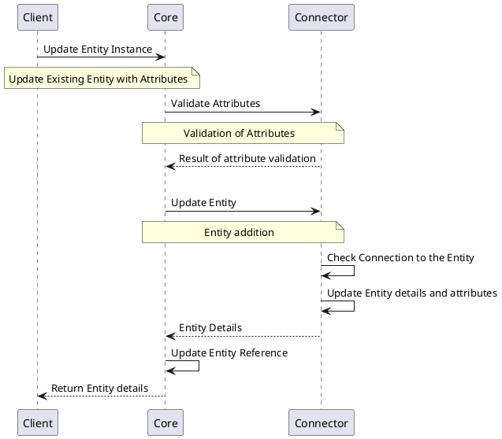

### Remove `Entity`

The below diagram shows the sequence of messages that are exchanged between the client, core, and provider to delete an `Entity`.

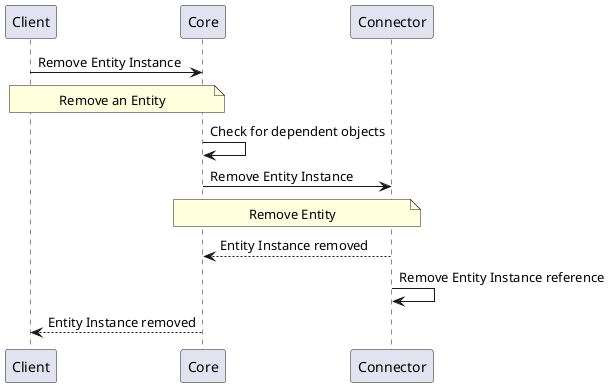

## Location
Sections below represents the list of processes involved in managing the locations on an `Entity`.

### Create `Location`

The below diagram shows the sequence of messages that are exchanged between the client, core, and provider to create a `Location`.

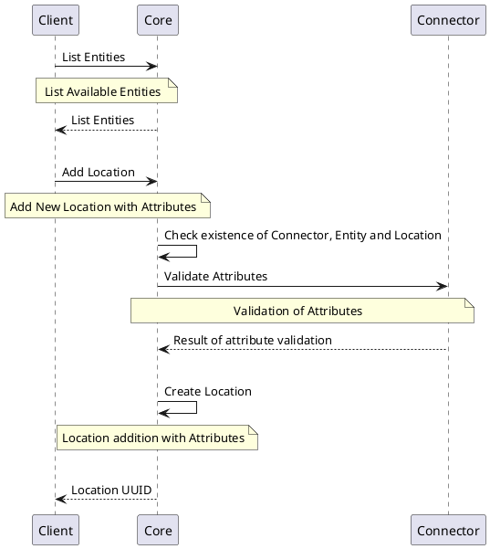

### `Location` Details

The below diagram shows the sequence of messages that are exchanged between the client, core, and provider to remove a `Location`.

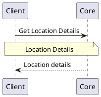

### Update `Location`

The below diagram shows the sequence of messages that are exchanged between the client, core, and provider to update a `Location`.

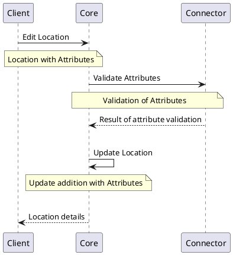

### Remove `Location`

The below diagram shows the sequence of messages that are exchanged between the client, core, and provider to remove a `Location`.

### Change `Location` State

The below diagram shows the sequence of messages that are exchanged between the client, core, and provider to enable/disable a `Location`.

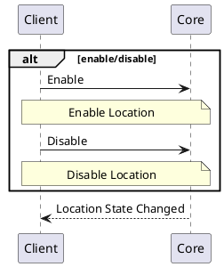

### Issue `Certificate` in `Location`

The below diagram shows the sequence of messages that are exchanged between the client, core, and provider to issue a certificate in the `Location`.

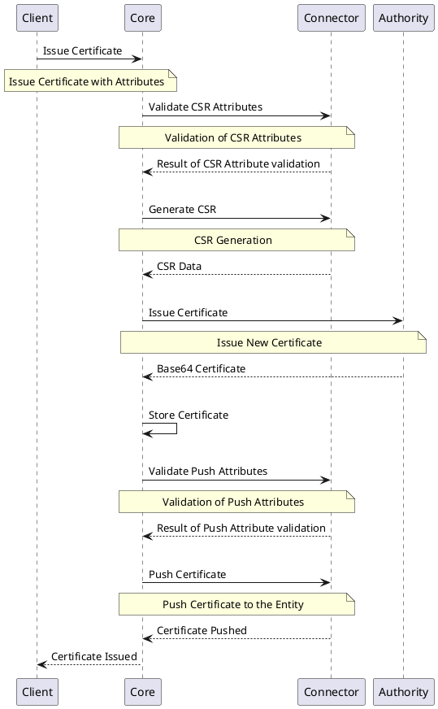

### Renew `Certificate` in `Location`

The below diagram shows the sequence of messages that are exchanged between the client, core, and provider to renew a certificate in the `Location`.

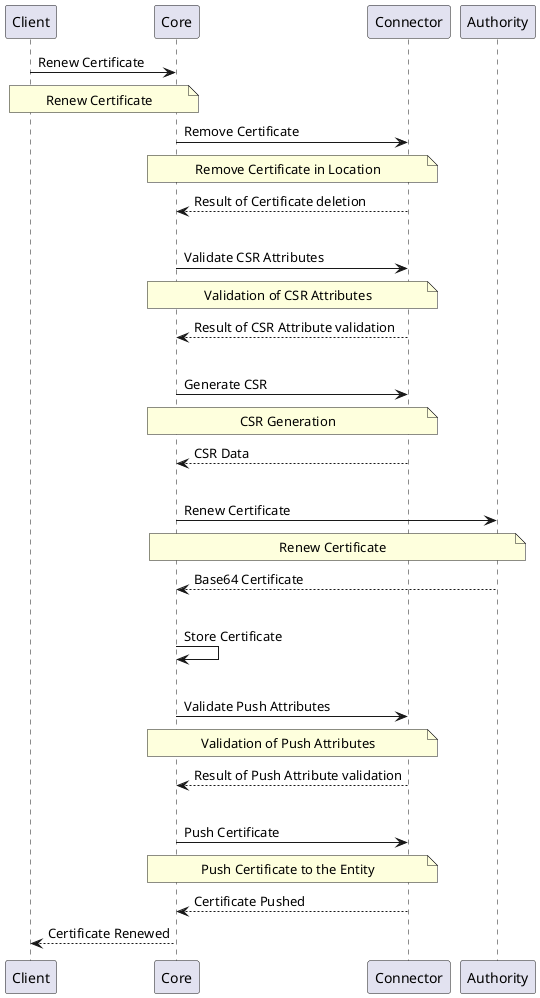

### Push `Certificate` to `Location`

The below diagram shows the sequence of messages that are exchanged between the client, core, and provider to push a certificate to the `Location`.

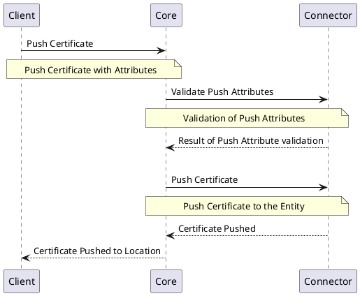

### Delete `Certificate` from `Location`

The below diagram shows the sequence of messages that are exchanged between the client, core, and provider to revoke and delete a certificate from the `Location`.

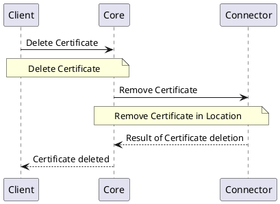

## Specification and example

`Entity Providers` implement the following `Function Groups`:

- [Entity Interface](https://github.com/3KeyCompany/CZERTAINLY-Interfaces/blob/develop/src/main/java/com/czertainly/api/interfaces/connector/entity/EntityController.java)
- [Location Interface](https://github.com/3KeyCompany/CZERTAINLY-Interfaces/blob/develop/src/main/java/com/czertainly/api/interfaces/connector/entity/LocationController.java)
- [Health Interface](https://github.com/3KeyCompany/CZERTAINLY-Interfaces/blob/develop/src/main/java/com/czertainly/api/interfaces/connector/HealthController.java)
- [Info](https://github.com/3KeyCompany/CZERTAINLY-Interfaces/blob/develop/src/main/java/com/czertainly/api/interfaces/connector/InfoController.java)
- [Attributes](https://github.com/3KeyCompany/CZERTAINLY-Interfaces/blob/develop/src/main/java/com/czertainly/api/interfaces/connector/AttributesController.java)

:::info
API specification can be found in the [API Specification](https://docs.czertainly.com/api/connector-entity-provider/)
