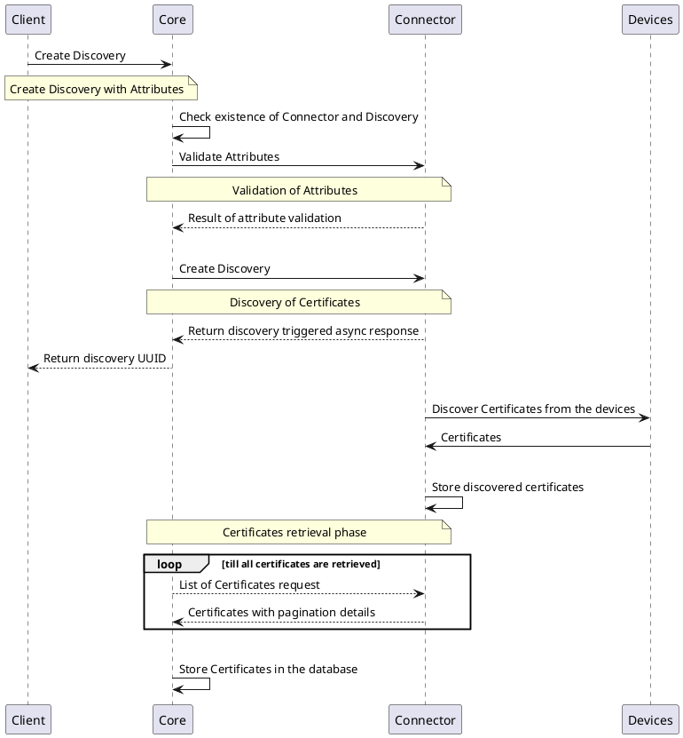
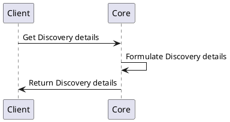
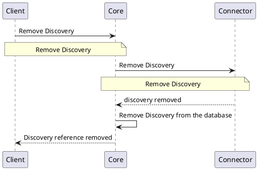

# Discovery Provider

## Overview

Discovery Providers are the implementation of the functionality to discover certificate from various sources. A Discovery Provider is responsible for discovering the certificates from the source and returning the list of certificates to the `Core`. The `Core` then stores the certificates in the database and makes it available for the users to perform various operations.

## How it works

This section of the document describes the process of working with the Discovery Provider.

The step by step process of working of `Discovery Provider` is as follows:
1. Each `Discovery Providers` has their own list of `attributes` based on their integration with the technology.
2. `Core` sends the request to the `Discovery Provider` with the list of `attributes`.
3. `Discovery Provider` uses the list of `attributes` to discover the certificates from the source.
4. `Discovery Provider` returns the list of certificates to the `Core`.
5. `Core` stores the certificates in the database.

## Provider objects

The Discovery Provider is managing `Discovery` Module.
For more information, refer to [`Discovery`](../../concept-design/modules/certificate-discovery).

## Processes

This section of the document describes the list of processes involved in discovering the certificates using the Discovery Providers.

### Create `Discovery`

The below diagram shows the sequence of messages that are exchanged between the client, core, and provider to create a `Discovery`.

### Get `Discovery` Details

The below diagram shows the sequence of messages that are exchanged between the client, core, and provider to get the details of a `Discovery`.

### Delete Discovery

The below diagram shows the sequence of messages that are exchanged between the client, core, and provider to delete a `Discovery`.

To know more about the `Certificate Discovery`, [click here](../../concept-design/modules/certificate-discovery)

## Specifications

`Discovery Providers` implement the following interfaces:

- [Discovery Interface](https://github.com/3KeyCompany/CZERTAINLY-Interfaces/blob/develop/src/main/java/com/czertainly/api/interfaces/connector/DiscoveryController.java)
- [Health Interface](https://github.com/3KeyCompany/CZERTAINLY-Interfaces/blob/develop/src/main/java/com/czertainly/api/interfaces/connector/HealthController.java)
- [Info](https://github.com/3KeyCompany/CZERTAINLY-Interfaces/blob/develop/src/main/java/com/czertainly/api/interfaces/connector/InfoController.java)
- [Attributes](https://github.com/3KeyCompany/CZERTAINLY-Interfaces/blob/develop/src/main/java/com/czertainly/api/interfaces/connector/AttributesController.java)

:::info
API specification can be found in the [API Specification](https://docs.czertainly.com/api/connector-discovery-provider/)