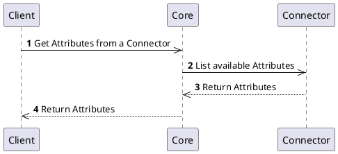
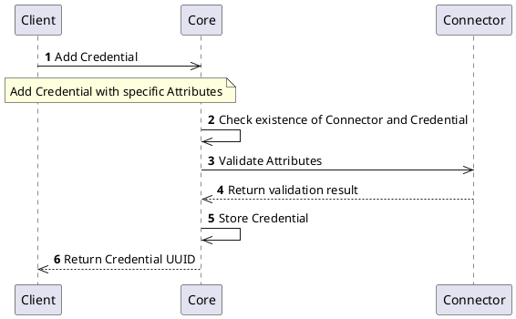

# Attributes Interface

## Overview

Each `Connector` has to implement the `Attributes` interface. This interface provides information about supported `Attributes` of the `Connector`. `Attributes` are specific to implementation and gives information about the data that can be exchanged and properly parsed by the `Connector`.

Fo more information, refer to [Connector Architecture](../../concept-design/architecture/connector).

## How it works

The `Attributes` interface provides information about all supported mandatory or optional `Attributes` for the `Connector`. `Attributes` are necessary to manage `Connector` specific objects. For more information about how `Attributes` can be used and implemented, including details about `Attribute` types, refer to [Contribution guide - Attributes and Callbacks](../../contributors/attributes/overview).

Each `Connector` implements interface for listing available `Attributes` and their validation.

## Processes

### Get `Attributes`

Because each `Connector` defines its own specific `Attributes`, we need to get information about that before we can start creating and managing objects.

### Create object using `Attributes`

When you have a list of available `Attributes` supported by the `Connector`, you can create objects like `Authority`, `Credential`, `Discovery`, `Entity`, etc. For this operation you need to provide at least mandatory `Attribute` values that are validated against the definition and if success, the object is created.

:::note
The following example is creating `Credential` object. The same approach can be used for other objects that can be created based on the `Attributes` definition and specific `Connector`.
:::

## Specification and example

You can find specification and information about the `Attributes` interface on the following locations:
- [Core Connector API](/api/core-connector/)
- Connector API specifications, see for example [Authority Provider](/api/connector-authority-provider-v2/)