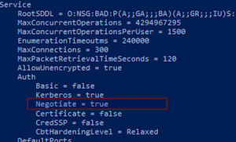

# Integration Guide

This document outlines the steps necessary to be taken on the Windows Server before the connector can be configured.

This integration guide was tested on:
- Windows Server 2012 R2
- Windows Server 2016
- Windows Server 2019

## Active Directory Presence

Depending on your environment, install the Active Directory Server Role according to the instructions from Microsoft and promote the Domain. Omit the step if you already have an onsite Active Directory structure. Make sure, the machine you are connecting is a member of the AD Domain.

:::info
You can use as example the following guide:
[Install a New Windows Server 2012 Active Directory Forest (Level 200) | Microsoft Docs](https://docs.microsoft.com/en-us/windows-server/identity/ad-ds/deploy/install-a-new-windows-server-2012-active-directory-forest--level-200-)
:::

## Active Directory Certificate Services Presence

Depending on your environment, install the Active Directory Certificate Services Server Role according to the instructions from Microsoft. Omit the step if you already have Microsoft Certification Authority Running.

:::info
You can use as example the following guide:
[Install Active Directory Certificate Services | Microsoft Docs](https://docs.microsoft.com/en-us/previous-versions/windows/it-pro/windows-server-2012-r2-and-2012/jj717285(v=ws.11))
:::

## Windows Remote Management Configuration

Windows Remote Management is used to facilitate client-less integration with Microsoft Certification Authority. To configure Windows Remote Management (WinRM), run the following command from an elevated PowerShell console:
```powershell
winrm quickconfig
```

Check that the WinRM Service is listening on port 5985 by running the following command from an elevated PowerShell console:
```powershell
winrm e winrm/config/listener
```

Validate the default configuration of WinRM service by running the following command from the elevated PowerShell console:
```powershell
winrm get winrm/config
```

Under the service configuration, negotiation authentication needs to be enabled. Check the output of the previous command to verify that `Negotiate = true`.



## Create a user used for WinRM

To enable the WinRM connection, create a user in Active Directory and assign the user with necessary permissions by adding the user to the respective groups as per your use case.
To enable the user to connect through WinRM, the user needs to be in Remote Management Users user group.
Since WinRM connection requires escalation of permission, the user needs to be either a Domain Admin, or needs to be a local administrator on the machine where the connector is going to connect to. To add the user to local administrators group run the following command:
```powershell
net localgroup Administrators /add “User Name”
```

:::note
Use the full domain login domain\username.
:::

## Firewall and Testing

To connect to the machine that has WinRM enabled, the firewall needs to allow inbound connections from the connector on TCP/IP port 5985.
To test the correct setup of WinRM, the machine can be accessed over WinRM from any Windows Machine with PowerShell using the following command:
```powershell
Enter-PSSession “Machine IP or Name” -Credential “User Name”
```

Be aware, that by default WinRM client configuration only allows Kerberos authentication to not known hosts (not in domain). To add your server to the trusted hosts on the client Windows machine run the following command:
```powershell
Set-Item WSMan:localhost\client\trustedhosts -value “Machine IP or Name”
```

## Install PSPKI module

To provide the rich functions, the Microsoft Windows set of PowerShell commands for managing Certification Authorities needs to be expanded. To do this, connector makes use of the **PSPKI module for PowerShell** [GitHub - PKISolutions/PSPKI: PowerShell PKI Module](https://github.com/PKISolutions/PSPKI).

To install the PSPKI module, first make sure you are using the newest version of PowerShell from Microsoft. At least version 5 is required.

### Installation steps

- Enable TLSv1.2 Protocol for PowerShell by running the following in an elevated PowerShell console on the server:
```powershell
[Net.ServicePointManager]::SecurityProtocol = [Net.SecurityProtocolType]::Tls12
```
- Register a PSRepository for installation of modules to PowerShell by running the following in an elevated PowerShell console on the server:
```powershell
Register-PSRepository -Default
```
- Finally, install the PSPKI module by running the following in an elevated PowerShell console on the server:
```powershell
Install-Module -Name PSPKI
```