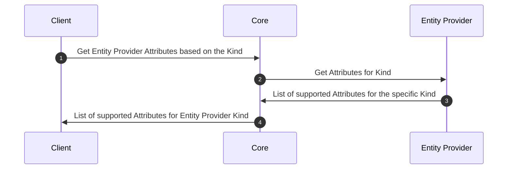

# Entity Provider

## Overview

[//]: # (High-level overview about the provider, it should contain description of the provider purpose)

Something about the entity provider

## How it works

[//]: # (How the provider works in its specific context, it should describe its specifics that are part of its functionality. Here should be also a diagram showing all the components and their relation)

How it works including the diagram with all components

## Provider objects

[//]: # (Description of the provider specific objects, their purpose, how it works)

Multiple certificates support and key management

## Processes

[//]: # (Description of the provider processes, how it works from the client to provider, including the sequence diagram showing the messages that are exchanged between the client, core, and provider, endpoints)

### Register Entity

### Create Location

### Issue certificate in Location

### Renew certificate already existing in Location

### Revoke and delete certificate from Location

## Specification and example

[//]: # (Where to find specifications, e.g. OpenAPI, and related resources. Examples, maybe including the list enpoints?)