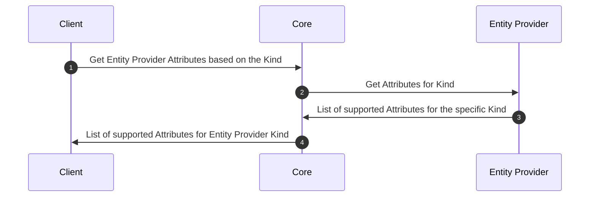
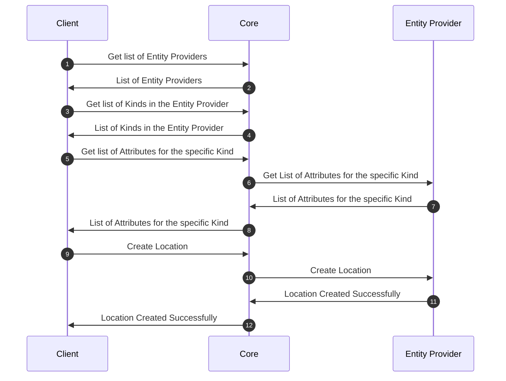
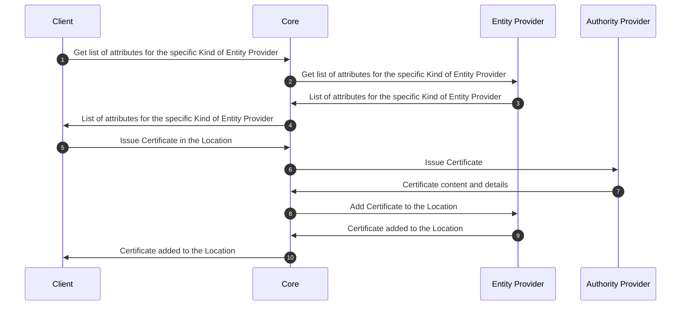
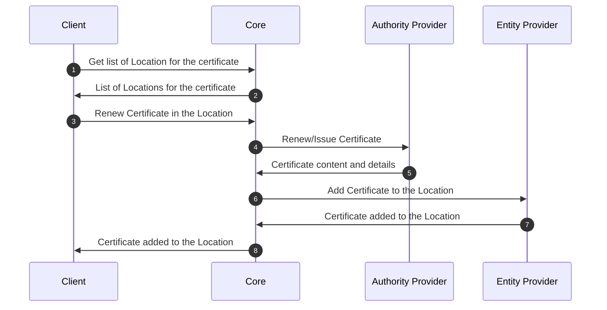
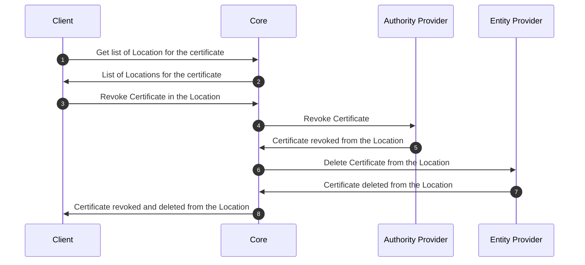

# Entity Provider

## Overview

Entity Providers are the implementation of management of `Certificates` in the end entities. These end entity can be of any type of devices like key stores, servers, mobile devices, etc. `Entity Providers` provides the communication channel between the entity and the core.

`Entity Providers` provides the pathways to perform the following operations:
- Discover the `Certificates` in the entity
- Remove a `Certificate` from the entity
- Issue a new `Certificate` to the entity
- Push an existing `Certificate` to the entity

## How it works

`Keystore Entity Provider` `Connector` provides access to the keystore locations on the remote servers. Multiple locations on one server are supported. The Connector can create multiple Entities and automate the certificate lifecycle on associated locations.

## Provider objects

The table below contains the list of `Entity Provider` specific objects.

| Object | Purpose |
| -------- | --------- |
| `Entity` | The `entity` that is managed by the `Entity Provider`. Entities are comprised of multiple locations|
| `Location` | The `location` of the `entity` that is managed by the `Entity Provider`. Location is the object that contains the details of the certificates and information about where they are currently deployed. A Single location can have more than one certificates |

## Processes

This section of the document explains the list of processes involved in managing the certificates on the entities using the `Entity Providers`.

### Register Entity

The below diagram shows the sequence of messages that are exchanged between the client, core, and provider to register the entity.

### Create Location

The below diagram shows the sequence of messages that are exchanged between the client, core, and provider to create the location.

### Issue certificate in Location

The below diagram shows the sequence of messages that are exchanged between the client, core, and provider to issue a certificate in the location.

### Renew certificate already existing in Location

The below diagram shows the sequence of messages that are exchanged between the client, core, and provider to renew a certificate in the location.

### Revoke and delete certificate from Location

The below diagram shows the sequence of messages that are exchanged between the client, core, and provider to revoke and delete a certificate from the location.

## Specification and example

`Entity Providers` implement the following `Function Groups`:

- [Entity Interface](https://github.com/3KeyCompany/CZERTAINLY-Interfaces/blob/develop/src/main/java/com/czertainly/api/interfaces/connector/entity/EntityController.java)
- [Location Interface](https://github.com/3KeyCompany/CZERTAINLY-Interfaces/blob/develop/src/main/java/com/czertainly/api/interfaces/connector/entity/LocationController.java)
- [Health Interface](https://github.com/3KeyCompany/CZERTAINLY-Interfaces/blob/develop/src/main/java/com/czertainly/api/interfaces/connector/HealthController.java)
- [Info](https://github.com/3KeyCompany/CZERTAINLY-Interfaces/blob/develop/src/main/java/com/czertainly/api/interfaces/connector/InfoController.java)
- [Attributes](https://github.com/3KeyCompany/CZERTAINLY-Interfaces/blob/develop/src/main/java/com/czertainly/api/interfaces/connector/AttributesController.java)

:::info
API specification can be found in the [API Specification](https://docs.czertainly.com/api/connector-entity-provider/)