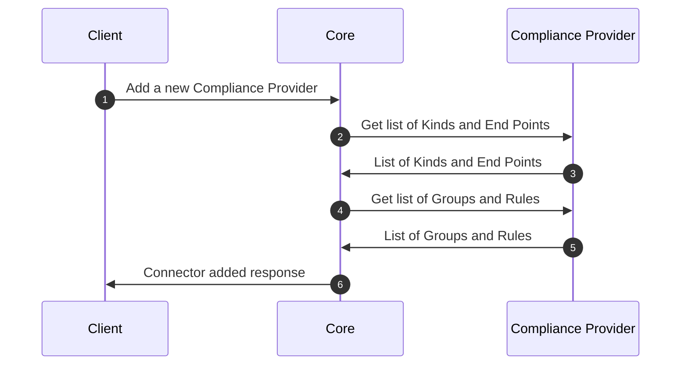
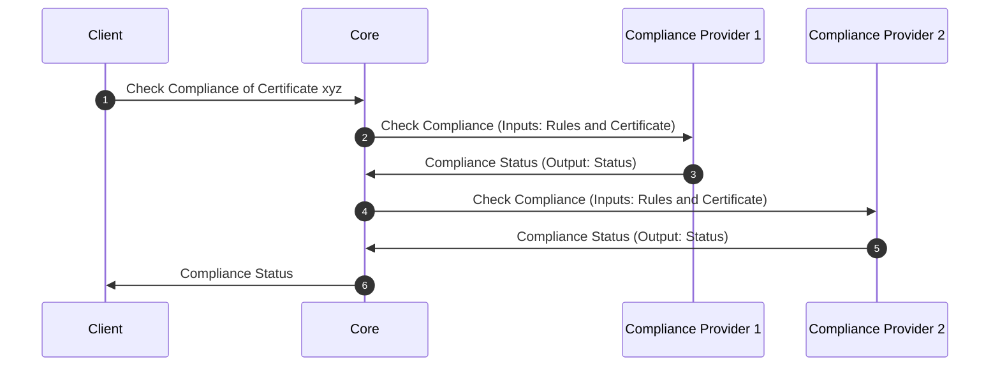

# Compliance Provider

## Overview

`Compliance Providers` are the implementation of the functionality of compliance checking for the certificates available in the platform. A `Compliance Provider` applies specific rules and group of rules to a `Certificate` and returns a status that contains the result of the compliance check. Based on the rules, the `Certificate` will either be determined as compliant or not compliant.

## How it works

This section of the document describes the process of working with the `Compliance Provider`.

`Compliance Providers` works on the basis of `Rules` and `Groups`. The `Connector` contains the list of `Rules` and `Groups` based on which the logics of the compliance check will be applied to the certificate.

The step by step process of working of `Compliance Provider` is as follows:
1. Core groups the list of rules to be applied on the certificate collected from the `Compliance Profile`
2. For each `Connector` in the `Compliance Profile`, `Core` send the list of rules (UUIDs) and `Certificate` to the `Connector`.
3. `Connector` applies the rules on the certificate and returns the result of the compliance check.
4. `Core` aggregates the results of the compliance check and returns the final result.
5. Final results are then stored in the database.

## Provider objects

The table below shows the provider specific objects that are part of the provider.

| Object | Purpose |
| -------- | --------- |
| `Rule` | The `rule` that is used to check the compliance of the `Certificate`. `Rules` contains specific logic that will apply it to the certificate. If the rule is satisfied, then the certificate is marked as `Compliant`. Else the certificate is marked as `Non Compliant`|
| `Group` | The `group` of `rules` that are used to check the compliance of the certificate. The groups are the logical grouping of the `rules` provided by the `Compliance Provider`. A `rule` may or may not be a part of the `Group`|

## Processes

This section of the document describes the list of processes involved in checking the compliance of the certificate.

### Rules and Groups

:::info
When a new `Compliance Provider` is added to the list of `Connectors`, the list of available `groups` and `rules` are fetched from the provider and are stored in the core.

These rules are then used to pass the information to the client to get the inputs for Compliance check. There are sync mechanisms that will update the list of rules and groups from the connector to the core
:::

### Compliance

This section of the document describes the process of checking the compliance of the certificate.

When a request is made to check the compliance of the certificate, the core gathers list of rules selected for the certificate from the associated `Compliance Profile`, group them based on the connectors. Once the grouping operation is completed, then the request is made to each of the `Compliance Providers` in the list. Core then computes the overall compliance status based on the result from the individual compliance providers.

To know more about the `Compliance Profile`, [click here](../concept-design/core-components/compliance-profile)

## Specifications

`Compliance Providers` implement the following `Function Groups`:

- [Compliance Interface](https://github.com/3KeyCompany/CZERTAINLY-Interfaces/blob/develop/src/main/java/com/czertainly/api/interfaces/connector/ComplianceController.java)
- [Compliance Rule Interface](https://github.com/3KeyCompany/CZERTAINLY-Interfaces/blob/develop/src/main/java/com/czertainly/api/interfaces/connector/ComplianceRulesController.java)
- [Health Interface](https://github.com/3KeyCompany/CZERTAINLY-Interfaces/blob/develop/src/main/java/com/czertainly/api/interfaces/connector/HealthController.java)
- [Info](https://github.com/3KeyCompany/CZERTAINLY-Interfaces/blob/develop/src/main/java/com/czertainly/api/interfaces/connector/InfoController.java)
- [Attributes](https://github.com/3KeyCompany/CZERTAINLY-Interfaces/blob/develop/src/main/java/com/czertainly/api/interfaces/connector/AttributesController.java)

:::info
API specification can be found in the [API Specification](https://docs.czertainly.com/api/connector-compliance-provider/)