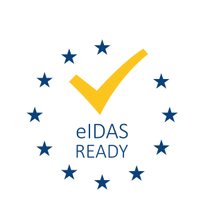

import {Fragment} from "react";

# Introduction

The CZERTAINLY Signing is a set of modules and implementations that enables eIDAS compliant remote signing on advanced or qualified assurance level.
It is a everything you need package, which is further developed in time to support varios technologies and use cases.

The SignServer comes with a number of out-of-the-box available modules and functionality. CZERTAINLY Signing builds on top of the SignServer in order to provide additional functionality.

The CZERTAINLY Signing adds the following parts:

export const data = [
    {
        module:
            (
                <>
                    <a href="./saml-authorizer/overview"><b>SAML 2.0 Authorizer</b></a>
                </>
            ),
        description:
            (
                <>
                    Using the SAML 2.0 Authorizer, you can configure the behaviour of the request authorization based on the SAML signed assertions. Request are authorized only when the assertion contains trusted and validated data.
                </>
            )
    },
    {
        module:
            (
                <>
                    <a href="./extended-jws-authorizer/overview"><b>Extended JWS Authorizer</b></a>
                </>
            ),
        description:
            (
                <>
                    Using the Extended JWS Authorizer, you can configure the behaviour of the request authorization based on the JWS. Request are authorized only when the claims of the valid JWS contains trusted and validated data.
                </>
            )
    },
    {
        module:
            (
                <>
                    <a href="./ades-formats/overview"><b>AdES Signature Formats</b></a>
                </>
            ),
        description:
            (
                <>
                    Configure PAdES (including External CMS), XAdES, CAdES, JAdES or ASiC signature formats and sign documents and data compliant to eIDAS regulation. Integration with DSS framework provides support for all relevant format levels and use cases.
                </>
            )
    },
    {
        module:
            (
                <>
                    <a href="./ades-validation/overview"><b>AdES Signature Validation</b></a>
                </>
            ),
        description:
            (
                <>
                    Validate signatures in a compliant way to eIDAS regulation. Integration with DSS framework provides support for custom validation policies and validation reports.
                </>
            )
    },
    {
        module:
            (
                <>
                    <a href="./qscd-integration/overview"><b>QSCD Integration</b></a>
                </>
            ),
        description:
            (
                <>
                    Integration and configuration of various QSCDs (Qualified Signature Creation Device) within the Signer and guidance on how to use it.
                </>
            )
    },
    {
        module:
            (
                <>
                    <a href="./sam-integration/overview"><b>SAM Integration</b></a>
                </>
            ),
        description:
            (
                <>
                    SAM (Signature Activation Module) integration and configuration with the Signers to achieve remote signing and sealing on qualified assurance level.
                </>
            )
    },
    {
        module:
            (
                <>
                    <a href="./aws-kms-cryptotoken/overview"><b>AWS KMS CryptoToken Support</b></a>
                </>
            ),
        description:
            (
                <>
                    Support for AWS Key Management Service to manage cryptographic keys.
                </>
            )
    }
];

export const GenTable = ({data}) => (
    <Fragment>
        {data.map((dat, i) =>{
            return(
                <tr key={i}>
                    <td><b>{dat.module}</b></td>
                    <td>{dat.description}</td>
                </tr>)
        })}
    </Fragment>
);

<table>
    <th>Module</th>
    <th>Description</th>
    <tbody>
    <GenTable data={data}/>
    </tbody>
</table>

Moreover, the following part seamlessly integrates with the CZERTAINLY Signing and are optional:

<table>
    <tbody>
    <tr>
        <td><b>Windows KSP Module</b></td>
        <td>Signature module for Windows environment, which provides integration with the KSP (Key Storage Provider) to sign documents and data through Windows applications on the SignServer.</td>
    </tr>
    <tr>
        <td><b>DMR</b></td>
        <td>Dashboarding, Monitoring, and Reporting module for the SignServer cluster.</td>
    </tr>
    </tbody>
</table>

:::info
When you are looking for eIDAS compliant signing solution on top of SignServer, you might be already aware of the SignServer technology.
SignServer is a server-side digital signature software for any digital data such as code, PDFs, ePassports, and many more. Its main characteristics are:
- A digital signature software with high performance and high availability.
- Operates on behalf of business applications.
- Designed to perform automated signatures (and other cryptographic operations on digital documents).
- SignServer is easy to adapt to customer specific needs by using plug-ins.
  :::