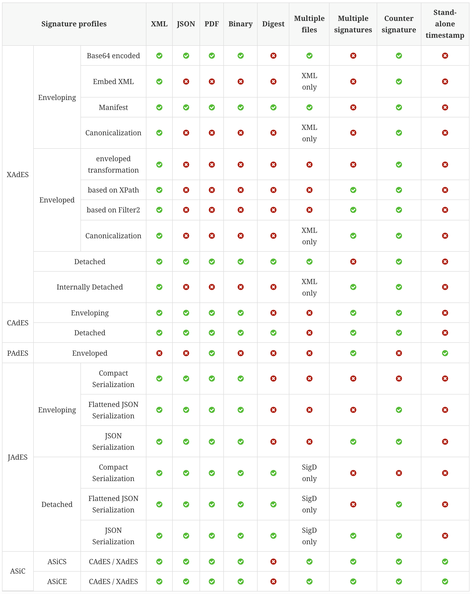

# Available Signature Formats

**AdES module** for the SignServer seamlessly integrates the DSS framework libraries within the standard interfaces of the Signer Workers. Therefore, it is possible to achieve the same signature formats and compliance level.

Implementation class for the **PAdES**, **XAdES**, **CAdES**, **JAdES**, or **ASiC**, is configured in the Signer together with other relevant properties, including the Crypto Token or internal TSAs. Integration of SignServer and DSS framework gives you all benefits of centralized mature signing solution with eIDAS compliant signature formats.

The table below specifies various signature possibilities available in DSS signature’s profiles/formats:

For more information about the DSS framework implementation visit [official documentation](https://github.com/esig/dss/blob/master/dss-cookbook/src/main/asciidoc/dss-documentation.adoc).