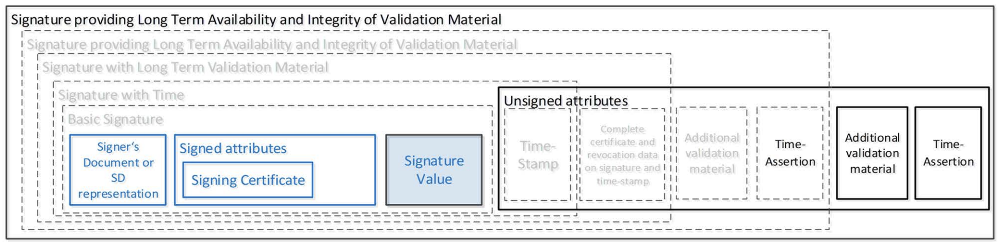

# Signature Augmentation

Signature augmentation is the process of extending existing signature to a higher Baseline. The augmentation typically extends the B-B or B-T signature by adding additional validation material and timestamps which eventually extend the validity of the signature. The augmentation process is necessary to achieve longer period of validity of signed data (for example for digital archives).

Only existing Baseline-B signature can be extended. The B-B signature contains signed attributes that cannot be changed further without breaking the integrity of the signature. Once the B-B signature exists, it can be extended to any of the B-T, B-LT, or B-LTA signature level without having access to the signers private key. Depending on the augmentation level, validation data and/or new timestamps are included in the signature unsigned attributes.

The following diagram from the **ETSI EN 319 102-1** shows the building blocks of the signature and augmentation:


See [Electronic Signatures and Trust Infrastructures (ESI); Procedures for Creation and Validation of AdES Digital Signatures; Part 1: Creation and Validation](https://www.etsi.org/deliver/etsi_en/319100_319199/31910201/) for more information about the augmentation process.

:::tip[Extending validity of signed data]
The augmentation process needs to be executed on a signature that does not have expired certificates to keep the validation chain valid in time. New timestamp can be added to existing B-LTA signature any time. In such case, also new validation data is added to existing signature that extends the validity of the signature.
:::

## Process of augmentation

Only valid signatures can be augmented. Therefore, the first step during the augmentation is to validate the existing signature. If the signature is not valid, the augmentation will fail. In case the validation of detached signatures, the original data needs to be provided for the augmentation as well to validate the signature.

You can augment from any Baseline signature level up to LTA, and you can repeat the LTA augmentation to achieve longer validity of the signature. The augmentation process is always iterative. When you would like to augment B-B to B-LTA, the process will first augment existing B-B signature to B-T, then to B-LT, and eventually to B-LTA.

## Augmentation properties

The augmentation properties are same as the signature properties but do not require `CRYPTOTOKEN` to be configured because the augmentation extends only existing signature that was created.

Also, [B-level propeties](../common-properties/blevel-properties) are not applicable for the augmentation as they are contained in signed attributes of B-B signature.

Properties for collecting of validation material from trusted sources and TSA properties must be set for the augmentation.

The data that needs to be provide for validation of detached signatures should be included as a Base64 encoded original data in the `DETACHED_CONTENTS` metadata when requesting for the augmentation.

### Detached contents in batch augmentation

When augmenting detached signatures in batch, the original data should be provided in the `detachedContens` field. The original data should be Base64 encoded and the field should be included in the request for each signature that is being augmented.

An example of the batch augmentation request with detached contents is following:

```json
{
  "signatureRequests": [
    {
      "data": "base64signature1",
      "customIdentifier": "signature 1",
      "detachedContents": "base64detachedContents1"
    },
    {
      "data": "base64signature2",
      "customIdentifier": "signature 2",
      "detachedContents": "base64detachedContents2"
    }
  ]
}
```

The output of the batch augmentation will be the same as the output for batch signing, with the augmented signatures. See [Batch signing request format](../batch-signing#batch-signing-response-format) for more information.
