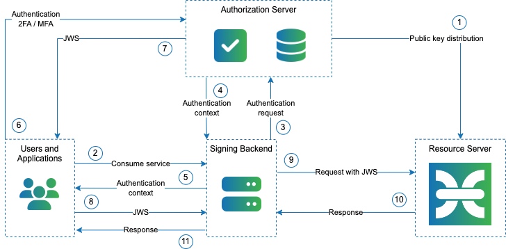

# Introduction

JSON Web Signature (JWS) represents content secured with digital signatures or Message Authentication Codes (MACs) using JSON-based data structures. JWS are used to exchange authentication and authorization information and identities between various systems supporting OAuth 2.0. Authorization server issues JWS after successful identity verification, and it is validated by the CZERTAINLY Signing that acts as a resource server. JSON-based data structure contains claims to pass information about user and additional information that is required for authorization. The claims are digitally signed and can be verified with the public key and certificate of the resource server. The Extended JWS Authorizer allows having the authorization server separate from the CZERTAINLY Signing application and provides eIDAS compliant authentication and authorization to signing and validation workers using multi-factor authentication (MFA).

:::info
The Extended JWS token provides authorization of the signing request and propagates valid claims information into the signing process that can use them in order to perform and configure some specific attributes of certificates.
:::

## Use case example

There are several authorization servers available compliant to JWS specification according [RFC 7515](https://datatracker.ietf.org/doc/html/rfc7515) and this implementation has been tested according that. The following use case example outlines authenticating authorization server to obtain JWS, then used it in the request sent from the client to CZERTAINLY Signing. The client in the following overview could, for example, be an mobile application communicating with a document management system or remote signing backend.

## Authentication and authorization flow

| Step | Name                                                 | Description                                                                                                                                                             |
|------|------------------------------------------------------|-------------------------------------------------------------------------------------------------------------------------------------------------------------------------|
| 1    | Public key of the authorization server distribution  | The worker in CZERTAINLY Signing is configured to trust the public key of the authorization server. Authorization rules matching claims of the JWS are also configured. |
| 2    | Client or user sends the request to consume service  | The user requests signing or validation services from signing backend.                                                                                                  |
| 3    | Authentication requested                             | The signing backend request for authentication from authorization server providing details about the user’s authentication domain.                                      |
| 4    | Authorization server provides authentication context | The authentication context for the user is provided.                                                                                                                    |
| 5    | Authentication context forwarder to user             | The user receives the authentication context that should be used in order to authenticate to the service from authorization server. Context is used by the user.        |
| 6    | Authentication of the user                           | User authenticates using credentials with the authorization server. When MFA is enabled, there may be multiple rounds in the authentication process.                    |
| 7    | Producing JWS                                        | Upon successful authentication, the user receives the JWS from the authorization server.                                                                                |
| 8    | Forward JWS                                          | User forwards the JWS as a proof of successful authentication and authorization for signing / validation request.                                                       |
| 9    | Request to sign / validate                           | The request with the JWS is submitted to CZERTAINLY Signing.                                                                                                            |
| 10   | Perform task and provide response                    | CZERTAINLY Signing validates the JWS and its claims to perform the operation and provide a response to signing backend.                                                 |
| 11   | Response                                             | User receives response from CZERTAINLY Signing.                                                                                                                         |