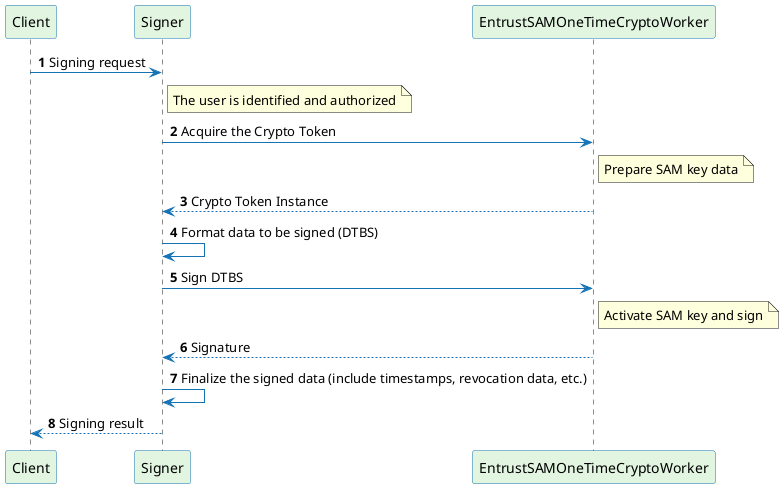
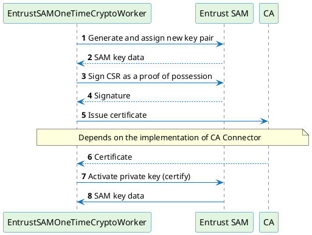
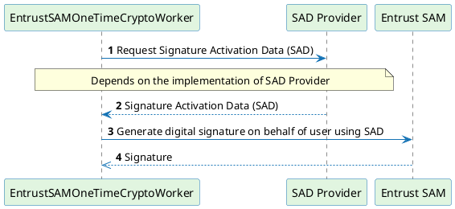

# Signing with Onetime Crypto Worker

The following chapters describe the signing flow using the `EntrustSAMOneTimeCryptoWorker`. The same process is applicable for any type of the Signer configured.

## Signing process

The signing process starts with the request coming to Signer to process and return the signature. It can be any of the supported signature formats.

The user must be properly identified and authorized to generate unique onetime SAM key. The signing process is synchronous. If some step during the signing process fails, the SAM private key is destroyed and the operation is reported as failed.

The signing process has 2 subprocesses that are described in more detail below:
- [**Prepare SAM key data**](#prepare-sam-key-data)
- [**Activate SAM key and sign**](#activate-sam-key-and-sign)



### Prepare SAM key data

This process consists of generating, assigning, and certifying the SAM key that is should be authorized to be used on behalf of the user.

When the SAM key is generated, it must be certified. This consists of providing the proof of possession in the form of the CSR to certification authority. How is the certificate requested and issued depends on the implementation of CA Connector identified by `CA_CONNECTOR_IMPLEMENTATION_CLASS` property of the `EntrustSAMOneTimeCryptoWorker`.

:::warning
Out-of-the-box implementation of the EJBCA connector using Web Services can be used with the SAM crypto worker. The implementation class for this CA connector is `CA_CONNECTOR_IMPLEMENTATION_CLASS=com.czertainly.signserver.module.sam.onetime.caconnector.EjbcaWSSAMCAConnector`. It is expected that this implementation will be moved to generic package in the future release. The configuration properties are same as in case [EJBCA WS CA Connector](https://doc.primekey.com/signserver/signserver-operations/setting-up-one-time-keys#SettingupOnetimeKeys-EJBCAWSCAConnector)
:::



As a result of this process, the SAM key data are ready to be activated and used to generate a digital signature on behalf of the user that owns the SAM key.

### Activate SAM key and sign

Once the data to be signed (DTBS) and SAM key is ready, the process of activation the SAM key and signing on behalf of the user can be executed.

For that we need to get Signature Activation Data (SAD) which represents the explicit authorization from the user to sign the DTBS and can be used to generate the digital signature. How is the SAD obtained depends on the implementation of the SAD Provider and it can be configured using the `SAD_PROVIDER_IMPLEMENTATION_CLASS` of the underlying `CRYPTOTOKEN` of the `EntrustSAMOneTimeCryptoWorker`. See [SAD Providers](../sad-providers/overview) for more information.



The digital signature is eventually obtained from Entrust SAM and returned back to the Signer.

## Typical setup of onetime signing

To make the onetime signing work, we typically need the following component workers to be properly configured and activated:
- EntrustSAMCryptoToken - source crypto token for managing SAM keys
- EntrustSAMOneTimeCryptoWorker - managing the onetime SAM keys lifecycle
- Signer - format of DTBS and execution of the signing process

:::info
External components like certification authority and SAD provider should be available and are not further discussed in this document. Refer to the installation and configuration guide of these components for details.
:::

### EntrustSAMCryptoToken

For more information about the `EntrustSAMCryptoToken`, refer to [Entrust SAM Crypto Token Properties](../properties) and [Basic Crypto Worker](./basic-crypto-worker).

The following is a sample configuration of the `EntrustSAMCryptoToken`:

```
ENTRUST_CONNECTION_POOL_SIZE=20
SAD_PROVIDER_PASSWORD=password
SAD_PROVIDER_URL=http://host.docker.internal:8080
OTHER_SIGNERS=EntrustSSPUP12
SAD_PROVIDER_AUTH_TYPE=BASIC
NAME=EntrustSAMCryptoToken
ENTRUST_TRUST_SELF_SIGNED=true
KEY_ALIAS_SEPARATOR=_____
DISABLED=FALSE
IMPLEMENTATION_CLASS=com.czertainly.signserver.module.entrustsam.EntrustSAMCryptoWorker
SAD_PROVIDER_IMPLEMENTATION_CLASS=com.czertainly.signserver.module.entrustsam.sad.RestSAMSadProvider
ENTRUST_CLIENT_AUTHENTICATION_KEY_ALIAS=sspu1
ENTRUST_SAM_SERVER=https://127.0.0.1:9572
TYPE=PROCESSABLE
CRYPTOTOKEN_IMPLEMENTATION_CLASS=com.czertainly.signserver.module.entrustsam.EntrustSAMCryptoToken
SAD_PROVIDER_USERNAME=admin
```

### EntrustSAMOneTimeCryptoWorker

For more information about the `EntrustSAMOneTimeCryptoWorker`, refer to [OneTime Crypto Worker](./onetime-crypto-worker).

The following is a sample configuration of the `EntrustSAMOneTimeCryptoWorker`:

```
TLSCLIENTKEY=ra_signserver_02
CANAME=DemoClientSubCA
SUBJECTALTNAME_PATTERN=uri=TID://${TRANSACTION_ID},uri=keyId://${entrustsam.keyid}
EJBCAWSURL=https://host.docker.internal:8453/ejbca
USERNAME_PATTERN=onetime-${TRANSACTION_ID}
KEYGEN_ALGORITHM=RSA
OTHER_SIGNERS=RA02CryptoTokenP12
NAME=EntrustSAMOneTimeCryptoTokenWithEJBCA
CA_CONNECTOR_IMPLEMENTATION_CLASS=com.czertainly.signserver.trident.EjbcaWSSAMCAConnector
CRYPTOTOKEN=EntrustSAMCryptoToken
DISABLED=FALSE
IMPLEMENTATION_CLASS=com.czertainly.signserver.module.entrustsam.EntrustSAMOneTimeCryptoWorker
ENDENTITYPROFILE=DemoDocumentSigningEndEntityProfile
TRUSTSTOREPATH=/opt/primekey/truststore.jks
TRUSTSTORETYPE=JKS
CERTIFICATEPROFILE=DemoDocumentSigningEECertificateProfile
TRUSTSTOREPASSWORD=changeit
TYPE=PROCESSABLE
KEYGEN_SPECIFICATION=2048
CERTSIGNATUREALGORITHM=SHA256WithRSA
SUBJECTDN_PATTERN=CN=${AUTHORIZED_USERNAME},UID=${TRANSACTION_ID}
```

### Signer

The Signer is responsible for the formatting of the signature. Based on your needs, configure available Signer with the following properties:

```
CRYPTOTOKEN=EntrustSAMOneTimeCryptoTokenWithEJBCA
AUTHTYPE=org.signserver.server.UsernameAuthorizer
ALIASSELECTOR=org.signserver.server.aliasselectors.AuthorizedUsernameAliasSelector
ACCEPT_ALL_USERNAMES=true
```

The following is a sample configuration of PAdES Signer:

```
CRYPTOTOKEN=EntrustSAMOneTimeCryptoTokenWithEJBCA
AUTHTYPE=org.signserver.server.UsernameAuthorizer
IMPLEMENTATION_CLASS=com.czertainly.signserver.module.pades.signer.PAdESSigner
ALIASSELECTOR=org.signserver.server.aliasselectors.AuthorizedUsernameAliasSelector
ACCEPT_ALL_USERNAMES=true
SIGNATURE_LEVEL=PAdES-BASELINE-B
TYPE=PROCESSABLE
DIGESTALGORITHM=SHA256
DISABLEKEYUSAGECOUNTER=true
NAME=PAdES-Baseline-B-EntrustSAM-OneTime
```

## Signing process execution

When the configuration is ready, you can request signing through any of the supported interfaces of the SignServer.

The signing request must contain `IS_SIGNING_OPERATION` metadata:
```
REQUEST_METADATA.IS_SIGNING_OPERATION=true
```
Otherwise only dummy onetime crypto instance of the `EntrustSAMOneTimeCryptoWorker` will be provided.