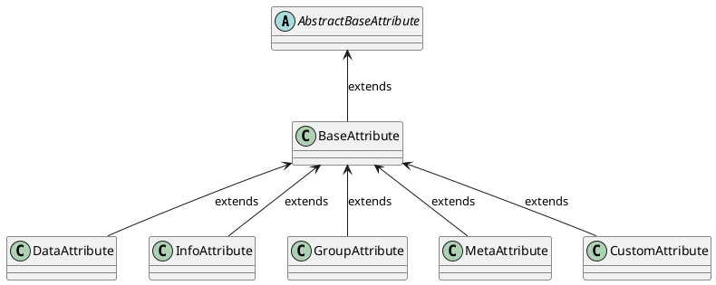

import DocCardList from '@theme/DocCardList';

# Overview

Although the CZERTAINLY platform is technology independent, each technology have its own specifics that the users should be able to use properly.

CZERTAINLY uses `Attribute` to control such specific behaviour of different technologies, like certification authorities, credential providers, discovery of certificates, etc. So called `Attributes` are used in almost every `Connector` and developer must understand them in order to implement custom behaviour or extend the functionality of the platform.

:::info
For more information about the concept behind the `Connector`, `Attributes`, `Callbacks`, etc, see the [CZERTAINLY platform overview](../../concept-design/overview).
:::

Now let's take a look on what exactly is an `Attribute` and how it can be used.

## It is all about the `Attributes`

The concept works on the principle of exchanging and validation of `Attributes` between the `Client`, `Connector` and CZERTAINLY platform.
Implementation of some specific `Connector` must be able to define and properly handle its specific `Attributes`. The definition is then exchanged with the `Client` and the platform validates it consistency and mediate the flow and logic between them:

```
Client                        CZERTAINLY                      Connector             Technology
  |                               |                               |                     |
  | list available Attributes     |                               |                     |
  | ----------------------------> | check and validate request    |                     |
  |                               | get Attributes for the Client |                     |
  |                               | ----------------------------> | Get technology data |
  |                               |                               | <-----------------> |
  |                               |           AttributeDefinition |                     |  
  |           validate Attributes | <---------------------------- |                     |
  |           AttributeDefinition |                               |                     |
  | <---------------------------- |                               |                     |
  |                               |                               |                     |
  | RequestAttribute with content |                               |                     |
  | ----------------------------> | validate and merge Attributes |                     |
  |                               | Request with the content      |                     |
  |                               | ----------------------------> | Use the Attributes  |
  |                               |                               | <-----------------> |
```

Because the communication is controlled by the platform, it ensures the consistency and security of the `Attributes` that are exchanged between the `Client` and the `Connector`. and eventually applied in the target technology.

## `BaseAttribute`

The `BaseAttribute` is the base class for all `Attributes`. It contains the basic properties that are common for all `Attributes` and uses the generic type `T` to define the 'content`. Tab                                                                                                  |

You can find specification of the `BaseAttribute` in the [CZERTAINLY Interfaces repository](https://github.com/3KeyCompany/CZERTAINLY-Interfaces).

Table below describes the properties of the `BaseAttribute`:

| `Attribute` property | Short description                                                                                                                                                                                                                                                                               | Required                                      |
| -------------------- | ----------------------------------------------------------------------------------------------------------------------------------------------------------------------------------------------------------------------------------------------------------------------------------------------- | --------------------------------------------- |
| `uuid`               | UUID of the `Attribute`, ensures the uniqueness across `Connectors` in the platform. The combination of the `Connector` UUID and the `Attribute` UUID should be unique.                                                                                                                         | <span class="badge badge--success">Yes</span> |
| `name`               | System name of the `Attribute` that is used for the processing.                                                                                                                                                                                                                                 | <span class="badge badge--success">Yes</span> |
| `description`        | Text description of the `Attribute` for better understanding of the `Attribute` purpose. This should contain descriptive explanation of the `Attribtue`.                                                                                                                                        | <span class="badge badge--danger">No</span>   |
| `type`               | Type of the `Attribute`, various supported data types based on the [AttributeType](https://github.com/3KeyCompany/CZERTAINLY-Interfaces/blob/develop/src/main/java/com/czertainly/api/model/common/attribute/v2/AttributeType.java). For example, `DATA`, `INFO`, `GROUP`, `CUSTOM` and "META". | <span class="badge badge--success">Yes</span> |
| `content`            | Content of the `Attribute` defined based on its `type`. Each content type have a defined structure that can be processed as the JSON formatted string. Content is a generic type and this typed class accepts data from the classes that are extending the `BaseAttribute`                      | <span class="badge badge--danger">No</span>   |


## Attribute Types

Based on the usage and specific behaviour you want to provide, `Attribute` can be one of 5 the following defined types:

| `Attribute` type    | Short description                                                                                                                                                                                                                                                                                  |
| ------------------- | -------------------------------------------------------------------------------------------------------------------------------------------------------------------------------------------------------------------------------------------------------------------------------------------------- |
| `Data Attribute`    | `Attributes` that are used by the connectors to gather the required information from the client. They are full fledged data carriers used by the `Connectors` for information exchange                                                                                                             |
| `Info Attributes`   | `Info Attributes` are information carriers whose primary responsibility to carry information that will assist the client with additional data to be displayed to the user.                                                                                                                         |
| `Group Attributes`  | `Group Attributes` are advanced type of attributes that carry a group of `Attributes` that are logically connected. They compose list of `Data Attributes` and `Info Attributes`. They are implemented as callback responses and are handy when the attributes are dependent on the value selected |
| `Meta Attributes`   | Attributes used by the connector to pass the extended information about the objects created. The metadata are stored in the core and sent to the connector when needed.                                                                                                                            |
| `Custom Attributes` | `Custom Attributes` are used defined attributes for storing additional information about the objects created in the platform. These are local to core and are not sent to the `connectors`.     




<DocCardList/>