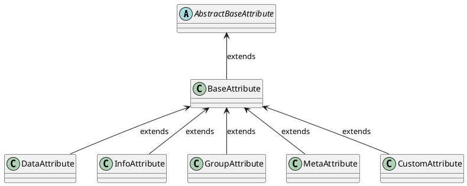

import DocCardList from '@theme/DocCardList';

# Overview

Although the CZERTAINLY platform is technology independent, each technology have its own specifics that the users should be able to use properly.

CZERTAINLY uses `Attribute` to control such specific behaviour of different technologies, like certification authorities, credential providers, discovery of certificates, etc. So called `Attributes` are used in almost every `Connector` and developer must understand them in order to implement custom behaviour or extend the functionality of the platform.

:::info
For more information about the concept behind the `Connector`, `Attributes`, `Callbacks`, etc, see the [CZERTAINLY platform overview](../../concept-design/overview).
:::

Now let's take a look on what exactly is an `Attribute` and how it can be used.

## It is all about the `Attributes`

The concept works on the principle of exchanging and validation of `Attributes` between the `Client`, `Connector` and CZERTAINLY platform.
Implementation of some specific `Connector` must be able to define and properly handle its specific `Attributes`. The definition is then exchanged with the `Client` and the platform validates it consistency and mediate the flow and logic between them:

```
Client                        CZERTAINLY                      Connector             Technology
  |                               |                               |                     |
  | list available Attributes     |                               |                     |
  | ----------------------------> | check and validate request    |                     |
  |                               | get Attributes for the Client |                     |
  |                               | ----------------------------> | Get technology data |
  |                               |                               | <-----------------> |
  |                               |           AttributeDefinition |                     |  
  |           validate Attributes | <---------------------------- |                     |
  |           AttributeDefinition |                               |                     |
  | <---------------------------- |                               |                     |
  |                               |                               |                     |
  | RequestAttribute with content |                               |                     |
  | ----------------------------> | validate and merge Attributes |                     |
  |                               | Request with the content      |                     |
  |                               | ----------------------------> | Use the Attributes  |
  |                               |                               | <-----------------> |
```

Because the communication is controlled by the platform, it ensures the consistency and security of the `Attributes` that are exchanged between the `Client` and the `Connector`. and eventually applied in the target technology.

## `BaseAttribute`

`BaseAttribute` contains set of properties that are defined for a specific parameter required for the `Connector` to work and process requests properly.

A typical example may be the `Connector` that implements `Authority Provider` interface. `Authority Provider` serves as a certification authority, and it needs to know how to issue, renew, and revoke certificates. To issue the certificate, we probably need something like certificate signing request, however each technology may require additional data based on which the certificate will be issued.

For example, in case of MS ADCS, you need to know at least the certificate template that should be used to issue the certificate. And this is the place where you can use the `BaseAttribute` to define the `Attribute` that will contain information about the certificate templates.

## Attribute Types

Based on the usage and specific behaviour you want to provide, `Attribute` can be one of 5 the following defined types:

| `Attribute` type                         | Short description                                                                                                                                                                                                                                                                                  |
|------------------------------------------|----------------------------------------------------------------------------------------------------------------------------------------------------------------------------------------------------------------------------------------------------------------------------------------------------|
| [`Data Attribute`](data-attributes)      | `Attributes` that are used by the connectors to gather the required information from the client. They are full fledged data carriers used by the `Connectors` for information exchange                                                                                                             |
| [`Info Attributes`](info-attributes)     | `Info Attributes` are information carriers whose primary responsibility to carry information that will assist the client with additional data to be displayed to the user.                                                                                                                         |
| [`Group Attributes`](group-attributes)   | `Group Attributes` are advanced type of attributes that carry a group of `Attributes` that are logically connected. They compose list of `Data Attributes` and `Info Attributes`. They are implemented as callback responses and are handy when the attributes are dependent on the value selected |
| [`Meta Attributes`](meta-attributes)     | Attributes used by the connector to pass the extended information about the objects created. The metadata are stored in the core and sent to the connector when needed.                                                                                                                            |
| [`Custom Attributes`](custom-attributes) | `Custom Attributes` are used defined attributes for storing additional information about the objects created in the platform. These are local to core and are not sent to the `connectors`.                                                                                                        |


You can find specification of the `AttributeDefinition` in the [CZERTAINLY Interfaces repository](https://github.com/3KeyCompany/CZERTAINLY-Interfaces). Common `Attribute` properties are following:
 The table below describes the common properties for the list of `Attributes`.

| `Attribute` property | Short description                                                                                                                                                                                                                                                                               | Required                                      |
| -------------------- | ----------------------------------------------------------------------------------------------------------------------------------------------------------------------------------------------------------------------------------------------------------------------------------------------- | --------------------------------------------- |
| `uuid`               | UUID of the `Attribute`, ensures the uniqueness across `Connectors` in the platform. The combination of the `Connector` UUID and the `Attribute` UUID should be unique.                                                                                                                         | <span class="badge badge--success">Yes</span> |
| `name`               | System name of the `Attribute` that is used for the processing.                                                                                                                                                                                                                                 | <span class="badge badge--success">Yes</span> |
| `description`        | Text description of the `Attribute` for better understanding of the `Attribute` purpose. This should contain descriptive explanation of the `Attribtue`.                                                                                                                                        | <span class="badge badge--danger">No</span>   |
| `type`               | Type of the `Attribute`, various supported data types based on the [AttributeType](https://github.com/3KeyCompany/CZERTAINLY-Interfaces/blob/develop/src/main/java/com/czertainly/api/model/common/attribute/v2/AttributeType.java). For example, `DATA`, `INFO`, `GROUP`, `CUSTOM` and "META". | <span class="badge badge--success">Yes</span> |
| `content`            | Content of the `Attribute` defined based on its `type`. Each content type have a defined structure that can be processed as the JSON formatted string.                                                                                                                                          | <span class="badge badge--danger">No</span>   |



<DocCardList/>

:::warning
below should be written in a separate section about Content
:::

## Attribute Content

Content section of the `Attributes` carry the information or value. Supported `AttributeContentType` are detailed [here](#appendix-a---supported-attributecontenttype)

:::info
Content are always List of `AttributeContent` objects. For more information about the content, see [Content](https://github.com/3KeyCompany/CZERTAINLY-Interfaces/tree/develop/src/main/java/com/czertainly/api/model/common/attribute/v2/content)
:::

### Attribute Content Properties

Properties of Attribute Content are following:

| Property    | Short description                                                       | Required                                      |
| ----------- | ----------------------------------------------------------------------- | --------------------------------------------- |
| `reference` | Reference for the value. Meaningful, user readable string for the value | <span class="badge badge--success">Yes</span> |
| `data`      | Actual value of the content                                             | <span class="badge badge--success">Yes</span> |

## Appendix A - Supported `AttributeContentType`

<table>

<tr>
<th> 

`AttributeContentType`

</th>
<th>

Associated `content` field

</th>
</tr>

<tr>
<td>

`STRING`

</td>
<td>

```json
{  
  "content": [
    {
      "reference": "string",
      "data": "string"
    }
  ]
}
```

</td>
</tr>

<tr>
<td>

`INTEGER`

</td>
<td>

```json
{  
  "content": [
    {
      "reference": "string",
      "value": 12345
    }
  ]
}
```

</td>
</tr>

<tr>
<td>

`SECRET`

</td>
<td>

```json
{  
  "content": [
    {
      "reference": "string",
      "data": {
        "secret": "secret"
    }
  ]
}
```
`SECRET` is handled by the platform in a secure way and its value will never be presented to `Client` once defined.

</td>
</tr>

<tr>
<td>

`FILE`

</td>
<td>

```json
{  
  "content": [
    {
      "reference": "string",
      "data": {
        "value": "base64-encoded content of the file",
        "fileName": "name of the file",
        "mimeType": "type of the file"
      }
    }
  ]
}
```
`FILE` type can be specifically handled based on the content and its purpose.

</td>
</tr>

<tr>
<td>

`BOOLEAN`

</td>
<td>

```json
{  
  "content": [
    {
      "reference": "string",
      "value": true
    }
  ]
}
```

</td>
</tr>

<tr>
<td>

`CREDENTIAL`

</td>
<td>

```json
{
  "content": [
    {
      "reference": "identification of Credential",
      "data": {
        "name": "string",
        "uuid": "UUID of the Credential",
        "kind": "kind of the Credential",
        "attributes": [
          ...list of Credential Attributes
        ]
        "enabled": true,
        "connectorUuid": "UUID of the Credential Provider Connector",
        "connectorName": "name of the Credential Provider Connector"
      }
    }
  ]
}
```
`CREDENTIAL` is a special purpose type that is handled by the platform for `Connectors` that needs to use the credential for authentication and authorization to technology, for example API Key, username/password, and any other `Credential`.

</td>
</tr>

<tr>
<td>

`DATE`

</td>
<td>

```json
{
  "content": [
    {
      "reference": "string",
      "value": "2022-11-30"
    }
  ]
}
```
`DATE` should be in the format `yyyy-MM-dd`.

</td>
</tr>

<tr>
<td>

`FLOAT`

</td>
<td>

```json
{
  "content": [
    {
      "reference": "string",
      "value": 12.4487211
    }
  ]
}
```

</td>
</tr>

<tr>
<td>

`OBJECT`

</td>
<td>

```json
{
  "content": [
    {
      "reference": "identification of Object",
      "data": {
        ... any JSON object
      }
    }
  ]
}
```
`OBJECT` type provides a flexible way how to work with the custom objects within the `Attributes` and `Callbacks`.

</td>
</tr>

<tr>
<td>

`TEXT`

</td>
<td>

```json
{
  "content": [
    {
      "reference": "string",
      "value": "long text"
    }
  ]
}
```
`TEXT` supports long string/text data to be processed.

</td>
</tr>

<tr>
<td>

`TIME`

</td>
<td>

```json
{
  "content": [
    {
      "reference": "string",
      "value": "11:45:32"
    }
  ]
}
```
`TIME` should be in the format `HH:mm:ss`.

</td>
</tr>

<tr>
<td>

`DATETIME`

</td>
<td>

```json
{
  "content": [
    {
      "reference": "string",
      "value": "2011-12-03T10:15:30+01:00"
    }
  ]
}
```
`DATETIME` should be in the format `yyyy-MM-dd'T'HH:mm:ss.SSSXXX`, which is ISO-8601 extended offset date-time format.

</td>
</tr>

</table>