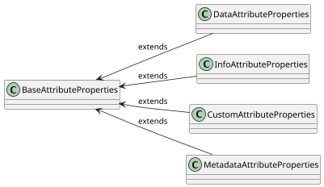

# Properties

Properties defines the behaviour of the `Attribute`.
The following is a complete list of supported and available properties:

| Property name | Type      | Short description                                                                                                                       |
|---------------|-----------|-----------------------------------------------------------------------------------------------------------------------------------------|
| `label`       | `string`  | Friendly name of the the `Attribute`                                                                                                    |
| `required`    | `boolean` | Boolean determining if the `Attribute` content is required. If true, the `Attribute` must provide its content in the `content` property |
| `readOnly`    | `boolean` | Boolean determining if the `Attribute` `content` is read only and cannot be changed                                                     |
| `visible`     | `boolean` | Boolean determining if the `Attribute` is visible or used as a helper only                                                              |
| `list`        | `boolean` | Boolean determining if the `Attribute` contains list of values in its `content`                                                         |
| `multiSelect` | `boolean` | Boolean determining if the `Attribute` can have multiple values in the `content`                                                        |
| `group`       | `string`  | Name of the group `Attribute` belong to. It can be used for logical grouping of multiple `Attributes`                                   |
| `global`      | `boolean` | Boolean determining if the `Attribute` is global. Global mean that two `Attributes` with the same definition cannot exist               |

## Properties and Attribute types

Not every property is mandatory and applicable for every `Attribute` type. The following matrix shows which properties are supported for each `Attribute` type:

| Property name / Attribute type | `BaseAttributeProperties`                    | `DataAttributeProperties`                           | `InfoAttributeProperties`                    | `CustomAttributeProperties`                  | `MetadataAttributeProperties`                |
|--------------------------------|----------------------------------------------|-----------------------------------------------------|----------------------------------------------|----------------------------------------------|----------------------------------------------|
| `label`                        |    |  |    |    |    |
| `visible`                      |    |           |    |    |    |
| `group`                        |     |            |     |     |     |
| `required`                     |  |           |  |    |  |
| `readOnly`                     |  |           |  |    |  |
| `list`                         |  |           |  |    |  |
| `multiSelect`                  |  |           |  |    |  |
| `global`                       |  |         |  |  |     |

-  - the property is required
-  - the property is optional
-  - the property is not applicable

:::info Attribute types
For more details about `Attribute` types, see [Attributes](attributes).
:::

## Properties model

Th following diagram represents the Properties model inherited from the `AbstractBaseAttribute`. Details can be found in the [CZERTAINLY Interfaces repository](https://github.com/3KeyCompany/CZERTAINLY-Interfaces/tree/master/src/main/java/com/czertainly/api/model/common/attribute/v2/properties).

