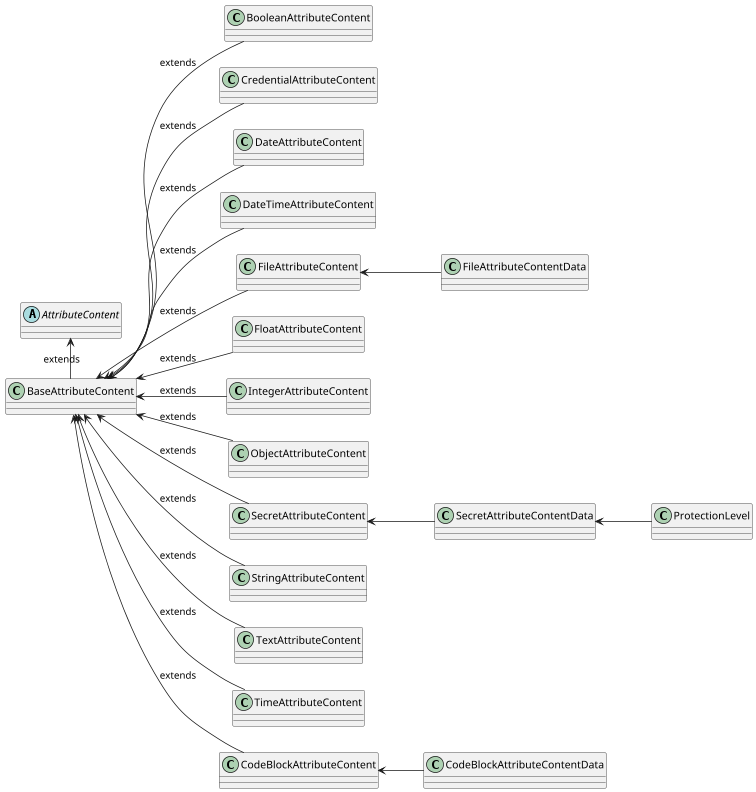

# Content

`Attribute` supports various content defined by `contentType`.

:::info Attribute types
For more details about `Attribute` types and `contentType`, see [Attributes](attributes).
:::

## Content properties

Each content type must extends [`BaseAttributeContent`](https://github.com/3KeyCompany/CZERTAINLY-Interfaces/blob/master/src/main/java/com/czertainly/api/model/common/attribute/v2/content/BaseAttributeContent.java) which is abstracted from [`AttributeContent`](https://github.com/3KeyCompany/CZERTAINLY-Interfaces/blob/master/src/main/java/com/czertainly/api/model/common/attribute/v2/content/AttributeContent.java).

The content has the following properties defined and inherited from `BaseAttributeContent`:

| Property    | Type               | Short description                                                                                                                                       | Required                                      |
|-------------|--------------------|---------------------------------------------------------------------------------------------------------------------------------------------------------|-----------------------------------------------|
| `reference` | `string`           | Reference that can be used for the content value. It is usefull especially when the `data` contains an object, or any other more complex data structure | <span class="badge badge--danger">No</span>   |
| `data`      | `AttributeContent` | The value of the content, depending on the `contentType` from supported [`AttributeContentType`](#supported-content-types)                              | <span class="badge badge--success">Yes</span> |

## Supported content types

Supported content types are defined in [`AttributeContentType`](https://github.com/3KeyCompany/CZERTAINLY-Interfaces/blob/master/src/main/java/com/czertainly/api/model/common/attribute/v2/content/AttributeContentType.java).
The following content types are available and supported:

| `AttributeContentType` | Class                                                                                                                                                                                               | Data                                                                                                                                                                                                     |
|------------------------|-----------------------------------------------------------------------------------------------------------------------------------------------------------------------------------------------------|----------------------------------------------------------------------------------------------------------------------------------------------------------------------------------------------------------|
| `STRING`               | [`StringAttributeContent`](https://github.com/3KeyCompany/CZERTAINLY-Interfaces/blob/master/src/main/java/com/czertainly/api/model/common/attribute/v2/content/StringAttributeContent.java)         | `string`                                                                                                                                                                                                 |
| `INTEGER`              | [`IntegerAttributeContent`](https://github.com/3KeyCompany/CZERTAINLY-Interfaces/blob/master/src/main/java/com/czertainly/api/model/common/attribute/v2/content/IntegerAttributeContent.java)       | `integer`                                                                                                                                                                                                |
| `SECRET`               | [`SecretAttributeContent`](https://github.com/3KeyCompany/CZERTAINLY-Interfaces/blob/master/src/main/java/com/czertainly/api/model/common/attribute/v2/content/SecretAttributeContent.java)         | [`SecretAttributeContentData`](https://github.com/3KeyCompany/CZERTAINLY-Interfaces/blob/master/src/main/java/com/czertainly/api/model/common/attribute/v2/content/data/SecretAttributeContentData.java) |
| `FILE`                 | [`FileAttributeContent`](https://github.com/3KeyCompany/CZERTAINLY-Interfaces/blob/master/src/main/java/com/czertainly/api/model/common/attribute/v2/content/FileAttributeContent.java)             | [`FileAttributeContentData`](https://github.com/3KeyCompany/CZERTAINLY-Interfaces/blob/master/src/main/java/com/czertainly/api/model/common/attribute/v2/content/data/FileAttributeContentData.java)     |
| `BOOLEAN`              | [`BooleanAttributeContent`](https://github.com/3KeyCompany/CZERTAINLY-Interfaces/blob/master/src/main/java/com/czertainly/api/model/common/attribute/v2/content/BooleanAttributeContent.java)       | `boolean`                                                                                                                                                                                                |
| `TEXT`                 | [`TextAttributeContent`](https://github.com/3KeyCompany/CZERTAINLY-Interfaces/blob/master/src/main/java/com/czertainly/api/model/common/attribute/v2/content/TextAttributeContent.java)             | `string`                                                                                                                                                                                                 |
| `CODEBLOCK`            | [`CodeBlockAttributeContent`](https://github.com/3KeyCompany/CZERTAINLY-Interfaces/blob/master/src/main/java/com/czertainly/api/model/common/attribute/v2/content/CodeBlockAttributeContent.java)             |[`CodeBlockAttributeContentData`](https://github.com/3KeyCompany/CZERTAINLY-Interfaces/blob/master/src/main/java/com/czertainly/api/model/common/attribute/v2/content/data/CodeBlockAttributeContentData.java) |
| `FLOAT`                | [`FloatAttributeContent`](https://github.com/3KeyCompany/CZERTAINLY-Interfaces/blob/master/src/main/java/com/czertainly/api/model/common/attribute/v2/content/FloatAttributeContent.java)           | `float`                                                                                                                                                                                                  |
| `DATE`                 | [`DateAttributeContent`](https://github.com/3KeyCompany/CZERTAINLY-Interfaces/blob/master/src/main/java/com/czertainly/api/model/common/attribute/v2/content/DateAttributeContent.java)             | `date`                                                                                                                                                                                                   |
| `DATETIME`             | [`DateTimeAttributeContent`](https://github.com/3KeyCompany/CZERTAINLY-Interfaces/blob/master/src/main/java/com/czertainly/api/model/common/attribute/v2/content/DatetimeAttributeContent.java)     | `datetime`                                                                                                                                                                                               |
| `TIME`                 | [`TimeAttributeContent`](https://github.com/3KeyCompany/CZERTAINLY-Interfaces/blob/master/src/main/java/com/czertainly/api/model/common/attribute/v2/content/TimeAttributeContent.java)             | `time`                                                                                                                                                                                                   |
| `CREDENTIAL`           | [`CredentialAttributeContent`](https://github.com/3KeyCompany/CZERTAINLY-Interfaces/blob/master/src/main/java/com/czertainly/api/model/common/attribute/v2/content/CredentialAttributeContent.java) | [`CredentialDto`](https://github.com/3KeyCompany/CZERTAINLY-Interfaces/blob/master/src/main/java/com/czertainly/api/model/core/credential/CredentialDto.java)                                            |
| `OBJECT`               | [`ObjectAttributeContent`](https://github.com/3KeyCompany/CZERTAINLY-Interfaces/blob/master/src/main/java/com/czertainly/api/model/common/attribute/v2/content/ObjectAttributeContent.java)         | `object`                                                                                                                                                                                                 |

:::caution Mulitple content types in one Attribute
One `Attribute` can define only one `contenttype`. Multiple different content types for one `Attribute` is not supported.
:::

## Content type samples

The table below shows the `AttributeContentType` and the sample for each type.

<table>

<tr>
<th> 

`AttributeContentType`

</th>
<th>

Associated `content` field

</th>
</tr>

<tr>
<td>

`STRING`

</td>
<td>

```json
{  
  "content": [
    {
      "reference": "string",
      "data": "string"
    }
  ]
}
```

</td>
</tr>

<tr>
<td>

`INTEGER`

</td>
<td>

```json
{  
  "content": [
    {
      "reference": "string",
      "value": 12345
    }
  ]
}
```

</td>
</tr>

<tr>
<td>

`SECRET`

</td>
<td>

```json
{  
  "content": [
    {
      "reference": "string",
      "data": {
        "secret": "secret"
    }
  ]
}
```

`SECRET` is handled by the platform in a secure way and its value will never be presented to client once defined.

</td>
</tr>

<tr>
<td>

`FILE`

</td>
<td>

```json
{  
  "content": [
    {
      "reference": "string",
      "data": {
        "value": "base64-encoded content of the file",
        "fileName": "name of the file",
        "mimeType": "type of the file"
      }
    }
  ]
}
```

`FILE` type can be specifically handled based on the `mimeType`.

</td>
</tr>

<tr>
<td>

`BOOLEAN`

</td>
<td>

```json
{  
  "content": [
    {
      "reference": "string",
      "value": true
    }
  ]
}
```

</td>
</tr>

<tr>
<td>

`CREDENTIAL`

</td>
<td>

```json
{
  "content": [
    {
      "reference": "identification of Credential",
      "data": {
        "name": "string",
        "uuid": "UUID of the Credential",
        "kind": "kind of the Credential",
        "attributes": [
          ...list of Credential Attributes
        ]
        "enabled": true,
        "connectorUuid": "UUID of the Credential Provider Connector",
        "connectorName": "name of the Credential Provider Connector"
      }
    }
  ]
}
```

`CREDENTIAL` is a special purpose type that is handled by the platform for `Connectors` that needs to use the credential for authentication and authorization to technology, for example API Key, username/password, and any other `Credential`.

</td>
</tr>

<tr>
<td>

`DATE`

</td>
<td>

```json
{
  "content": [
    {
      "reference": "string",
      "value": "2022-11-30"
    }
  ]
}
```

`DATE` should be in the format `yyyy-MM-dd`.

</td>
</tr>

<tr>
<td>

`FLOAT`

</td>
<td>

```json
{
  "content": [
    {
      "reference": "string",
      "value": 12.4487211
    }
  ]
}
```

</td>
</tr>

<tr>
<td>

`OBJECT`

</td>
<td>

```json
{
  "content": [
    {
      "reference": "identification of Object",
      "data": {
        ... any JSON object
      }
    }
  ]
}
```

`OBJECT` type provides a flexible way how to work with the custom objects within the `Attributes` and `Callbacks`.

</td>
</tr>

<tr>
<td>

`TEXT`

</td>
<td>

```json
{
  "content": [
    {
      "reference": "string",
      "value": "long text"
    }
  ]
}
```

`TEXT` supports long string/text data to be processed.

</td>
</tr>

<tr>
<td>

`CODEBLOCK`

</td>
<td>

```json
{
  "content": [
    {
      "reference": "string",
      "value": {
          "language": "string",
          "code": "Block of the code in Base64. Formatting of the code is specified by variable language"
        }
    }
  ]
}
```

`CODEBLOCK` supports scripts from various [languages](https://github.com/3KeyCompany/CZERTAINLY-Interfaces/blob/master/src/main/java/com/czertainly/api/model/common/attribute/v2/content/data/ProgrammingLanguageEnum.java). For example, to store simple addition method written in C#

```csharp
public void Add(string a, string b) {
  return a + b;
}
```

you would sent following content
```json
{
  "content": [
    {
      "reference": "sample",
      "value": {
          "language": "csharp",
          "code": "cHVibGljIHZvaWQgQWRkKHN0cmluZyBhLCBzdHJpbmcgYikgewogIHJldHVybiBhICsgYjsKfQ=="
        }
    }
  ]
}
```

</td>
</tr>

<tr>
<td>

`TIME`

</td>
<td>

```json
{
  "content": [
    {
      "reference": "string",
      "value": "11:45:32"
    }
  ]
}
```

`TIME` should be in the format `HH:mm:ss`.

</td>
</tr>

<tr>
<td>

`DATETIME`

</td>
<td>

```json
{
  "content": [
    {
      "reference": "string",
      "value": "2011-12-03T10:15:30+01:00"
    }
  ]
}
```

`DATETIME` should be in the format `yyyy-MM-dd'T'HH:mm:ss.SSSXXX`, which is ISO-8601 extended offset date-time format.

</td>
</tr>

</table>

## Content model

The following diagram represents the content model inherited from the `AttributeContent`. Details can be found in the [CZERTAINLY Interfaces repository](https://github.com/3KeyCompany/CZERTAINLY-Interfaces/tree/master/src/main/java/com/czertainly/api/model/common/attribute/v2/content).

