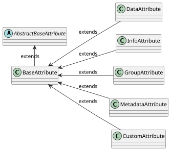

import Tabs from '@theme/Tabs';
import TabItem from '@theme/TabItem';

# Attributes

Attribute, specifically its type is used to control different behaviour of the content and values in the platform. Some attributes defined the data that are exchanged between technologies, some of them may represent read-only information, and some of them may contain additional attributes that are grouped together or works as a wizard.

## Attribute properties

The following is a list of properties that can be used to define the behaviour of the `Attribute` and extends properties of the [`BaseAttribute`](overview#baseattribute):

| Property            | Type                                                      | Required                                      |
|---------------------|-----------------------------------------------------------|-----------------------------------------------|
| `contentType`       | [`AttributeContentType`](content#supported-content-types) | <span class="badge badge--success">Yes</span> |
| `constraints`       | list of [`BaseAttributeConstraint`](constraints)          | <span class="badge badge--danger">No</span>   |
| `properties`        | [`AttributeProperties`](properties)                       | <span class="badge badge--success">Yes</span> |
| `attributeCallback` | [`AttributeCallback`](callbacks)                          | <span class="badge badge--danger">No</span>   |

## Attribute Types

Based on the usage and specific behaviour you want to provide, `Attribute` can be one of the following defined types in [AttributeType](https://github.com/3KeyCompany/CZERTAINLY-Interfaces/blob/master/src/main/java/com/czertainly/api/model/common/attribute/v2/AttributeType.java):

| `AttributeType` | Class                                                                                                                                                                      | Short description                                                                                                                                                                     |
|-----------------|----------------------------------------------------------------------------------------------------------------------------------------------------------------------------|---------------------------------------------------------------------------------------------------------------------------------------------------------------------------------------|
| `DATA`          | [`DataAttribute`](https://github.com/3KeyCompany/CZERTAINLY-Interfaces/blob/master/src/main/java/com/czertainly/api/model/common/attribute/v2/DataAttribute.java)          | Full fledged data carriers used by in the platform for information exchange                                                                                                           |
| `INFO`          | [`InfoAttributes`](https://github.com/3KeyCompany/CZERTAINLY-Interfaces/blob/master/src/main/java/com/czertainly/api/model/common/attribute/v2/InfoAttribute.java)         | Information carriers whose primary responsibility is to provide additional helper information. The content of this attribute is not sent back to the platform, it is just informative |
| `GROUP`         | [`GroupAttributes`](https://github.com/3KeyCompany/CZERTAINLY-Interfaces/blob/master/src/main/java/com/czertainly/api/model/common/attribute/v2/GroupAttribute.java)       | Advanced type of attribute that can group multiple attributes. Main use is when the attributes are dependent on the content selected from other attributes                            |
| `META`          | [`MetadataAttributes`](https://github.com/3KeyCompany/CZERTAINLY-Interfaces/blob/master/src/main/java/com/czertainly/api/model/common/attribute/v2/MetadataAttribute.java) | Metadata representation that can be exchanged between the platform and connectors                                                                                                     |
| `CUSTOM`        | [`CustomAttributes`](https://github.com/3KeyCompany/CZERTAINLY-Interfaces/blob/master/src/main/java/com/czertainly/api/model/common/attribute/v2/CustomAttribute.java)     | Used defined attributes for storing additional information about the objects supported in the platform                                                                                |

## Attribute properties and types

The following matrix shows which `Attribute` properties are supported for each `Attribute` type:

| Property name / Attribute type | `DataAttribute`                            | `InfoAttributeP`                             | `GroupAttributes`                            | `MetadataAttribute`                          | `CustomAttribute`                            |
|--------------------------------|--------------------------------------------|----------------------------------------------|----------------------------------------------|----------------------------------------------|----------------------------------------------|
| `contentType`                  | <span class="badge badge--success"></span> | <span class="badge badge--success"></span>   | <span class="badge badge--secondary"></span> | <span class="badge badge--success"></span>   | <span class="badge badge--success"></span>   |
| `constraints`                  | <span class="badge badge--danger"></span>  | <span class="badge badge--secondary"></span> | <span class="badge badge--secondary"></span> | <span class="badge badge--secondary"></span> | <span class="badge badge--secondary"></span> |
| `properties`                   | <span class="badge badge--success"></span> | <span class="badge badge--success"></span>   | <span class="badge badge--secondary"></span> | <span class="badge badge--success"></span>   | <span class="badge badge--success"></span>   |
| `attributeCallback`            | <span class="badge badge--danger"></span>  | <span class="badge badge--secondary"></span> | <span class="badge badge--danger"></span>    | <span class="badge badge--secondary"></span> | <span class="badge badge--secondary"></span> |

- <span class="badge badge--success" size="s"></span> - the property is required
- <span class="badge badge--danger"></span> - the property is optional
- <span class="badge badge--secondary"></span> - the property is not applicable

## Attribute structure samples

The following samples show how the `Attribute` can be defined in the platform for different types:

```mdx-code-block
<Tabs>
<TabItem value="data" label="DATA">
```

```json
{
  "uuid": "c7a8f8f0-f8f8-4f8f-8f8f-f8f8f8f8f8f8",
  "name": "certificateTemplate",
  "label": "Certificate Template",
  "type": "data",
  "contentType": "string",
  "content": [
    {
      "reference": "Template 1",
      "data": "template1"
    },
    {
      "reference": "Template 2",
      "data": "template2"
    },
    {
      "reference": "Template 3",
      "data": "template3"
    }
  ],
  "properties": {
    "required": true,
    "readOnly": false,
    "visible": true,
    "list": true,
    "multiSelect": true,
    "group": "Certificate Configuration"
  },
  "description": "Available certificate templates that can be selected for the certificate request",
  "constraints": [
    {
      "description": "Certificate Template Regex",
      "errorMessage": "Certificate Template must be a valid string",
      "type": "regexp",
      "data": "^[a-z\\s]{0,255}"
    }
  ]
}
```

```mdx-code-block
</TabItem>

<TabItem value="info" label="INFO">
```

```json
{
  "uuid": "c7a8f8f0-f8f8-4f8f-8f8f-f8f8f8f8f8f8",
  "name": "certificateTemplate",
  "label": "Certificate Template",
  "type": "info",
  "contentType": "string",
  "content": [
    {
      "reference": "Template 1",
      "data": "template1"
    }
  ],
  "properties": {
    "readOnly": false,
    "visible": true,
    "group": "Certificate Configuration"
  },
  "description": "Available certificate templates that can be selected for the certificate request",
}
```

```mdx-code-block
</TabItem>

<TabItem value="group" label="GROUP">
```

```json
{
  "uuid": "c7a8f8f0-f8f8-4f8f-8f8f-f8f8f8f8f8f8",
  "name": "group1",
  "label": "Option A Attributes",
  "type": "group",
  "content": [
    {
      "uuid": "c7a8f8f0-f8f8-4f8f-8f8f-f8f8f8f8f8f8",
      "name": "certificateTemplate",
      "label": "Certificate Template",
      "type": "data",
      "contentType": "string",
      "content": [
        {
          "reference": "Template 1",
          "data": "template1"
        },
        {
          "reference": "Template 2",
          "data": "template2"
        },
        {
          "reference": "Template 3",
          "data": "template3"
        }
      ],
      "properties": {
        "required": true,
        "readOnly": false,
        "visible": true,
        "list": true,
        "multiSelect": true,
        "group": "Certificate Configuration"
      },
      "description": "Available certificate templates that can be selected for the certificate request",
      "constraints": [
        {
          "description": "Certificate Template Regex",
          "errorMessage": "Certificate Template must be a valid string",
          "type": "regexp",
          "data": "^[a-z\\s]{0,255}"
        }
      ]
    }
  ],
  "description": "Available certificate templates that can be selected for the certificate request",
}
```

```mdx-code-block
</TabItem>

<TabItem value="meta" label="META">
```

```json
{
  "uuid": "c7a8f8f0-f8f8-4f8f-8f8f-f8f8f8f8f8f8",
  "name": "discoverySource",
  "label": "Discovery Source",
  "type": "meta",
  "contentType": "string",
  "content": [
    {
      "reference": "Internet",
      "data": "internet.com"
    }
  ],
  "properties": {
    "readOnly": false,
    "visible": true,
    "global": true,
    "group": "Discovery"
  },
  
  "description": "Source from where the certificate is discovered",
}
```

```mdx-code-block
</TabItem>

<TabItem value="custom" label="CUSTOM">
```

```json
{
  "uuid": "c7a8f8f0-f8f8-4f8f-8f8f-f8f8f8f8f8f8",
  "name": "purpose",
  "label": "Purpose",
  "type": "custom",
  "contentType": "string",
  "content": [
    {
      "reference": "",
      "data": "Created to test the custom attribute"
    }
  ],
  "properties": {
    "required": true,
    "readOnly": false,
    "visible": true,
    "list": true,
    "multiSelect": true,
    "group": "Certificate Configuration"
  },
  "description": "Sample description for the custom attribute"
}
```

```mdx-code-block
</TabItem>
</Tabs>
```

## `Attribute` model

Th following diagram represents the `Attribute` model inherited from the `AbstractBaseAttribute`. Details can be found in the [CZERTAINLY Interfaces repository](https://github.com/3KeyCompany/CZERTAINLY-Interfaces/tree/develop/src/main/java/com/czertainly/api/model/common/attribute/v2).

