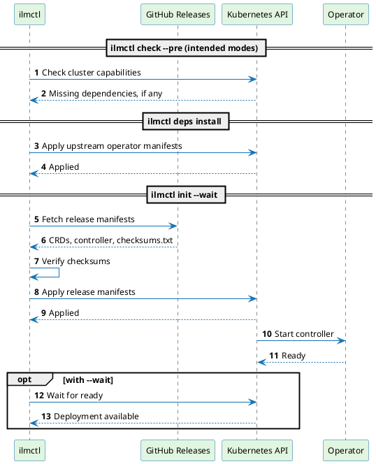

# Quickstart

## Install

| Channel | Command |
|---|---|
| Go | `go install github.com/OmniTrustILM/cli/cmd/ilmctl@latest` |
| Binary (signed) | Download from [Releases](https://github.com/OmniTrustILM/cli/releases), verify the checksum and cosign signature |
| kubectl plugin | Place `kubectl-ilm` on `$PATH`; kubectl auto-discovers it as `kubectl ilm` |
| Container | `docker run --rm -v ~/.kube:/home/nonroot/.kube hub.omnitrustregistry.com/ilm/cli:latest version` |

`.deb`/`.rpm` packages are attached to each release. A Homebrew tap, a Scoop bucket
and a custom krew index are prepared but **not published yet**; submission to the
public indexes (homebrew-core, krew-index) is held pending the trademark question.

## Use an already-running platform (no install step)

Point your kubeconfig at the cluster. The CLI discovers the operator and custom
resources from the API server; no local install is required.

```console
$ ilmctl version              # client + operator + platform versions (compat check)
$ ilmctl status -A            # operator, platforms, managed infra, connectors, proxies
$ ilmctl check                # diagnose the running install
$ ilmctl platform get         # list platforms, then describe / logs / events as needed
```

## Bootstrap a fresh cluster

```console
# 1. Check prerequisites for the modes you intend to run (here: all managed,
#    matching the Platform generated in step 4). Without mode flags, --pre has
#    no intended modes and requires no upstream operators.
$ ilmctl check --pre --db-mode managed --messaging-mode managed --keycloak-mode managed

# 2. Install the pinned upstream operators those modes need
#    (narrow with --only; alternatively pass --with-deps to init).
$ ilmctl deps install --only cnpg,rabbitmq,keycloak

# 3. Install the ILM operator.
#    Default: latest published release (CRDs applied first, then the controller).
#    The release manifests are verified against the release checksums.txt first.
$ ilmctl init --wait
#    Or pin the release:
$ ilmctl init --version v1.0.0 --wait
#    Development only — install from a commit or a local checkout (checksum-free):
$ ilmctl init --ref <commit-sha> --wait

# 4. Generate a Platform CR.
$ ilmctl platform generate \
    --profile managed-ha \
    --db-mode managed \
    --messaging-mode managed \
    --broker-type rabbitmq \
    --keycloak-mode managed \
    > platform.yaml

# 5. Review the file, commit it to Git, then apply.
$ kubectl apply -f platform.yaml
#    Or combine steps 4-5:
$ ilmctl platform generate --profile managed-ha --db-mode managed --apply

# 6. Wait for the platform to become available.
$ ilmctl platform wait ilm --for=condition=Available --timeout 10m

# 7. Verify.
$ ilmctl status
```

When installing a published release (the default, or a pinned `--version`),
`ilmctl init` is more than a bare `kubectl apply`: it fetches the release manifests
from the operator's GitHub release and verifies them against that release's
published `checksums.txt` before anything reaches the cluster. The developer
sources (`--ref`, `--manifest`, `--from-source`) are deliberately checksum-free —
no published checksums exist for a working tree or an arbitrary commit. The
sequence below covers the whole bootstrap — checking prerequisites, installing the
upstream operators the intended modes need, then installing the ILM operator
itself:



## What to read next

- [Configuration](./configuration.md) — flags, environment variables, output formats.
- [GitOps](./gitops.md) — the generate→commit→sync workflow with Argo/Flux.
- [Upgrades](./upgrades.md) — forward-only operator and platform upgrades.
- [Troubleshooting](./troubleshooting.md) — `check`, `status`, logs and events.
