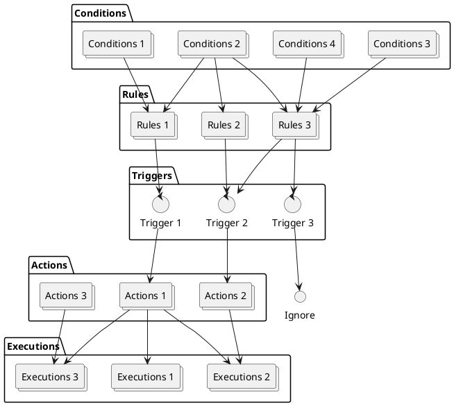

# Workflows

Workflows are a series of tasks executed in a specific sequence to automate processes, ensuring tasks are performed correctly and efficiently. They streamline operations by automating tasks such as categorizing discovered certificates in inventory, updating certificate statuses, and many other activities.

Workflows can be triggered manually, automatically, or by events such as the completion of a task or the creation of a new certificate. The primary goal of workflows is to automate and orchestrate tasks within a broader process, minimizing manual intervention and errors.

:::info[Workflow support]
The CZERTAINLY platform supports workflows starting from version 2.12.0. The current implementation includes a specific set of rules and actions that can be triggered for newly discovered certificates. The platform is designed to be extensible, with plans to add more rules, actions, and triggers in future releases.
:::

## Workflow components

A workflow consists of the following components:

| Component                                                  | Description                                                                                                                                                                            |
|------------------------------------------------------------|----------------------------------------------------------------------------------------------------------------------------------------------------------------------------------------|
| **[Conditions](../core-components/workflow/condition.md)** | Criteria used to evaluate if specific operations should be executed. If the conditions are met, the corresponding actions are triggered for the object.                                |
| **[Rules](../core-components/workflow/rule.md)**           | Collections of conditions that are assessed to decide if an action should be initiated. Rules can include multiple conditions with various types and operators.                        |
| **[Executions](../core-components/workflow/execution.md)** | Operations performed when a rule is triggered. Executions are typically processed in a specified order to ensure the correct sequence of actions.                                      |
| **[Actions](../core-components/workflow/action.md)**       | Groups of executions triggered when a rule's conditions are met. Actions may consist of multiple executions, each processed in a defined order for objects that match the rules.       |
| **[Triggers](../core-components/workflow/trigger.md)**     | Events that initiate a workflow. Triggers are linked to rules and actions, determining how and when a workflow starts. Triggers can be time-based, event-based, or manually initiated. |

## Components relations

The following diagram illustrates the relationship between the workflow components:

In this diagram:

- **Conditions** feed into **Rules**, defining the criteria for each rule.
- **Rules** link to **Triggers**, determining when the rules are evaluated.
- **Triggers** initiate **Actions**, specifying the actions to be taken.
- **Actions** lead to **Executions**, detailing the specific operations to be performed.
