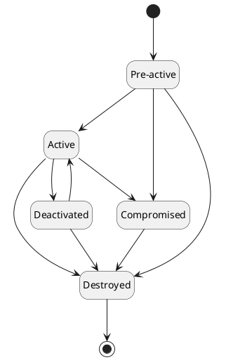

# Key

The `Key` holds the information about the cryptographic key and its lifecycle. It represents the cryptographic key in a human-readable format. `Key` holds the following information:

- `Key` management details
- Attributes of the `Key`
- Association with other related objects like `Certificate`
- History of events associated with the `Key`
- Wrapped content of other related parts of the `Key`, for example public/private key, or split/component parts

In addition to the above details, the following are mapped to the `Key` for the ease of management:

- `Token Profile` it belongs to and managed by
- Owner of the `Key`
- `Group` it belongs to
- Optionally description of the `Key`

## Attributes

`Key` attributes hold information related to the platform. It can contain Custom Attributes as well as Metadata Attributes.

Metadata Attributes provides any additional information about the `Key` that can be technology specific.
They can be used for further processing of the `Key` by different components and modules of the platform.

## Key state

Every key has defined its state during its lifecycle. The state of the `Key` defines its lifecycle phase and operations that can be performed.
Once the `Key` is created, it is in the `Pre-active` state and must be activated before it can be used for any cryptographic operation.

The following states are supported:

| State         | Description                                                                                                 |
|---------------|-------------------------------------------------------------------------------------------------------------|
| `Pre-active`  | The `Key` is created and ready to be used once activated, or activate date is reached                       |
| `Active`      | The `Key` is ready to be used                                                                               |
| `Deactivated` | The `Key` is not ready to be used                                                                           |
| `Compromised` | The `Key` is compromised and cannot be used, however it still exists                                        |
| `Destroyed`   | The `Key` is destroyed and mark for removal, however it is still in the inventory for the auditing purposes |

The transition `Key` state diagram is as follows:

## Key usage

Every key has defined its key usages. The key usage can restrict the type of cryptographic operation that can be performed using the `Key`.

The following key usages are supported:

| Key Usage | Description                                              |
|-----------|----------------------------------------------------------|
| `Encrypt` | Allows to request encryption operation using the `Key`   |
| `Decrypt` | Allows to request decryption operation using the `Key`   |
| `Sign`    | Allows to request signing operation using the `Key`      |
| `Verify`  | Allows to request verification operation using the `Key` |
| `Wrap`    | Allows to request wrapping operation using the `Key`     |
| `Unwrap`  | Allows to request unwrapping operation using the `Key`   |

The supported key usages and key types combinations are:

| Key Type      | Key Usage                                                |
|---------------|----------------------------------------------------------|
| `Public Key`  | `Encrypt`, `Verify`, `Wrap`                              |
| `Private Key` | `Decrypt`, `Sign`, `Unwrap`                              |
| `Secret Key`  | `Encrypt`, `Decrypt`, `Sign`, `Verify`, `Wrap`, `Unwrap` |
