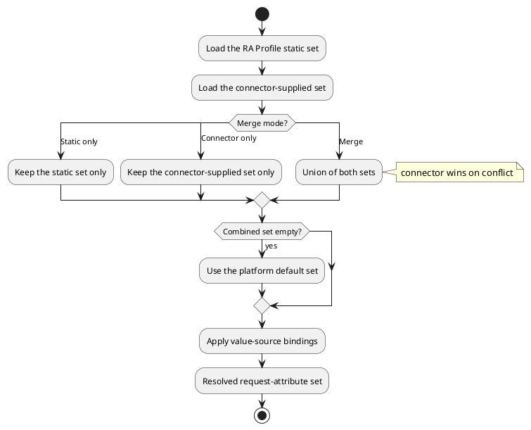

# Request Attribute

A request attribute defines one value the requester supplies when asking for a certificate. It is a regular platform attribute whose definition carries a **field mapping** — a declaration of which certificate field the value lands in. The presence of the mapping is the sole marker: an attribute without a mapping behaves exactly like any other attribute, so existing attribute definitions keep working unchanged.

Request attributes build on the platform attribute engine — see the [attributes overview](../architecture/attributes/overview.md). They are unrelated to [Custom Attributes](../../settings/custom-attributes.md): a custom attribute attaches extra information to a platform object, while a request attribute defines the content of the certificate itself.

## Why request attributes

Certificate requests are technical. They speak in subject components, SAN entries, and extension OIDs. Request attributes let you offer a friendly, policy-controlled request form instead — the requester fills in "Server FQDN" rather than composing a Common Name, and the platform places the value where it belongs.

The same definitions apply everywhere. They work the same whether the platform builds the request, a client supplies its own CSR, or the certificate is pre-registered before any key exists.

## Mapping targets

A field mapping declares one or more target fields in the certificate:

- **RDN (subject)** — a component of the certificate subject name. The RDN is identified by its code (for example `CN`) or its dotted-decimal OID, resolved through the [OID registry](../../settings/oid.md). Each mapping carries an ordering index, so multi-component subjects render in a defined order, and the same RDN type can appear more than once (multi-valued subjects).
- **Subject Alternative Name** — a typed SAN entry, such as a DNS name or an email address. SAN is a first-class target — it is never duplicated as a certificate extension.
- **Certificate extension** — an X.509 extension identified by its OID from the [OID registry](../../settings/oid.md). The registry entry provides the default criticality and the value encoding used to turn the string value into the extension value. The definition can allow the requester to override the criticality.

One attribute can map to several fields at once. A single "Server FQDN" value can land in both the subject `CN` and a `dNSName` SAN entry.

A mapped field also declares whose value wins when both a client CSR and platform-supplied attribute values offer it: the CSR value, the platform value, or the CSR value with the platform value as a fallback.

## Value sources

Orthogonal to the mapping, a definition can declare how the requester's value is obtained:

- **Free input** — the requester types any value.
- **Static list** — the requester picks from a fixed list of values defined with the attribute.
- **Connector callback** — the values are provided by a connector callback at request time.

Value-source bindings let an `RA Profile` attach a value source to a connector-supplied attribute by reference — attribute UUID, or name as a fallback. This is useful when the connector defines the attribute but you want to constrain what the requester can enter. Bindings are applied after the sets are combined, and each binding may target an attribute at most once. See [Request attributes on the RA Profile](./ra-profile.md#request-attributes).

## Where request-attribute sets come from

Request-attribute definitions have three sources:

- the **static set** authored on the [`RA Profile`](./ra-profile.md)
- the **connector-supplied set** provided by the `Authority`'s connector
- the **platform default set** managed in [platform settings](../../settings/request-attributes.md)

For a given `RA Profile`, the platform resolves them into one effective set:

1. Load the profile's static set.
2. Load the connector-supplied set. It is empty when the merge mode is **Static only**, or when the `Authority` has no connector.
3. Combine both per the profile's merge mode:
   - **Static only** — use only the static set; ignore the connector-supplied set.
   - **Connector only** — use only the connector-supplied set; ignore the static set.
   - **Merge** — union of both; on a conflict the connector definition wins and the static set contributes only what the connector did not supply. This is the default.
4. If the combined set is empty, the platform default set applies — the terminal fallback.
5. Apply the profile's value-source bindings onto matching definitions.

## Where the resolved set is used

- **Building a platform-side request** — when a certificate is issued with an existing platform key, the attribute values are projected into the subject, SAN entries, and extensions of the request the platform builds and signs.
- **Validating an external CSR** — a client-supplied CSR is checked against the resolved set, in strict or lenient mode. See [External CSR validation](./ra-profile.md#external-csr-validation).
- **Pre-registering a certificate** — the identity of a certificate registered before any key exists can be given as request-attribute values.
- **Protocol enrollment** — CSRs enrolled over protocols such as ACME, CMP, and SCEP are validated against the resolved set of the protocol's `RA Profile`.
