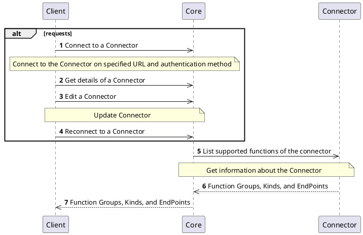
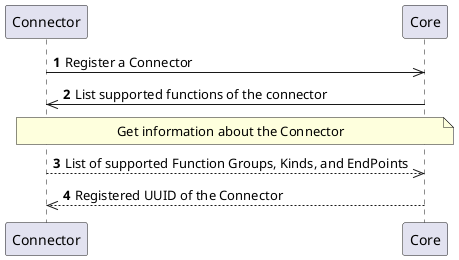

# Info Interface

## Overview

Each `Connector` has to implement the `Info` interface. This interface provides information about the list of supported functions and endpoints of the `Connector`.
The data is validated by the `Core` to check if the `Connector` is compliant with the definition of interfaces based on its function group.

## How it works

The `Info` interface is used during the `Connector` registration and reconnecting to update the information if necessary.

## Processes

### Client operations

The `Client` with proper permissions can manage the `Connectors` and invoke API that works with the `Info` interface of the `Connector`.
The following diagrams represents the requests and communication flow.

### Connector self-registration

The `Connector` is allowed to self-register in the platform. In this case the information about the `Connector` is stored and waiting for approval by the user or administrator.
The registration of the `Connector` may be executed by any external entity.

## Specification and example

You can find specification and information about the `Info` interface on the following locations:
- [Core Connector API](/api/core-connector/)
- Connector API specifications, see for example [Authority Provider](/api/connector-authority-provider-v2/)
