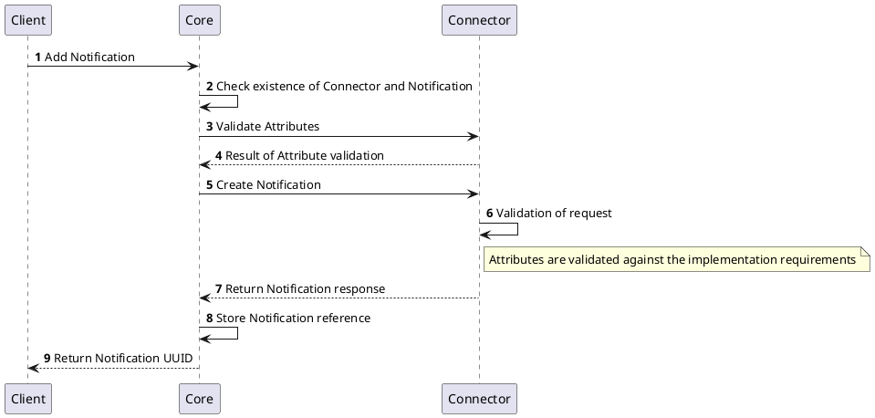
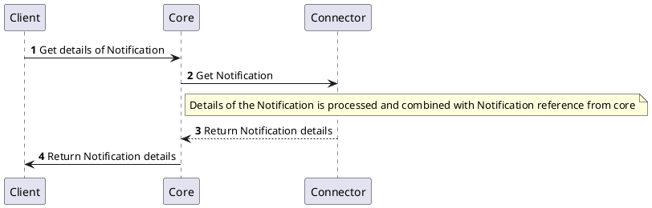
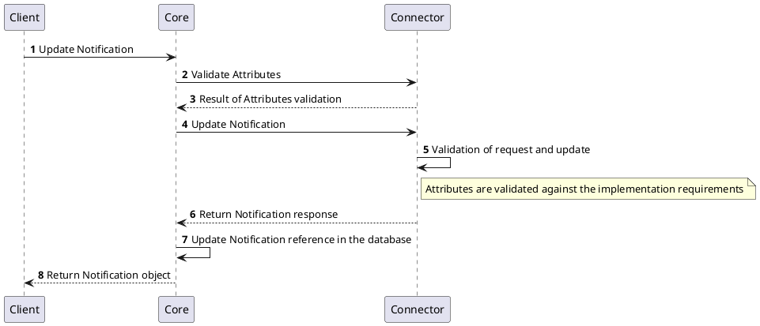
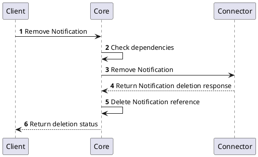
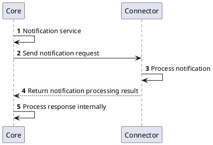

# Notification Provider

:::info[Using Notification Provider]
Notification Provider provides interface to extend the notification features of the platform. Notification Provider can be used to send notifications to the users of the platform using email, SMS, Slack, Team, webhook, or any other technology. 
:::

## Overview

Notification Provider handles notifications that should be sent to the users outside the scope of the deployment of the platform (external notification). The Notification Provider can be used to send notifications to the users of the platform using various technologies. Typical use cases are sending notifications to the users using email, however, the Notification Provider can be also used to create tickets in the ticketing system.

## How it works

Notification Provider consumes notification data from the `Core` and sends the notifications to the recipient(s) using the configured technology.

## Provider objects

[`Notification`](../concept-design/core-components/notification.md) objects are managed in the platform through the Notification Provider implementation.
Each `Notification` represents a single notification processing definition.

## Processes related to `Notification`

The following processes are associated with the Notification Provider and management of the `Notification` objects.

### Create `Notification` instance

### Get `Notification` instance details

### Update `Notification` instance

### Delete `Notification` instance

## Sending notifications

Once the notification should be sent to the recipient(s), the `Notification` object is used as proxy to the Notification Provider. The `Notification` object contains the information about how the notification should be processed. The `Notification` with the provided notification data.

## Specification and example

The Notification Provider implements [Common Interfaces](common-interfaces/overview.md) and the following additional interfaces:
- [Notification Instances Management](/api/connector-notification-provider/#tag/Notification-instances-Management)

The OpenAPI specification of the Notification Provider can be found here: [Connector API - Notification Provider](/api/connector-notification-provider/).
