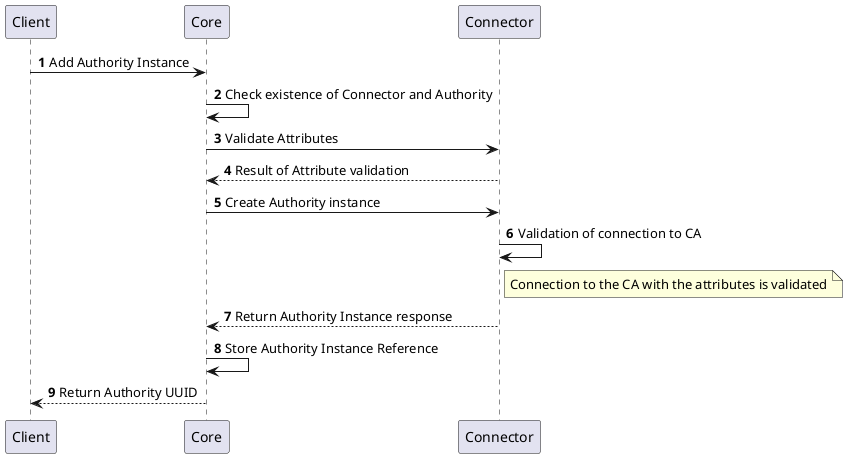
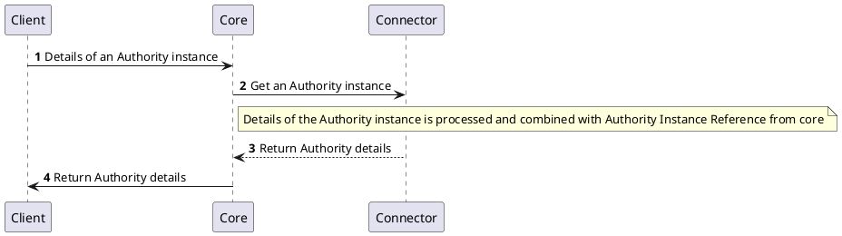
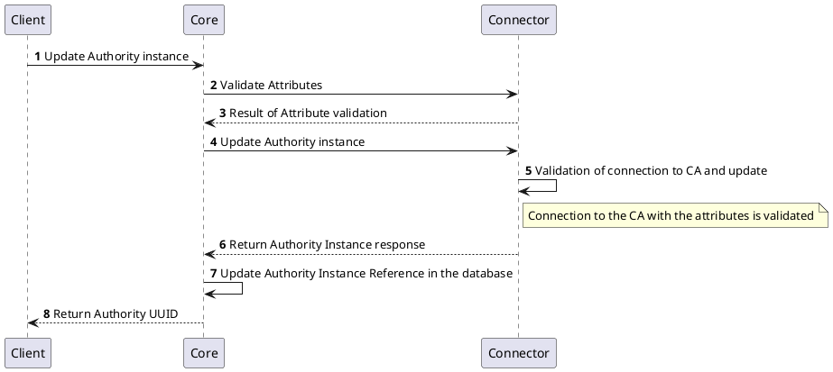
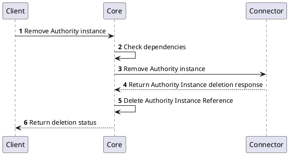
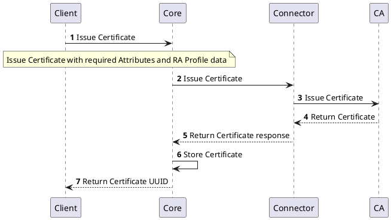
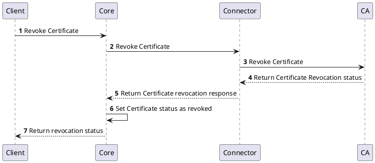

# Authority Provider Legacy

:::warning
Authority Provider Legacy is deprecated and will be removed in future release.
:::

## Overview

Authority Provider Legacy interface provides specific set of certificate management functions that support only API operations of the `EJBCA`.
The interfaces of the Authority Provider Legacy contain:
- Authority Management
- Certificate Management
- End Entity Management
- Profiles Management

## How it works

Authority Provider Legacy provides the ability to communicate with the EJBCA certification authorities.
:::warning
The Authority Provider Legacy interface is designed to work only with the EJBCA. If you are looking to support different technology, consider [Authority Provider v2](authority-provider-v2.md) interface.
:::

## Provider objects

[`Authority`](../../concept-design/core-components/authority.md) objects are managed in the platform through the Authority Provider Legacy implementation.

## Processes

The following processes are associated with the Authority Provider Legacy and management of the `Authority` objects.

## `Authority` Instance Management

### Create `Authority` Instance

### Get `Authority` Instance Details

### Update `Authority` Instance

### Delete `Authority` Instance

The below diagram shows the sequence of messages that are exchanged between the client, core, and provider to delete an Authority instance.

## `Certificate` Management

### Issue `Certificate`

### Renew `Certificate`

:::warning
Renewal of the certificate is not supported by the Authority Provider Legacy.
:::
### Revoke `Certificate`

## Specification and example

The Authority Provider Legacy implements [Common Interfaces](../common-interfaces/overview.md) and the following additional interfaces:
- [Authority Management](/api/connector-authority-provider-legacy#tag/authority-management)
- [Certificate Management](/api/connector-authority-provider-legacy#tag/certificate-management)
- [End Entity Profiles](/api/connector-authority-provider-legacy#tag/end-entity-profiles)
- [End Entity Management](/api/connector-authority-provider-legacy#tag/end-entity-management)

The OpenAPI specification of the Authority Provider Legacy can be found here: [Connector API - Authority Provider Legacy](/api/connector-authority-provider-legacy).
