# Authority Provider v3

## Overview

Authority Provider v3 is the current interface between the platform and a certification authority connector. A connector implementing it manages `Authority` instances and performs the certificate operations against the upstream CA:

- supplies the attribute definitions for issuing and registering certificates
- issues a certificate from a certificate signing request, renews it, and revokes it
- pre-registers a certificate's identity before any key exists
- identifies externally issued certificates at the CA
- accepts operations the CA cannot complete synchronously for asynchronous completion — the platform then polls the connector for the result, or cancels the pending operation

Compared to [v2](./authority-provider-v2.md), the v3 interface adds:

- **Typed request content** — the connector can receive the certificate identity as a structured `requestContent` object instead of only flat string fields. See [Structured Certificate Request Content](./request-attributes-structured.md).
- **Certificate pre-registration** — the platform can register a certificate's identity at the upstream CA before any CSR exists.
- **Identity override** — the platform can pass an authoritative identity alongside a forwarded CSR, for the connector to apply per its CA technology.
- **Capability flags** — every new behavior is gated by a feature flag the connector advertises. A connector that does not advertise a flag is never asked to perform the gated operation.

The platform-side model behind the typed content — request attributes, field mappings, and how the effective set is resolved — is described in [Request Attribute](../../concept-design/core-components/request-attribute.md).

## How it works

Authority Provider v3 provides the ability to communicate with different types and technologies of certification authorities. The platform supports both **synchronous** authorities (the connector returns the issued or revoked certificate immediately) and **asynchronous** authorities (the connector parks the operation and reports back later, or hands the operation off to an operator). The signal between the platform and the connector for the asynchronous case is the HTTP response code on the issue, renew, and revoke calls — see [Asynchronous certificate operations](#asynchronous-certificate-operations) below.

## Capability flags

Connectors advertise feature flags. The flags are opt-in: a feature is supported only when the connector explicitly lists it. An absent flag means the feature is not supported. The platform enforces the gate — it never calls a flag-dependent operation on a connector that does not advertise the flag.

Four flags gate the v3 authority features:

- **`certificateRegistration`** — the connector can pre-register a certificate's identity (subject DN, SAN entries, extensions) at the upstream CA before a CSR exists.
- **`certificateStatusPolling`** — the platform may poll the connector for completion of asynchronous operations.
- **`certificateRequestStructured`** — the connector accepts the structured `requestContent` model on register, issue, and renew, instead of only the flat fields. See [Structured Certificate Request Content](./request-attributes-structured.md).
- **`certificateIdentityOverride`** — the connector applies an authoritative platform-supplied identity to a forwarded CSR per its CA technology (for example an EJBCA end-entity override), without the platform stripping or re-signing the CSR.

## Provider objects

[`Authority`](../../concept-design/core-components/authority.md) objects are managed in the platform through the Authority Provider v3 implementation.

## `Authority` instance management

### Create `Authority` instance

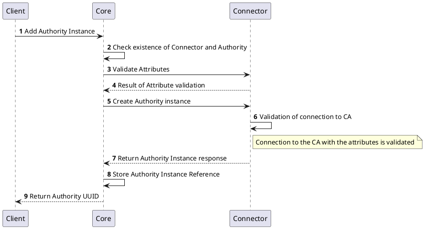

### Get `Authority` instance details

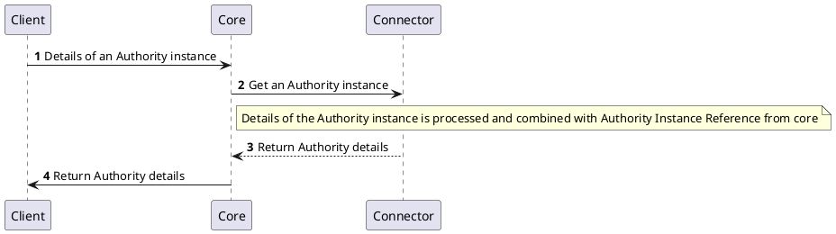

### Update `Authority` instance

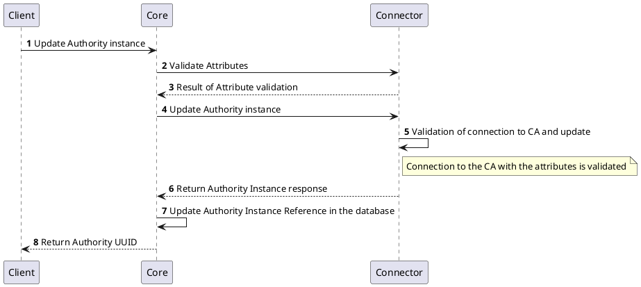

### Delete `Authority` instance

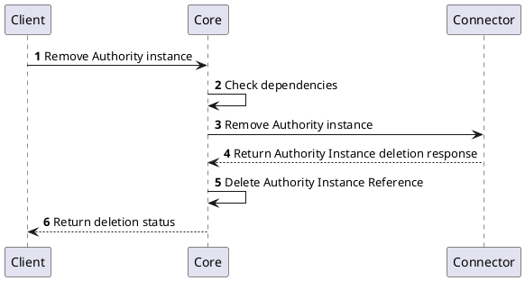

## `Certificate` management

### Issue `Certificate`

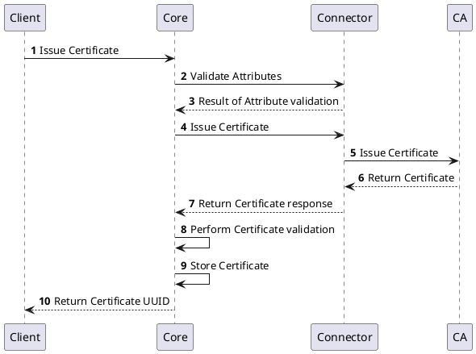

### Renew `Certificate`

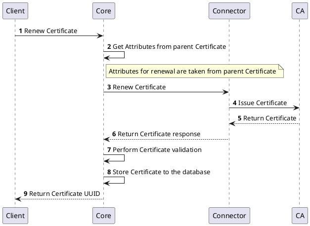

### Revoke `Certificate`

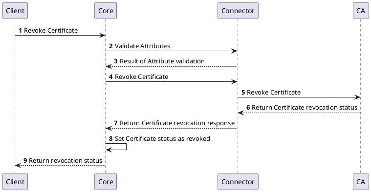

### Register `Certificate`

The register operation pre-registers a certificate's identity at the upstream CA before any key or CSR exists. It is gated by the `certificateRegistration` [capability flag](#capability-flags). When the connector does not advertise the flag, the platform still pre-registers the certificate — at the platform level only, with no connector call.

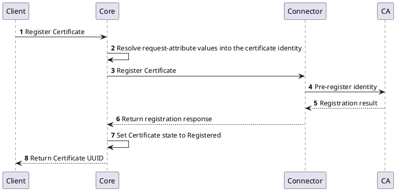

The connector registers synchronously, or accepts the registration for asynchronous completion — the certificate then waits in `Pending Registration` and the platform polls for the result when the connector advertises `certificateStatusPolling`. The response semantics are described in [Registration wire](./request-attributes-structured.md#registration-wire).

Completing a registration is an issue operation: the platform runs the standard [issue flow](#issue-certificate) with the registered identity. When the connector advertises both `certificateRequestStructured` and `certificateIdentityOverride`, the registered identity is passed alongside the CSR as the authoritative identity — see [Identity override](./request-attributes-structured.md#identity-override). For the operator flow, see the [Register Certificate](../../quick-start/certificate-management/register-certificate.mdx) quick start.

## Asynchronous certificate operations

When a certification authority cannot complete `issue`, `renew`, or `revoke` synchronously — for example a manual or air-gapped CA, a CA that processes requests in batches, or an external authority that requires an operator-driven step — the connector **parks** the operation.

### Parking signal

The signal is the HTTP response on the issue, renew, and revoke calls:

| Connector response                      | Certificate state transition                                            |
|-----------------------------------------|--------------------------------------------------------------------------|
| `200 OK` with the certificate content   | → `Issued` (issue/renew) or `Revoked` (revoke). Synchronous completion.  |
| `202 Accepted`                          | → `Pending Issue` (issue/renew) or `Pending Revoke` (revoke). Parked.    |
| Any other status / connector exception  | → `Failed` (or back to `Issued` for revoke).                             |

Either response may carry `meta` — a value **opaque** to the platform. The connector chooses what to put in it (an order ID, a transaction reference, multi-field state); the platform stores it against the certificate and sends it back on later calls for the same operation. The platform does not interpret the value.

There is no platform-level "offline" or "external" classification of authorities, RA profiles, or connectors. Behaviour is driven by certificate state and the connector's response.

### Parked-operation lifecycle

Four operations complete the parked-operation lifecycle: cancel a parked issue, cancel a parked revoke, poll the status of a parked issue, and poll the status of a parked revoke. The operation type is explicit in each call, so the connector knows unambiguously what it is acting on. The platform dispatches by certificate state — a `Pending Issue` certificate routes to the issue operations, a `Pending Revoke` certificate to the revoke operations. Sync-only connectors are never asked: these operations are invoked only for certificates in `Pending Issue` or `Pending Revoke`, which exist only after a `202` response.

**Status polling.** The platform polls only when the connector advertises the `certificateStatusPolling` [capability flag](#capability-flags). A poll reports the operation as in progress, completed, or failed. For a completed issue or renew, the response carries the certificate content and the platform finalises it through the same internal path as a manual upload. For a completed revoke, no payload is needed — the platform finalises the revoke transition. For a failed operation, the connector's reason is surfaced and the certificate moves to `Failed`. The optional `meta` in the response lets the connector refresh the tracked state on each poll.

**Cancel.** The platform treats the connector's response to a cancel as follows:

- **Acknowledged** (`204`) — the platform proceeds with the local state transition.
- **Not tracked** (`404`) — the operation was already finalised externally, or the implementation is stateless. A soft failure: the result is recorded in event history and the local transition proceeds.
- **Refused** (`422`, with a reason) — the underlying CA cannot abort the operation. A hard failure: the reason is surfaced to the user and the certificate stays in its pending state.
- **Server or network error** — a soft failure. The platform records the error and proceeds with the local transition (cancel is user intent).

### Park `Certificate` issue (renew)

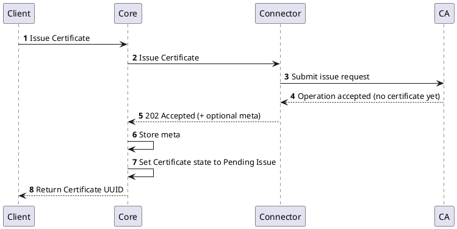

The same flow applies to renew — the new certificate ends in `Pending Issue` while the predecessor remains `Issued` until the new certificate is finalised.

### Park `Certificate` revoke

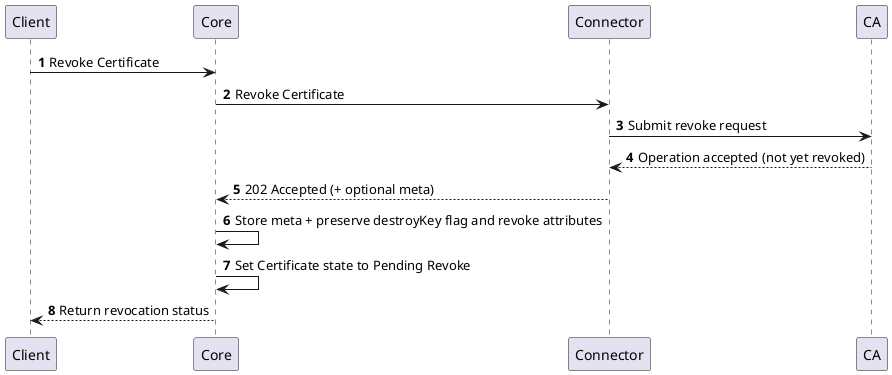

The `destroyKey` flag and revoke attributes from the original request are preserved on the certificate and applied when the parked revoke is confirmed.

### Finalise parked issue (manual upload)

When an operator uploads the externally-issued certificate, the platform verifies the upload, asks the connector to identify it, and transitions the certificate to `Issued`.

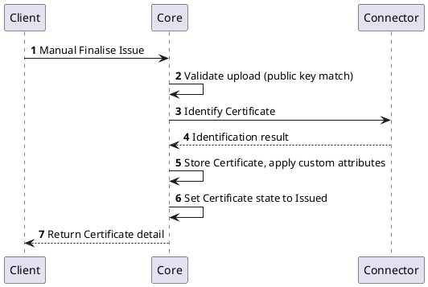

### Confirm parked revoke

Used when the revocation has been completed externally and the operator confirms it in the platform.

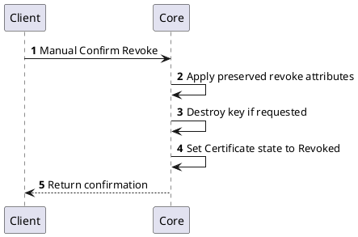

### Cancel parked operation

Used when the parked operation is no longer wanted. The platform dispatches to the appropriate connector cancel operation based on certificate state.

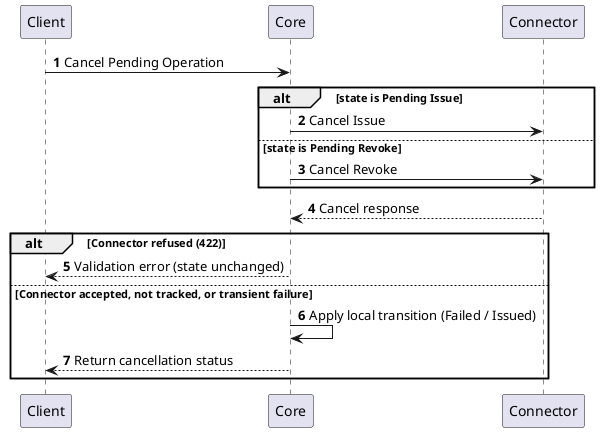

### Operations blocked while pending

While a certificate is in `Pending Issue` or `Pending Revoke`, the following client operations return `400 Bad Request`:

- renew
- rekey
- revoke (for certificates in `Pending Issue`)
- re-issue of the same `Requested` certificate
- switching the RA profile

The escape hatch from a stuck pending state is [Cancel parked operation](#cancel-parked-operation).

## Specification and example

The Authority Provider v3 implements [Common Interfaces](../common-interfaces/overview.md). The wire contract for the typed request content, the identity override, and the registration responses is described in [Structured Certificate Request Content](./request-attributes-structured.md).

:::info[API reference]
The OpenAPI specification of the Authority Provider v3 will be published with the next platform release. The sequence diagrams above therefore link only the platform's client operations for now.
:::
