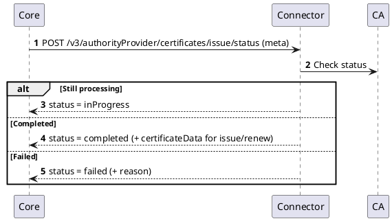
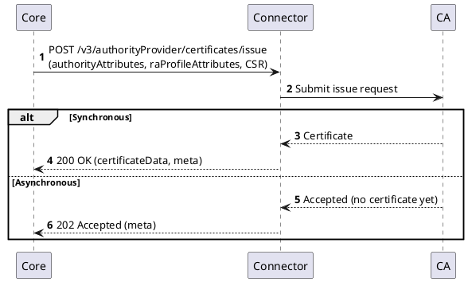
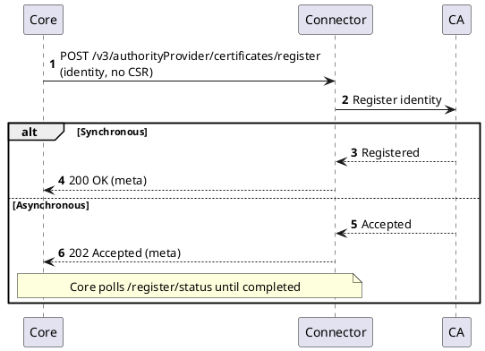

# Authority Provider v3

## Overview

Authority Provider v3 is the current interface between the `Core` and a certification authority. Like the [v2 interface](./authority-provider-v2.md) it covers certificate **issue**, **renew**, **rekey**, and **revoke**, and adds **pre-registration** — registering an identity with the CA before a CSR exists. It differs from v2 in three ways:

- **Stateless.** There is no authority-instance lifecycle (`createAuthorityInstance` and friends are gone). The authority identity travels in every request.
- **Capability-driven.** Optional behavior (pre-registration, status polling, structured requests, identity override) is advertised per connector and enforced by the platform.
- **Synchronous or asynchronous.** Any operation may complete immediately or be accepted for later completion, which the platform polls to a terminal state.

The v3 certificate states and transitions (`Pending Registration`, `Registered`, the async `Pending Issue` / `Pending Revoke` states, and their restore paths) are documented on the [Certificate state](../../concept-design/core-components/certificate.md#certificate-state) page; this page describes the connector interface itself and does not repeat the state diagram.

## Relationship to Legacy and v2

The `interfaces` repository carries three generations of the authority-provider contract. The platform picks the implementation from the interface version the connector reports for its authority:

| Generation | Wire | Authority identity | Certificate operations |
|------------|------|--------------------|------------------------|
| [Legacy](./authority-provider-legacy.md) | `/v1/…` | Stateful authority instance | Issue, renew, revoke |
| [v2](./authority-provider-v2.md) | `/v2/…` (instance mgmt at `/v1/…`) | Stateful authority instance | Issue, renew, revoke, plus async parking of parked operations |
| **v3** | `/v3/…` | **Stateless** — attributes in each request | Issue, renew, rekey, revoke, **register**, identify — synchronous or asynchronous |

A connector that reports interface version `v2` is served by the stateful adapter; one that reports `v3` is served by the stateless adapter. A legacy connector uses the separate legacy path. The stateless and stateful models are otherwise independent — a v3 authority has no authority-instance object at all.

## How it works

### Stateless model

v3 has **no authority-instance lifecycle**. There is no create, read, update, or delete of an authority instance on the connector — the operations a v3 connector exposes at the authority level are only:

- `listAuthorityAttributes` — the attribute schema shown when an operator sets up an authority.
- `checkAuthorityConnection` — validate the supplied authority attributes by reaching the CA (a `204` means reachable).
- `listRaProfileAttributes` — the RA-profile attribute schema, given authority context.
- `getCrl`, `getCaCertificates` — fetch a CRL (full or delta) and the CA chain.

Because nothing is stored connector-side, **every** certificate request carries the full context the connector needs to reconstruct the upstream-CA session: two attribute lists, `authorityAttributes` and `raProfileAttributes`. The platform assembles them from the authority and RA-profile configuration on each call (dereferencing any secret or credential references as the system identity) and the connector rebuilds its CA session per request. There is no session or instance handle to keep in sync.

### Capabilities (feature flags)

Optional v3 behavior is gated by capabilities a connector advertises in its interface `features`. These flags are **opt-in and enforced**: if a connector does not advertise a capability, the platform treats it as unsupported and never invokes it.

| Capability | Code | What it enables |
|------------|------|-----------------|
| Certificate registration | `certificateRegistration` | Pre-register an identity with the CA before a CSR exists (the `/register` endpoints). |
| Certificate status polling | `certificateStatusPolling` | The connector can be polled for asynchronous completion. Without it, the platform will not poll even if the connector accepts an operation with `202`. |
| Structured certificate request | `certificateRequestStructured` | The connector accepts the structured request-content model on register / issue / renew. |
| Certificate identity override | `certificateIdentityOverride` | The connector applies a platform-supplied identity to a forwarded CSR (e.g. an End Entity override) instead of stripping and re-signing it. |

The platform enforces capabilities in depth: the operation is only attempted when the adapter supports it, the authority advertises the flag, and — as a final backstop — the connector may still answer `OPERATION_NOT_SUPPORTED` at runtime.

## Certificate operations

All v3 certificate operations are `POST` requests under `/v3/authorityProvider/certificates`, each carrying `authorityAttributes` + `raProfileAttributes` alongside the operation payload.

| Operation | Path | Purpose |
|-----------|------|---------|
| List issue attributes | `/issue/attributes` | Dynamic attribute schema for issuance. |
| Issue | `/issue` | Issue a certificate from a CSR. |
| Renew / rekey | `/renew` | Renew or rekey. Status and cancel reuse the `issue` endpoints. |
| List revoke attributes | `/revoke/attributes` | Dynamic attribute schema for revocation. |
| Revoke | `/revoke` | Revoke a certificate. |
| List register attributes | `/register/attributes` | Dynamic attribute schema for registration. |
| Register | `/register` | Pre-register an identity (no CSR). |
| Identify | `/identify` | Identify an uploaded certificate at the CA. |
| Status | `/issue/status`, `/revoke/status`, `/register/status` | Poll a parked operation. |
| Cancel | `/issue/cancel`, `/revoke/cancel`, `/register/cancel` | Cancel an in-flight operation. |

Renew and rekey do not have their own status, cancel, or attribute endpoints — they reuse the `issue` ones.

Unlike v2, v3 has **no connector-side attribute validation** round-trip. The platform validates request attributes structurally against the schema returned by the `…/attributes` endpoints; the connector is not asked to re-validate.

## Synchronous and asynchronous operations

A v3 connector may complete an operation immediately or accept it for later completion. The signal is the HTTP status on the operation call:

| Operation | Synchronous | Asynchronous |
|-----------|-------------|--------------|
| Issue / renew / register | `200 OK` with the result in the body | `202 Accepted` |
| Revoke | `204 No Content` (or `200 OK` with metadata only) | `202 Accepted` |

When a connector accepts an operation asynchronously, it returns a connector-owned **`meta`** tracking handle in the body. `meta` is a single opaque bag — the platform never interprets it; it stores it against the certificate and replays it verbatim on every subsequent status, cancel, or register-bound issue call. The connector decides what to put in it (an order ID, a transaction reference, multi-field state).

The platform then resolves the operation by **polling** the matching `…/status` endpoint, provided the authority advertises `certificateStatusPolling`. If it does not, the platform does not poll and the operation is completed out-of-band. (The pending certificate states the platform tracks meanwhile are described on the [Certificate state](../../concept-design/core-components/certificate.md#certificate-state) page.)

### Polling

The status response reports one of `inProgress`, `completed`, or `failed`. For a completed issue or renew it carries the Base64 certificate; for a completed revoke no payload is needed. A failed status carries a curated `reason` that the platform surfaces to the operator. An `inProgress` result resets the attempt counter, so a genuinely slow CA never times out on the platform side.

### Issue (synchronous or asynchronous)

### Cancel

A cancel targets an in-flight operation. The connector returns one of three outcomes:

- **Aborted** (`204`) — the connector aborted the operation.
- **Not tracked** (`404`, or `422` with a not-tracked error code) — the connector does not (or no longer) track the operation: already finalized externally, or a stateless implementation.
- **Refused** (`422` with a point-of-no-return error code) — the CA cannot abort the operation.

The connector reports the outcome; the platform decides the resulting certificate state.

## Certificate registration (pre-registration)

When an authority advertises `certificateRegistration`, the connector supports **pre-registration** — registering an identity with the CA before any CSR exists. The connector exposes two endpoints for it:

- `/register/attributes` — the attribute schema for registration.
- `/register` — register an identity. The request carries the registration identity (the subject and, when `certificateRequestStructured` is advertised, the structured request content) but **no CSR**. Like issue, it completes synchronously (`200`) or asynchronously (`202` with a `meta` handle, resolved through `/register/status` and `/register/cancel`).

Registration returns no certificate — it establishes the identity at the CA. When the certificate is later issued, the connector receives an ordinary `/issue` call that **replays the registration's `meta` handle**, so it can link the issuance to the earlier registration. Accepting that replayed handle is the connector's only obligation at completion; how the platform drives completion (attaching the CSR, verifying any challenge) is on the [Certificate state](../../concept-design/core-components/certificate.md#registration-lifecycle) page.

Two aspects of registration are handled entirely by the platform and do not involve the connector:

- **Platform-level pre-registration** — when an authority does not advertise `certificateRegistration`, the platform registers the identity itself, with no `/register` call.
- **Authorization secret (challenge)** — an operator may protect a registration with a secret that must be presented again to complete the issuance. It is a control between the operator and the platform; no connector request or response carries it.

Both, along with the certificate states through registration and completion, are described on the [Certificate state](../../concept-design/core-components/certificate.md#registration-lifecycle) page.

## For connector developers

A v3 connector reconstructs the CA session from `authorityAttributes` + `raProfileAttributes` on every call. The **base contract** it must implement is the attribute-list endpoints (`/issue/attributes`, `/revoke/attributes`), `issue`, `renew`, `revoke`, `identify`, and the authority-level `listAuthorityAttributes`, `checkAuthorityConnection`, `listRaProfileAttributes`, `getCrl`, `getCaCertificates`.

**Optional, capability-advertised** behavior (only used when the corresponding flag is advertised):

- `certificateRegistration` → implement `/register` and `/register/attributes` (and, if registration can be asynchronous, `/register/status` and `/register/cancel`).
- `certificateStatusPolling` → implement the `…/status` and `…/cancel` endpoints and honor `202`. Without advertising it, returning `202` will leave the certificate parked with no polling.
- `certificateRequestStructured` / `certificateIdentityOverride` → accept the structured request-content model and apply a platform-supplied identity to a forwarded CSR.

**Signalling async:** return `202` with a connector-owned `meta` tracking handle in the body. The platform replays that `meta` on every subsequent status, cancel, and register-bound issue call, and reports completion through the status endpoint as `inProgress` / `completed` / `failed`.

## Specification

Authority Provider v3 implements the [Common Interfaces](../common-interfaces/overview.md) plus the v3 Authority Management and Certificate Management interfaces.

The OpenAPI specification of the Authority Provider v3 is published in the platform API reference: [Connector API - Authority Provider v3](/api/connector-authority-provider-v3/).
