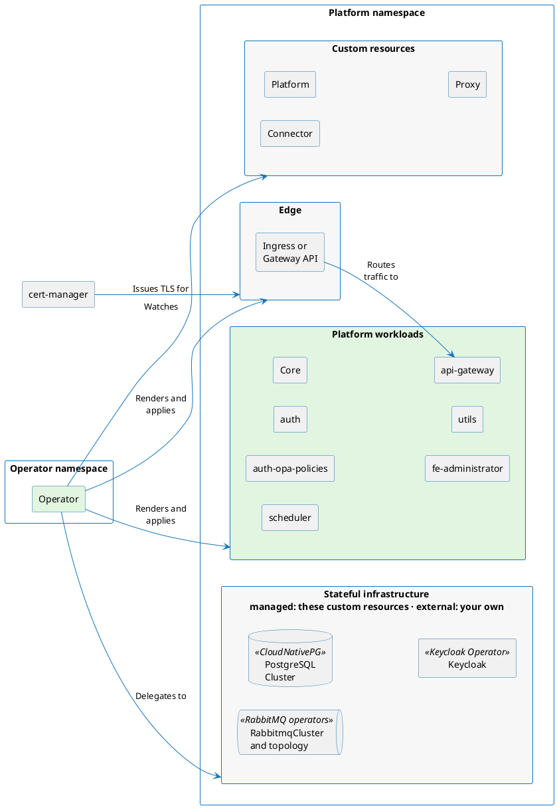

# Deployment using the Kubernetes Operator

The Kubernetes operator is the recommended way to run the platform on a Kubernetes cluster. Instead of rendering templates yourself, you describe the platform you want in a single `Platform` custom resource and the operator renders every object that follows from it, applies it, and keeps it converged for the lifetime of the deployment. It can provision the database, the message broker, and the identity provider for you, or wire the platform to instances you already run.

## What the operator manages

One operator binary serves three custom resources in the `otilm.com` API group, all at version `v1alpha1`. It renders the platform's own workloads and the objects around them, delegates stateful infrastructure to the upstream operators that specialize in it rather than re-templating it, and renders an edge in front of the platform only when you ask for one.

## The three custom resources

**`Platform`** describes one platform in one namespace — its components, its database, broker, and identity provider, its edge, and how all of them are wired together. It is the resource you apply to deploy the platform, and the one you edit to change it: [The Platform CR](./custom-resources/platform.md).

**`Connector`** extends a platform with a provider service the platform calls out to. The custom resource deploys that service and, when you ask it to, registers the service with the platform so it appears in the administration UI: [The Connector CR](./custom-resources/connector.md).

**`Proxy`** runs the outbound-only broker bridge that reaches a platform from a restricted network zone. It is configured entirely from a config token the platform's provisioning service issues, so the custom resource itself carries no broker settings: [The Proxy CR](./custom-resources/proxy.md).

## Where to go next

| I want to… | Go to |
|---|---|
| Install the operator | [Installation](./installation.md) |
| Stand up my first platform | [Run your first platform](./custom-resources/platform.md#run-your-first-platform) |
| Configure the platform — infrastructure, edge, secrets, scaling | [The Platform CR](./custom-resources/platform.md) |
| Look up a specific `Platform` field | [Platform options](./custom-resources/platform-options.md) |
| Add a connector to the platform | [The Connector CR](./custom-resources/connector.md) |
| Run a proxy at a remote site | [The Proxy CR](./custom-resources/proxy.md) |
| Move the platform to a newer version | [Upgrading](./upgrading.md) |
| Move an existing Helm deployment onto the operator | [Migrating from the Helm chart](./migration-from-helm.md) |
| Work out why the platform is not ready | [Troubleshooting](./troubleshooting.md) |
