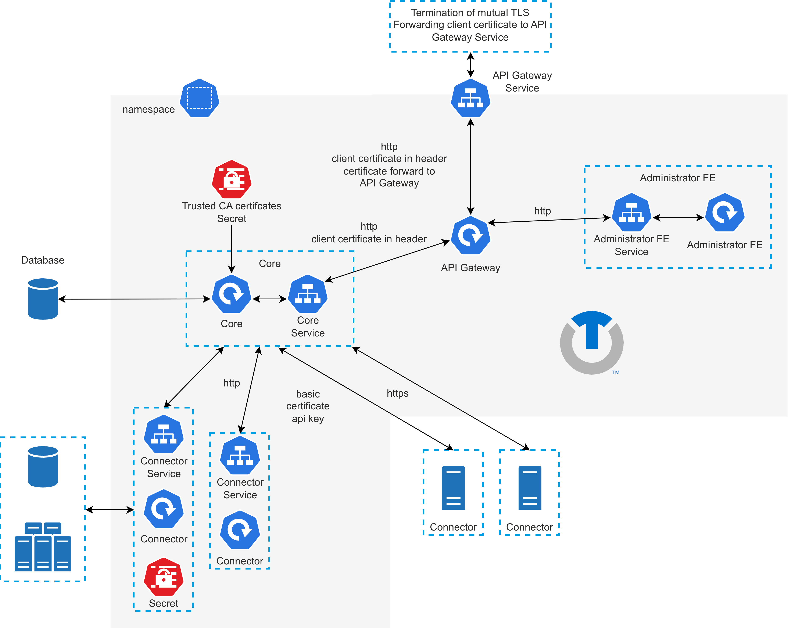

# Introduction

One of the approaches we have adopted from the beginning of development of the platform is easy installation and deployment. We believe that you should not spend weeks or even months working on the configuration before starting to use the platform.

Therefore, we have adopted a container-based approach and prepared container images and related documentation. With this you can easily and in a short time deploy the platform and required connectors and services.

## How the platform is deployed

The platform is composed of microservices, and containers are its basic building blocks. It can be deployed in more than one way, and the way you choose determines the rest of the installation — its prerequisites, its procedure and, later, its upgrade path. The choice is therefore the first step, not an implementation detail at the end.

The following diagram shows the platform deployed in Kubernetes — the topology the Kubernetes Operator and the Helm chart both produce; the virtual appliance runs the same services as a self-contained image. A Kubernetes deployment can be further extended by whatever the target environment supports (for example the [Istio](https://istio.io/) service mesh).

## What you need before you start

Every option needs somewhere to run. The Kubernetes Operator and the Helm chart both deploy into a Kubernetes cluster you provide; the virtual appliance runs on a virtual-machine host. Sizing depends on which components you enable, so each option's guide carries its own prerequisites and figures.

| Option | Where it runs | Prerequisites |
|---|---|---|
| Kubernetes Operator | A Kubernetes cluster | [Before you begin](deployment/deployment-operator/installation.md#before-you-begin) |
| Helm chart | A Kubernetes cluster | [Prerequisites](deployment/deployment-helm/overview.md#prerequisites) |
| Virtual appliance | A virtual-machine host | [Deployment using Virtual Appliance](deployment/deployment-appliance/overview.md) |

## Installation steps

| Step | Description | Reference |
|---|---|---|
| 1. Choose a deployment option | The option you choose determines the prerequisites, the installation procedure and the upgrade path. | [Deployment options](deployment/deployment-options.md) |
| 2. Follow that option's guide | Each option documents its own prerequisites and installation steps end to end. | [Kubernetes Operator](deployment/deployment-operator/overview.md) · [Helm](deployment/deployment-helm/overview.md) · [Virtual appliance](deployment/deployment-appliance/overview.md) |
| 3. Create the first Super Administrator | Create a Super Administrator and configure the platform. | [Create Super Administrator](create-super-administrator.md) |

## Shared infrastructure

The Helm chart expects you to provide a database and a set of trusted certificates before you install. The virtual appliance installs its own database, and the Kubernetes Operator can manage the database for you — with those two options you need these pages only if you run external infrastructure.

- [Database setup](database-setup.md)
- [Create Trusted Certificates](create-trusted-certificates.md)

## After installation

Once the first administrator is created, you can access the Administrator Interface.
Use the following URL with the client certificate authentication (first administrator):
`https://[domain]:[port]/administrator`

After successfully logging in, you can start administering and using the platform.

:::info[Changing administrator web base URL context]
You can change the base URL of the administrator web interface. By default, the `/administrator` is used.
:::
