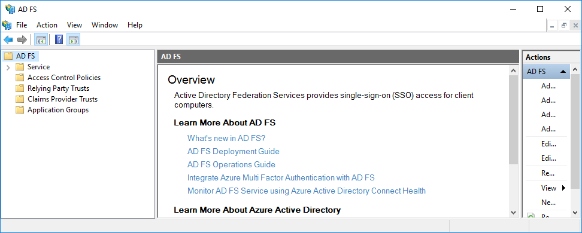
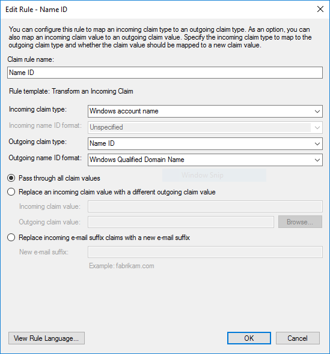
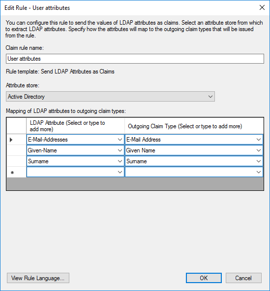
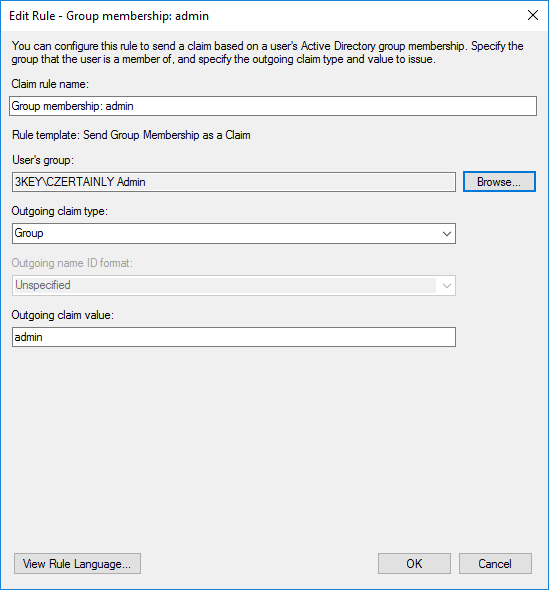

# Configure AD FS

To configure AD FS for integration with Keycloak, we need to add a new Relying Party Trust and set up claim issuance policy.

## Add Relying Party Trust

Open the *AD FS Management console* on the Windows Server and follow the steps below:

1. Right-click on **`Trust relationships`** and select **`Add Relying Party Trusts...`** from the context menu.
2. Select **`Claims aware`** and click **`Start`**.
3. Import data about the relying party using URL or manually via file by clicking browse and click **`Next`**. You can find the SAML 2.0 service provider metadata URL in the [Keycloak configuration](./configure-keycloak.mdx#export-service-provider-metadata).
4. Enter the **`Display name`** of the new relying party and click **`Next`**.
5. Adjust the **`Access control Policy`** to limit users from using the new relying party and click **`Next`**.
6. Review all settings and click **`Next`**.
7. Keep the **`Configure claims issuance policy for this application`** checkbox checked and click **`Close`** to add the new relying party trust.

<center>
    <div style={{width: "80%"}}>

        

    </div>
</center>

The new relying party trust is now added to the list of relying party trusts. Users can authenticate using the new relying party trust, however, no user attributes are sent to the service provider. For that, we need to set up claim mapping.

## Setup claim issuance policy

Open the *AD FS Management console* on the Windows Server. In the list of **`Relying Party Trusts`** right-click on the relying party and from the context menu select **`Edit claim Issuance Policy...`** to open the editor. Configure the following rules:

### Name ID

1. Click on **`Add Rule...`** to open the **`Add Transform Claim Rule Wizard`**.
2. Select **`Transform an Incoming Claim`** and click **`Next`**.
3. Enter the **`Claim rule name`** as `Name ID`.
4. Select **`Windows Account Name`** as the **`Incoming claim type`** and **`Name ID`** as the **`Outgoing claim type`**.
5. Select **`Outgoing name ID format`** as **`Windows Qualified Domain Name`** and click **`Finish`**.

This rule will provide claims about the user's name in the format `username/domain`.

<center>
    <div style={{width: "80%"}}>

        

    </div>
</center>

### User attributes

1. Click on **`Add Rule...`** to open the **`Add Transform Claim Rule Wizard`**.
2. Select **`Send LDAP Attributes as Claims`** and click **`Next`**.
3. Enter the **`Claim rule name`** as `User attributes`.
4. Select **`Active Directory`** as the **`Attribute store`**.
5. Select the **`LDAP Attribute`** as **`E-Mail-Addresses`** and the **`Outgoing Claim Type`** as **`E-Mail Address`**.
6. Select the **`LDAP Attribute`** as **`Given-Name`** and the **`Outgoing Claim Type`** as **`Given Name`**.
7. Select the **`LDAP Attribute`** as **`Surname`** and the **`Outgoing Claim Type`** as **`Surname`**.
8. Click **`Finish`**.

This rule will provide claims about the user's email address, given name, and surname from the Active Directory data.

<center>
    <div style={{width: "80%"}}>

        

    </div>
</center>

### Group membership

1. Click on **`Add Rule...`** to open the **`Add Transform Claim Rule Wizard`**.
2. Select **`Send Group Membership as a Claim`** and click **`Next`**.
3. Enter the **`Claim rule name`** as `Group membership: admin`. Change the name according to the group you want to send.
4. Select user's group using **`Browse...`** button.
5. Select **`Group`** as the **`Outgoing claim type`**.
6. Select the **`Outgoing claim value`** as the the associated name of the role in the CZERTAINLY platform, for example **`admin`**.
7. Click **`Finish`**.

This rule will provide claims about the user's group membership in the format of the group name.

<center>
    <div style={{width: "80%"}}>

        

    </div>
</center>

:::info[Group membership]
The group membership rule will provide claims about the user's group membership only in case the user is a member of the selected group. If you want to provide claims about multiple groups, you need to create a separate rule for each group. The group name should match the role name in the CZERTAINLY platform, or it will be created as a new role, depending on the platform configuration.
:::

## PowerShell configuration

You can use PowerShell to automate the configuration of the AD FS relying party trust and claim issuance policy. The following script will add a new relying party trust and configure claim issuance policy for the new relying party trust. Change the `$metadataUrl`, `$relyingPartyName`, and `$accessControlPolicy` variables to match your environment.

```powershell
# Add new relying party trust
$metadataUrl = "https://keycloak.example.com/realms/CZERTAINLY/broker/adfs-idp-alias/endpoint/descriptor"
$relyingPartyName = "CZERTAINLY"
$accessControlPolicyName = "Permit everyone"
$relyingPartyTrust = Add-AdfsRelyingPartyTrust -MetadataUrl $metadataUrl -Name $relyingPartyName -AccessControlPolicyName $accessControlPolicy

# Get the group SID
$groupSid = (Get-ADGroup -Filter {Name -eq "Administrators"}).SID.Value

# Configure claim issuance policy
$stringClaimRule = @'

@RuleTemplate = "MapClaims"
@RuleName = "Name ID"
c:[Type == "http://schemas.microsoft.com/ws/2008/06/identity/claims/windowsaccountname"]
 => issue(Type = "http://schemas.xmlsoap.org/ws/2005/05/identity/claims/nameidentifier", Issuer = c.Issuer, OriginalIssuer = c.OriginalIssuer, Value = c.Value, ValueType = c.ValueType, Properties["http://schemas.xmlsoap.org/ws/2005/05/identity/claimproperties/format"] = "urn:oasis:names:tc:SAML:1.1:nameid-format:WindowsDomainQualifiedName");

@RuleTemplate = "LdapClaims"
@RuleName = "User attributes"
c:[Type == "http://schemas.microsoft.com/ws/2008/06/identity/claims/windowsaccountname", Issuer == "AD AUTHORITY"]
 => issue(store = "Active Directory", types = ("http://schemas.xmlsoap.org/ws/2005/05/identity/claims/emailaddress", "http://schemas.xmlsoap.org/ws/2005/05/identity/claims/givenname", "http://schemas.xmlsoap.org/ws/2005/05/identity/claims/surname"), query = ";mail,givenName,sn;{0}", param = c.Value);

@RuleTemplate = "EmitGroupClaims"
@RuleName = "Group membership: admin"
c:[Type == "http://schemas.microsoft.com/ws/2008/06/identity/claims/groupsid", Value == "$groupSid", Issuer == "AD AUTHORITY"]
 => issue(Type = "http://schemas.xmlsoap.org/claims/Group", Value = "admin", Issuer = c.Issuer, OriginalIssuer = c.OriginalIssuer, ValueType = c.ValueType);

'@

$stringClaimRule = $stringClaimRule.Replace('$groupSid', $groupSid)

$issuancerules = New-AdfsClaimRuleSet -ClaimRule $stringClaimRule

# Get relying party trust
$relyingparty = Get-ADFSRelyingPartyTrust -Name $relyingPartyName

# Set claim issuance policy
Set-AdfsRelyingPartyTrust -TargetName $relyingParty.Name -IssuanceTransformRules $issuancerules.ClaimRulesString
```
