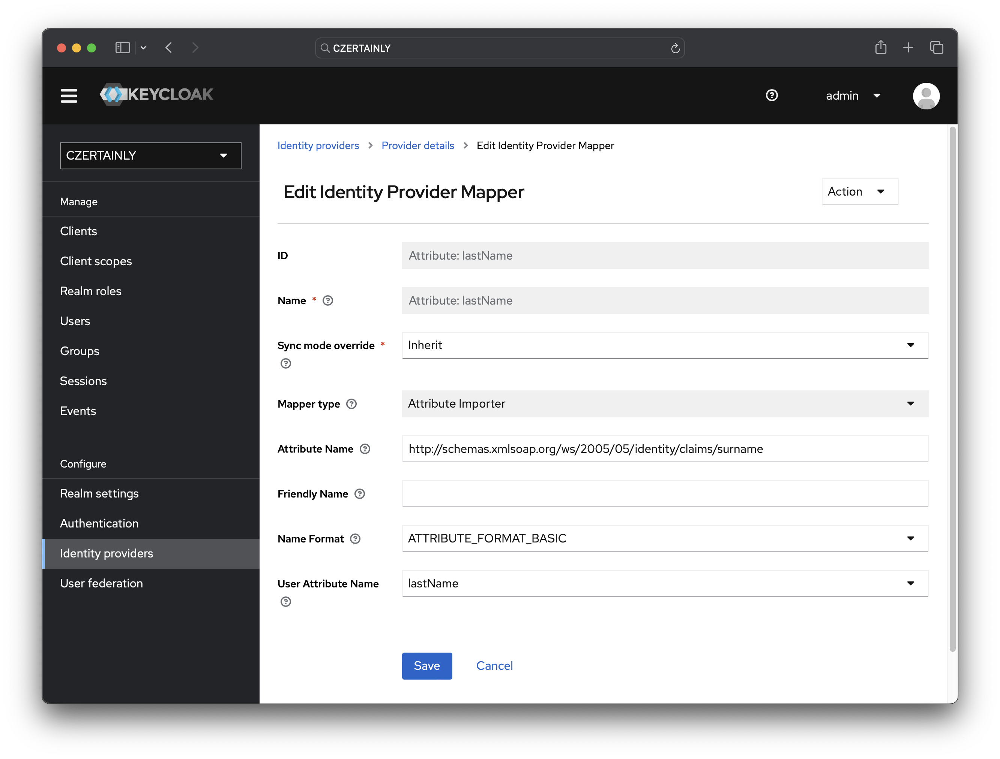
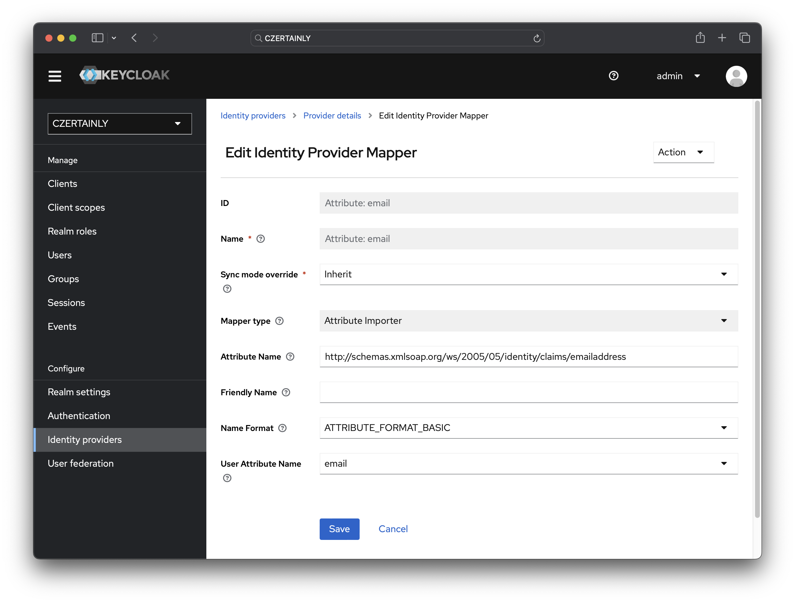
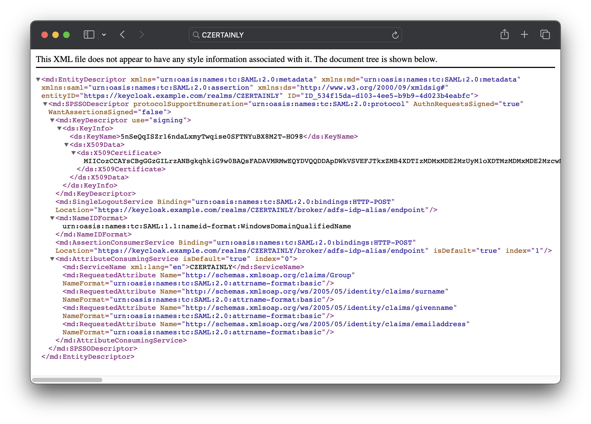

# Configure Keycloak

We need to create a new Identity Provider in Keycloak and configure Mappers. This will allow us to authenticate users against AD FS.

Login to your Keycloak instance as an administrator, where you have CZERTAINLY realm configured and follow the steps below:

1. From the menu, select **`Identity Providers`** and add new **`SAML v2.0`** identity provider.
2. Insert **`alias`** and **`Display name`** of your choice. We are going to use **`adfs-idp-alias`** and **`AD FS`** respectively in this guide.
3. Insert **`SAML entity descriptor`**, which is the metadata of your AD FS. You can find it at `https://adfs.example.com/FederationMetadata/2007-06/FederationMetadata.xml`. Replace **`adfs.example.com`** with your AD FS hostname.
4. Click on **`Add`** button to save the new Identity Provider.
5. Change **`Name ID Policy Format`** to **`Windows Domain Qualified Name`**.
6. Enable **`Want AuthnRequests signed`** option.
7. Change **`SAML signature key name`** to **`CERT_SUBJECT`**.
8. Change **`First login flow override`** to **`first broker login`**.
9. Change **`Sync mode`** to **`Force`**. This will ensure that the attribute coming from AD FS will overwrite local values in Keycloak and will be always current.

:::tip[Manual import of AD FS metadata]
In case you are unable to provide AD FS metadata from AD FS from URL, you can import it manually into Keycloak. To do so, disable `Use entity descriptor`, and the option `Import config from file` will be displayed.
:::

:::warning[Keycloak version]
The configuration options may vary depending on the Keycloak version. The instructions are based on Keycloak 24.
:::

## Mappers

Mappers are used to transform the information from the SAML assertion into Keycloak user attributes. SAML Assertion is a set of attributes about the user that is sent from the Identity Provider to the Service Provider in XML format. The Service Provider can use this information to create or update the user account in its system. In our case, the Service Provider is Keycloak and the Identity Provider is AD FS.

Example of SAML Assertion providing user's email address:

```xml
...
<AttributeStatement>
    <Attribute Name="http://schemas.xmlsoap.org/ws/2005/05/identity/claims/emailaddress">
        <AttributeValue>some.user@example.com</AttributeValue>
    </Attribute>
...
```

The configuration of Mappers depends on your AD FS configuration. The following is a typical configuration to map the user's first name, last name, email, and groups from AD FS to Keycloak.

To create Mappers, go to the Identity Provider configuration and switch to the Mappers tab. Click the `Add mapper` button and define the mappers as shown below:

### Attribute: firstName

1. Name: **Attribute: firstName**
2. Sync mode override: **Inherit**
3. Mapper type: **Attribute Importer**
4. Attribute Name: **`http://schemas.xmlsoap.org/ws/2005/05/identity/claims/givenname`**
5. Friendly Name: *keep empty*
6. Name Format: **ATTRIBUTE_FORMAT_BASIC**
7. User Attribute Name: **firstName**

<center>
    <div style={{width: "80%"}}>

        

    </div>
</center>

### Attribute: lastName

1. Name: **Attribute: lastName**
2. Sync mode override: **Inherit**
3. Mapper type: **Attribute Importer**
4. Attribute Name: **`http://schemas.xmlsoap.org/ws/2005/05/identity/claims/surname`**
5. Friendly Name: *keep empty*
6. Name Format: **ATTRIBUTE_FORMAT_BASIC**
7. User Attribute Name: **lastName**

<center>
    <div style={{width: "80%"}}>

        

    </div>
</center>

### Attribute: email

1. Name: **Attribute: email**
2. Sync mode override: **Inherit**
3. Mapper type: **Attribute Importer**
4. Attribute Name: **`http://schemas.xmlsoap.org/ws/2005/05/identity/claims/emailaddress`**
5. Friendly Name: *keep empty*
6. Name Format: **ATTRIBUTE_FORMAT_BASIC**
7. User Attribute Name: **email**

<center>
    <div style={{width: "80%"}}>

        

    </div>
</center>

### Attribute: groups

1. Name: **Attribute: groups**
2. Sync mode override: **Inherit**
3. Mapper type: **Attribute Importer**
4. Attribute Name: **`http://schemas.xmlsoap.org/claims/Group`**
5. Friendly Name: *keep empty*
6. Name Format: **ATTRIBUTE_FORMAT_BASIC**
7. User Attribute Name: **groups**

<center>
    <div style={{width: "80%"}}>

        

    </div>
</center>

## Export service provider metadata

After you have configured the Identity Provider and Mappers, you need to export the SAML 2.0 service provider metadata. This metadata will be used to configure the AD FS.

1. Go to the Identity Provider configuration and switch to the `Settings` tab.
2. Click on the link `SAML 2.0 Service Provider Metadata` to download the metadata file.

The metadata file contains the information about the Identity Provider, including the public key used to sign the SAML assertions.  

<center>
    <div style={{width: "80%"}}>

        

    </div>
</center>

:::tip[Metadata validation]
Before you proceed with the AD FS configuration, validate the metadata file to ensure that it contains the correct information. You can use online tools like [SAML Metadata Validator](https://www.samltool.com/validate_xml.php) to validate the metadata file. It should contain the correct entity ID, public key, and attribute mappings.
:::

## JSON configuration

The following JSON configuration can be used to automate the configuration of the Identity Provider and Mappers in Keycloak. You can use the [Keycloak Admin REST API](https://www.keycloak.org/docs-api/24.0.1/rest-api/index.html#_identity_providers) to import this configuration.

### Identity provider

The following JSON configuration can be used to create the Identity Provider in Keycloak. Change the values according to your AD FS configuration.

```json
{
  "alias": "adfs-idp-alias",
  "displayName": "AD FS",
  "providerId": "saml",
  "enabled": true,
  "updateProfileFirstLoginMode": "on",
  "trustEmail": false,
  "storeToken": false,
  "addReadTokenRoleOnCreate": false,
  "authenticateByDefault": false,
  "linkOnly": false,
  "firstBrokerLoginFlowAlias": "first broker login",
  "config": {
    "postBindingLogout": "true",
    "postBindingResponse": "true",
    "singleLogoutServiceUrl": "https://adfs.example.com/adfs/ls/",
    "backchannelSupported": "false",
    "xmlSigKeyInfoKeyNameTransformer": "CERT_SUBJECT",
    "loginHint": "false",
    "allowCreate": "true",
    "authnContextComparisonType": "exact",
    "syncMode": "FORCE",
    "singleSignOnServiceUrl": "https://adfs.example.com/adfs/ls/",
    "wantAuthnRequestsSigned": "true",
    "allowedClockSkew": "0",
    "encryptionPublicKey": "MIIC5jCCAc6...",
    "validateSignature": "false",
    "hideOnLoginPage": "false",
    "signingCertificate": "MIIC4DCC...",
    "nameIDPolicyFormat": "urn:oasis:names:tc:SAML:1.1:nameid-format:WindowsDomainQualifiedName",
    "entityId": "https://keycloak.example.com/realms/CZERTAINLY",
    "signSpMetadata": "false",
    "signatureAlgorithm": "RSA_SHA256",
    "wantAssertionsEncrypted": "false",
    "useJwksUrl": "true",
    "sendClientIdOnLogout": "false",
    "wantAssertionsSigned": "false",
    "sendIdTokenOnLogout": "true",
    "postBindingAuthnRequest": "true",
    "forceAuthn": "false",
    "attributeConsumingServiceIndex": "0",
    "addExtensionsElementWithKeyInfo": "false",
    "principalType": "SUBJECT"
  }
}
```

### Mappers

The following JSON configuration can be used to create the Mappers in Keycloak. Change the values according to your AD FS configuration.

```json
{
  "name": "Attribute: firstName",
  "identityProviderAlias": "adfs-idp-alias",
  "identityProviderMapper": "saml-user-attribute-idp-mapper",
  "config": {
    "syncMode": "INHERIT",
    "user.attribute": "firstName",
    "attribute.name.format": "ATTRIBUTE_FORMAT_BASIC",
    "attribute.name": "http://schemas.xmlsoap.org/ws/2005/05/identity/claims/givenname"
  }
}
```

```json
{
  "name": "Attribute: lastName",
  "identityProviderAlias": "adfs-idp-alias",
  "identityProviderMapper": "saml-user-attribute-idp-mapper",
  "config": {
    "syncMode": "INHERIT",
    "user.attribute": "lastName",
    "attribute.name.format": "ATTRIBUTE_FORMAT_BASIC",
    "attribute.name": "http://schemas.xmlsoap.org/ws/2005/05/identity/claims/surname"
  }
}
```

```json
{
  "name": "Attribute: email",
  "identityProviderAlias": "adfs-idp-alias",
  "identityProviderMapper": "saml-user-attribute-idp-mapper",
  "config": {
    "syncMode": "INHERIT",
    "user.attribute": "email",
    "attribute.name.format": "ATTRIBUTE_FORMAT_BASIC",
    "attribute.name": "http://schemas.xmlsoap.org/ws/2005/05/identity/claims/emailaddress"
  }
}
```

```json
{
  "name": "Attribute: groups",
  "identityProviderAlias": "adfs-idp-alias",
  "identityProviderMapper": "saml-user-attribute-idp-mapper",
  "config": {
    "syncMode": "INHERIT",
    "user.attribute": "groups",
    "attribute.name.format": "ATTRIBUTE_FORMAT_BASIC",
    "attribute.name": "http://schemas.xmlsoap.org/claims/Group"
  }
}
```
