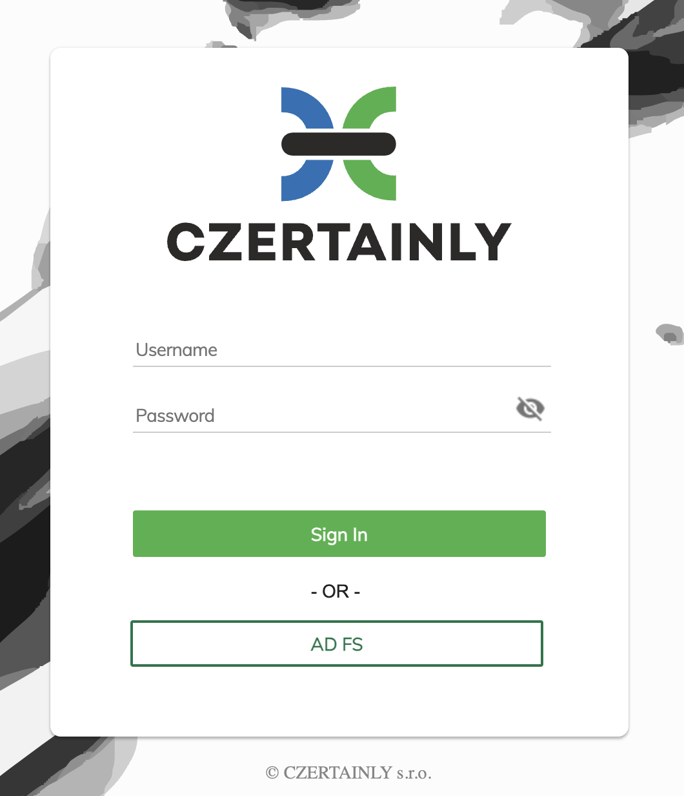

# Overview

This integration guide describes how to use [Microsoft Active Directory Federation Services](https://learn.microsoft.com/en-us/windows-server/identity/ad-fs/ad-fs-overview) (AD FS) as an Identity Provider (IdP) for CZERTAINLY platform and enable SSO. AD FS is integrated using Security Assertion Markup Language 2.0. The platform is internally using OIDC and Keycloak is used as a bridge and mapping of user attributes between AD FS and platform.

This integration guide was tested using:
- Keycloak version 24
- AD FS 3.0

:::info[SAML 2.0]
Security Assertion Markup Language 2.0 (SAML 2.0) is a version of the SAML standard for exchanging authentication and authorization identities between security domains. SAML 2.0 is an XML-based protocol that uses security tokens containing assertions to pass information about a principal (usually an end-user) between a SAML authority, named an Identity Provider, and a SAML consumer. The assertions are digitally signed and can be verified with the public key and certificate of the SAML authority.
:::

## Active Directory Federation Services presence

Before you start with the integration, make sure that you have AD FS installed and configured. If you don't have AD FS installed, you can follow the official Microsoft documentation on how to [Install Active Directory Federation Services](https://learn.microsoft.com/en-us/windows-server/identity/ad-fs/deployment/install-the-ad-fs-role-service).

## Prerequisites

We assume that the integration is done using existing Keycloak. Although any OpenID Connect (OIDC) enabled provider can be used with the platform, there is an existing Keycloak integration using [Helm chart](../../installation-guide/deployment/deployment-helm/overview.md).

Be sure that you provider is properly configured and integrated with CZERTAINLY platform. For more information, see integration guide on [Keycloak Authentication Server](../keycloak/overview.md).

## Integration

Integration consists of the following steps:

| # | Step                                           | Description                                                                                                     |
|---|------------------------------------------------|-----------------------------------------------------------------------------------------------------------------|
| 1 | [Configure Keycloak](./configure-keycloak.mdx) | Configure AD FS as SAML 2.0 IdP for Keycloak, define attribute mappings and export SAML XML metadata for AD FS. |
| 2 | [Configure AD FS](./configure-adfs.mdx)        | Import SAML metadata from Keycloak, establish trust and define attribute mappings for CZERTAINLY.               |

## Login using AD FS

After successful integration, you will be able to see additional login button in Keycloak login screen with the name of the configured identity provider display name, e.g. `AD FS`.

    

        

    

When you click on the button, you will be redirected to the AD FS login page where you can authenticate using your AD FS credentials.

## Troubleshooting

For common issues and troubleshooting, refer to [Troubleshooting](./troubleshooting.md).

## References

- [How to Setup MS AD FS 3.0 as Brokered Identity Provider in Keycloak](https://www.keycloak.org/2017/03/how-to-setup-ms-ad-fs-30-as-brokered)
