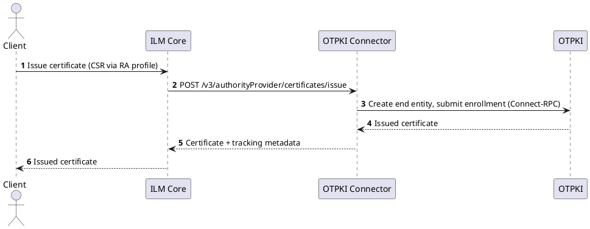

# Integration Guide

:::info
This integration guide assumes basic knowledge of ILM [`Connectors`](../../concept-design/architecture/connector.md), [`Authorities`](../../concept-design/core-components/authority.md), and [`RA Profiles`](../../concept-design/core-components/ra-profile.md), and that you already have a running OTPKI installation. It focuses on the steps needed to connect OTPKI to ILM through the OTPKI Connector.
:::

This document explains how to deploy the OTPKI Connector, register it with ILM, and configure an `Authority` and `RA Profiles` so you can issue, renew, revoke, and discover certificates from OTPKI through ILM.

The OTPKI Connector is an ILM **Authority Provider** connector. It exposes the ILM Authority Provider v3 REST interface to ILM `Core` and translates each request into calls to an OTPKI backend over Connect-RPC. The connector is **stateless** — it keeps no data of its own — and a single instance can serve any number of OTPKI authorities, because every request carries the details of the OTPKI installation it applies to.

Through its `/v2/info` endpoint the connector advertises the following interfaces:

| Interface  | Version | Purpose                                                             |
|------------|---------|--------------------------------------------------------------------|
| `authority`| v3      | Certificate issuance, renewal, registration, revocation, discovery |
| `info`     | v2      | Connector identity and supported interfaces                        |
| `health`   | v2      | Liveness and readiness health checks                               |
| `metrics`  | v1      | Prometheus metrics                                                 |

:::info[OTPKI installation]
This guide assumes that OTPKI is already installed, running, and reachable from where the connector runs. Installing and operating OTPKI itself is out of scope of this document.
:::

## How the connector works

ILM `Core` never talks to OTPKI directly. It calls the connector's Authority Provider v3 endpoints, and the connector calls OTPKI's `EnrollmentService`, `IssuanceService`, and `ValidationService` over Connect-RPC. A certificate issuance, for example, flows like this:



Configuration is split into two independent planes, and it is important to keep them apart:

- **Process configuration** — how the connector *runs*: listen port, logging, TLS trust bundle, tracing, and the password key. This is set through **environment variables** on the connector process (see [Deploy the connector](#deploy-the-connector)).
- **OTPKI connection** — *which* OTPKI installation to talk to and how to authenticate to it: base URL, token URL, OAuth2 credentials, TLS trust, timeouts, and retries. This is **not** set through environment variables. It is entered in ILM as `Authority` attributes (see [Create an authority](#create-an-authority)) and travels with every request. A freshly deployed connector has no OTPKI target until ILM sends it a request.

## Prerequisites

Before you begin, make sure you have:

- A running ILM instance with permission to register connectors and create authorities and RA profiles.
- A running OTPKI installation, reachable over the network from the connector.
- OAuth2 **client credentials** for OTPKI: a token endpoint (Token URL) and a client id / client secret that OTPKI accepts through the `client_credentials` grant. Scope and audience are optional and only needed if your identity provider requires them.
- A host (container runtime or Kubernetes cluster) to run the connector, reachable from ILM `Core`.
- If OTPKI is served by a private CA, the CA certificate(s) so the connector can trust the OTPKI endpoint.

## Deploy the connector

The connector is distributed as the container image `ilm/otpki-connector`. It is a single static binary, runs as the non-root user `ilm` (UID/GID `10001`), needs no database or writable volumes, and listens for **plain HTTP** on the port given by `PORT` (default `8080`). Terminate TLS at an ingress or service mesh in front of it and restrict inbound access to ILM `Core`.

### Configuration (environment variables)

The connector *process* is configured entirely through the environment variables below. Note that none of them point the connector at OTPKI — the OTPKI connection is configured later as `Authority` attributes.

| Variable                        | Default           | Required | Purpose                                                                                                  |
|---------------------------------|-------------------|----------|----------------------------------------------------------------------------------------------------------|
| `PORT`                          | `8080`            | No       | HTTP listen port.                                                                                        |
| `LOG_LEVEL`                     | `INFO`            | No       | Log level: `DEBUG`, `INFO`, `WARN`, or `ERROR`.                                                          |
| `TRUSTED_CERTIFICATES`          | _(unset)_         | No       | PEM bundle (concatenated `CERTIFICATE` blocks) added to the base TLS trust pool for outbound calls.       |
| `OTPKI_LOGIN_PASSWORD_KEY`      | _(unset)_         | Yes (production) | HMAC-SHA256 key used to derive OTPKI end-entity passwords. See the warning below.                 |
| `OTEL_SERVICE_NAME`             | `otpki-connector` | No       | OpenTelemetry service name.                                                                              |
| `OTEL_EXPORTER_OTLP_ENDPOINT`   | _(unset)_         | No       | OTLP/HTTP trace exporter endpoint. Traces are sampled and propagated regardless, but only exported when set. |
| `TRACING_SAMPLING_PROBABILITY`  | `1.0`             | No       | Trace sampling ratio, `0.0`–`1.0`.                                                                       |
| `HTTP_PROXY` / `HTTPS_PROXY` / `NO_PROXY` | _(unset)_ | No     | Standard Go proxy configuration for all outbound OTPKI and token calls.                                  |

:::warning[Set OTPKI_LOGIN_PASSWORD_KEY in production]
For every certificate it issues, the connector creates or reuses an OTPKI end entity and needs a password for it. That password is derived deterministically from the end entity's login id using `HMAC-SHA256(OTPKI_LOGIN_PASSWORD_KEY, loginId)`, so nothing has to be stored. If `OTPKI_LOGIN_PASSWORD_KEY` is left unset, the connector falls back to using the login id itself as the password and logs a one-time warning. **Always set a strong, secret `OTPKI_LOGIN_PASSWORD_KEY` in production**, and keep it stable — changing it changes the derived passwords for existing end entities.
:::

### Run with Docker

```sh
docker run --rm \
  -p 8080:8080 \
  -e PORT=8080 \
  -e LOG_LEVEL=INFO \
  -e OTPKI_LOGIN_PASSWORD_KEY=change-me \
  ilm/otpki-connector
```

Add `-e TRUSTED_CERTIFICATES="$(cat ca-bundle.pem)"` if outbound calls need extra trust roots, and `-e OTEL_EXPORTER_OTLP_ENDPOINT=http://collector:4318` to export traces.

### Run on Kubernetes

No Helm chart or manifests ship with the connector — deploy it as a standard stateless `Deployment` and `Service`. A minimal, hardened pod spec looks like this:

```yaml title="otpki-connector.yaml"
apiVersion: apps/v1
kind: Deployment
metadata:
  name: otpki-connector
spec:
  replicas: 2
  selector:
    matchLabels:
      app: otpki-connector
  template:
    metadata:
      labels:
        app: otpki-connector
    spec:
      securityContext:
        runAsNonRoot: true
        runAsUser: 10001
        runAsGroup: 10001
      containers:
        - name: otpki-connector
          image: ilm/otpki-connector
          ports:
            - containerPort: 8080
          env:
            - name: PORT
              value: "8080"
            - name: OTPKI_LOGIN_PASSWORD_KEY
              valueFrom:
                secretKeyRef:
                  name: otpki-connector
                  key: loginPasswordKey
          securityContext:
            readOnlyRootFilesystem: true
            allowPrivilegeEscalation: false
          livenessProbe:
            httpGet:
              path: /v2/health/liveness
              port: 8080
          readinessProbe:
            httpGet:
              path: /v2/health/readiness
              port: 8080
```

:::info[Readiness does not test OTPKI]
The connector's liveness and readiness probes report the status of the connector process only — they return healthy as long as the process is up and do **not** check that OTPKI is reachable. To verify the OTPKI connection, use the authority **connect** action in ILM (see [Create an authority](#create-an-authority)).
:::

### Endpoints, health, and metrics

The connector serves these routes:

| Route                                   | Purpose                                                        |
|-----------------------------------------|---------------------------------------------------------------|
| `GET /v2/info`                          | Connector identity and supported interfaces.                  |
| `GET /v2/health`                        | Aggregate health.                                             |
| `GET /v2/health/liveness`               | Liveness probe.                                               |
| `GET /v2/health/readiness`              | Readiness probe.                                              |
| `GET /v1/metrics`                       | Prometheus / OpenMetrics.                                     |
| `/v3/authorityProvider/*`               | Authority Provider v3 operations.                             |
| `/v2/attributes`, `/v2/attributes/{uuid}`, `/v2/attributes/callback` | Attribute discovery (see [Attribute discovery](#attribute-discovery)). |

Logs are written as JSON to standard output, with bearer tokens, passwords, client secrets, and CSRs redacted. Tracing uses the OpenTelemetry environment variables above. For background on these interfaces, see the connector [common interfaces](../../connectors/common-interfaces/overview.md) documentation ([health](../../connectors/common-interfaces/health-interface.md), [metrics](../../connectors/common-interfaces/metrics-interface.md), [info](../../connectors/common-interfaces/info-interface.md)).

## Register the connector in ILM

Once the connector is running and reachable from ILM `Core`, register it as a connector. The connector requires **no inbound authentication**, so register it with authentication type `none` and the connector's base URL, for example `http://otpki-connector:8080`.

ILM reads `/v2/info` during registration to learn the connector's identity and supported interfaces. For the full registration flow (Web UI and API), see [Register connectors](../../quick-start/certificate-management/register-connectors.mdx).

## Create an authority

Create an `Authority` that uses the registered OTPKI Connector. The authority attributes are the OTPKI connection details.

Before you start, create the supporting objects in ILM:

- A **Basic Authentication** credential holding the OTPKI OAuth2 client — its **username** is the OAuth client id and its **password** is the OAuth client secret. It is selected in the **OAuth client** attribute.
- If OTPKI uses a private CA, upload the CA certificate(s) so they can be selected in the **TLS trust** attribute.

The authority attributes are:

| Attribute            | Required | Default | Description                                                                                                     |
|----------------------|----------|---------|---------------------------------------------------------------------------------------------------------------|
| **Base URL**         | Yes      | —       | Address of the OTPKI server, for example `https://otpki.example.com:15580`.                                     |
| **Token URL**        | Yes      | —       | OAuth2 token endpoint that issues access tokens for OTPKI, for example `https://auth.example.com/realms/otpki/protocol/openid-connect/token`. |
| **OAuth client**     | Yes      | —       | A stored **Basic Authentication** credential. Its username is the OAuth client id; its password is the OAuth client secret. |
| **OAuth scope**      | No       | —       | Scope sent when requesting access tokens. Leave blank unless your identity provider requires one.               |
| **OAuth audience**   | No       | —       | Audience sent when requesting access tokens. Leave blank unless your identity provider requires one.            |
| **TLS trust**        | No       | —       | One or more **Root CA** or **Intermediate CA** certificates to trust the OTPKI endpoint. Leave empty to use only the system trust store. |
| **Call deadline (ms)** | No     | `30000` | Maximum time to wait for a single call to OTPKI before timing out.                                              |
| **Retry max attempts** | No     | `3`     | How many times a safe, read-only call is retried when OTPKI is briefly unavailable. State-changing calls are never retried. |
| **Retry initial backoff (ms)** | No | `500` | Wait before the first retry.                                                                                  |
| **Retry max backoff (ms)** | No | `5000`  | Upper bound on the wait between retries.                                                                        |

The connector authenticates to OTPKI with the OAuth2 `client_credentials` grant and reuses access tokens until shortly before they expire. There is no mutual TLS to OTPKI; authentication is by bearer token only.

When you create or update the authority, ILM runs a **connect** action that lists the OTPKI certificate authorities as a connectivity and credential check. If it fails, verify the Base URL, Token URL, OAuth client, and TLS trust. For the general flow, see [Create an authority](../../quick-start/certificate-management/create-authority.mdx).

## Create an RA profile

Create one or more `RA Profiles` against the OTPKI authority. An RA profile decides which OTPKI templates and CA are used and how each issued end entity is named.

**Select the End Entity Profile first.** The **Certificate Profile** and **Certificate Authority** dropdowns are then populated by a callback that returns only the options the selected end-entity profile allows.

| Attribute               | Required | Description                                                                                          |
|-------------------------|----------|------------------------------------------------------------------------------------------------------|
| **End Entity Profile**  | Yes      | OTPKI end-entity profile that defines the allowed certificate profiles and CAs. Populated from OTPKI. |
| **Certificate Profile** | Yes      | OTPKI certificate template to issue from. Populated from the selected end-entity profile.             |
| **Certificate Authority** | Yes    | OTPKI CA that signs the certificates. Populated from the selected end-entity profile.                 |
| **Login ID strategy**   | Yes      | How the OTPKI end-entity username is derived for each issued certificate (see below).                 |
| **Login ID DN attribute** | No     | Subject DN attribute to use as the login id. Required only when the strategy is *Login ID from DN attribute*, for example `UID`. |
| **Login ID custom value** | No     | Fixed login id value. Required only when the strategy is *Custom login ID*.                           |
| **Username prefix**     | No       | Text added before the derived login id, for example `otpki-`.                                         |
| **Username postfix**    | No       | Text added after the derived login id, for example `-prod`.                                           |

The **Login ID strategy** options are:

| Option                     | Meaning                                                                       |
|----------------------------|-------------------------------------------------------------------------------|
| **Login ID from CN**       | Use the CN from the certificate request.                                       |
| **Login ID from DN attribute** | Use a specific subject DN attribute (set *Login ID DN attribute*).         |
| **Custom login ID**        | Always use the same value (set *Login ID custom value*).                       |
| **Random login ID**        | Generate a unique value for each certificate.                                  |

The derived login id (including any prefix and postfix) must be between 3 and 64 characters long. For the general flow, see [Create an RA profile](../../quick-start/certificate-management/create-ra-profile.mdx).

## Issue and manage certificates

With an authority and RA profile in place, certificates can be managed through ILM as with any other Authority Provider. No extra attributes are required at issuance, renewal, registration, or revocation time — everything comes from the RA profile, the certificate request, and (for revocation) the chosen reason.

The connector stores tracking metadata on each certificate (the OTPKI end-entity id, certificate id, request ids, profile and CA ids). ILM round-trips this metadata back to the connector so that later renewal, revocation, and discovery can find the right OTPKI objects without the connector holding any state.

### Issuing and renewing

Issuance takes a CSR and the RA profile settings. The connector derives the login id from the request (per the RA profile's Login ID strategy), creates the OTPKI end entity if needed, and submits the enrollment. If OTPKI issues synchronously, the certificate is returned immediately; otherwise ILM polls until it completes. Renewal submits a new CSR for the existing end entity resolved from the certificate metadata.

### Registering existing certificates

Registration pre-creates an end-entity identity in OTPKI from a subject (no CSR, no enrollment) so the certificate can be managed through this authority later.

### Revoking

Revocation revokes the certificate in OTPKI using the reason chosen on the revocation form. The following ILM revocation reasons are supported: `unspecified`, `keyCompromise`, `cACompromise`, `affiliationChanged`, `superseded`, `cessationOfOperation`, `certificateHold`, `privilegeWithdrawn`, and `aACompromise`. Any other reason is rejected.

### Discovering certificates

Certificate identification looks up a certificate in OTPKI by its serial number and returns the tracking metadata needed to manage it. This is how certificates that were not issued through ILM become manageable through this authority.

### CRL and CA certificates

The connector serves the latest CRL and the CA certificate chain for the CA selected in the RA profile, which ILM uses for validation and chain building.

## Attribute discovery

The connector implements the common **Attributes v2** interface — a read-only, connector-wide catalog of every attribute it can request, so ILM `Core` can discover and resolve attribute definitions without keeping per-connector state. It exposes three routes:

| Route                          | Purpose                                                                                             |
|--------------------------------|-----------------------------------------------------------------------------------------------------|
| `GET /v2/attributes`           | The full attribute-definition registry (authority, RA profile, and per-operation attributes).        |
| `GET /v2/attributes/{uuid}`    | A single definition by UUID. Returns `ATTRIBUTE_DEFINITION_NOT_FOUND` (HTTP 404) when unknown.       |
| `POST /v2/attributes/callback` | Resolves the cascading dropdowns (the certificate profiles and CAs allowed by a selected end-entity profile) statelessly, from the connection details supplied in the request. |

You do not call these routes directly — ILM `Core` uses them when it builds the authority and RA profile forms. See the connector [attributes interface](../../connectors/common-interfaces/attributes-interface.md) documentation for background.

## Constraints

The following are known constraints of the OTPKI Connector:

| Constraint                                                                 | Note                                                                                     |
|---------------------------------------------------------------------------|------------------------------------------------------------------------------------------|
| Issuance, registration, and revocation cannot be cancelled                | OTPKI has no cancel operation; cancel requests are rejected.                              |
| CRMF requests require a Login ID strategy of **Custom** or **Random**     | The subject cannot be read from an opaque CRMF body, so the login id cannot be derived from the CN or a DN attribute. |
| Renewal requires a CSR                                                     | CSR-less or key-reuse renewal is not supported.                                           |
| The connector authenticates to OTPKI with an OAuth2 bearer token only     | There is no mutual TLS to OTPKI.                                                          |
| The connector serves plain HTTP                                           | Terminate TLS at an ingress or service mesh and restrict inbound access to ILM `Core`.    |
| Readiness does not test OTPKI connectivity                                | Use the authority **connect** action to verify the OTPKI connection.                      |

## Troubleshooting

- **The authority connect action fails.** Check that the **Base URL** and **Token URL** are reachable from the connector, that the **OAuth client** credential holds a valid client id and secret, and that any private OTPKI CA is selected in **TLS trust** (or added through `TRUSTED_CERTIFICATES`).
- **Upstream authentication errors.** Confirm the OAuth client credentials, and add the **OAuth scope** and **OAuth audience** if your identity provider requires them.
- **TLS handshake errors reaching OTPKI.** Add the OTPKI CA certificate to the authority's **TLS trust** attribute, or to the connector's `TRUSTED_CERTIFICATES` bundle.
- **Login id errors.** Make sure the derived login id (with any prefix and postfix) is between 3 and 64 characters, and that CRMF requests use the **Custom** or **Random** strategy.
- **End-entity password issues after a redeploy.** Confirm `OTPKI_LOGIN_PASSWORD_KEY` is set and unchanged; changing it changes the passwords derived for existing end entities.

Errors are returned as RFC 9457 `application/problem+json` responses whose `type` links to `https://docs.otilm.com/problems/common/`, with a machine-readable `errorCode` and a `retryable` flag. Increase detail by setting `LOG_LEVEL=DEBUG`, and enable tracing with `OTEL_EXPORTER_OTLP_ENDPOINT` to follow a request through to OTPKI.
